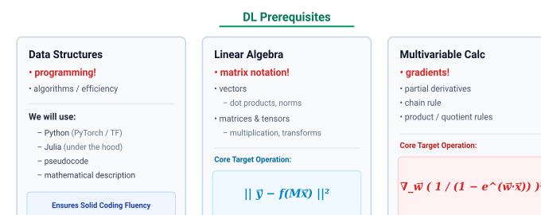
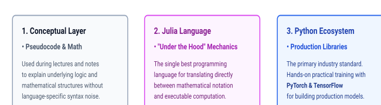
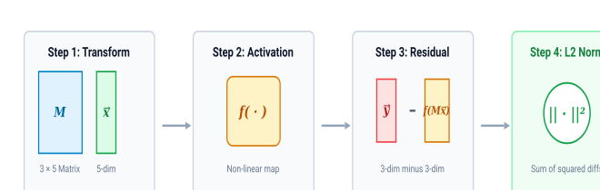
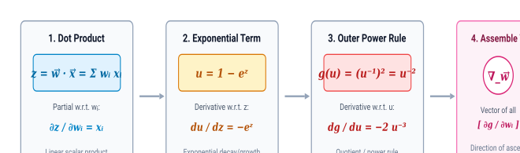

# Deep Learning Prerequisites: Essential Foundations

Computer Science & Mathematical Competencies for Deep Learning

Prerequisite Curriculum: Data Structures • Linear Algebra • Multivariable Calculus

Succeeding in deep learning requires synthesizing foundational concepts from both computer science and mathematics. Because deep learning is an upper-level topic, students need a solid grounding in computational problem-solving and key analytical tools.

The Three Pillars of Preparation

Preparation rests upon three standard university courses: **Data Structures** (programming experience and algorithmic efficiency), **Linear Algebra** (matrix notation, vector operations, and tensors), and **Multivariable Calculus** (gradients and the multivariable chain rule).

## 1. Master Prerequisite Overview

While the breadth of computer science and mathematics is vast, deep learning relies intensely on a focused subset of topics from each field.

Figure 1: Standalone visual recreation of the whiteboard organization: the three prerequisite pillars.

Reassuring Note on Mathematical Scope

Although linear algebra and multivariable calculus are prerequisite subjects, deep learning only requires a **small fraction** of the total material taught in those semester-long courses. If you have completed one course but not the other, or if your knowledge is slightly rusty, it is straightforward to catch up on the specific concepts needed during the opening week.

## 2. Pillar I: Data Structures & Programming Ecosystem

Because deep learning models require extensive implementation, **Data Structures** acts as the essential benchmark for programming fluency.

* **Programming Proficiency:** Serving as proof that students have accumulated substantial hands-on programming experience.
* **Algorithmic Efficiency:** Understanding time and space complexity (O(N), O(N²)), memory overhead, and cache-friendly operations, which become critical when processing massive datasets or millions of matrix parameters.

### Languages Used in the Curriculum

The curriculum intentionally balances mathematical theory with industrial software development:

Figure 2: The programming language hierarchy: theoretical formulation, algorithmic implementation, and industrial practice.

## 3. Pillar II: Linear Algebra & Tensor Notation

In deep learning, neural networks operate simultaneously across multidimensional numerical data:

* **Vectors (1D arrays):** Representing feature embeddings, input samples, and bias terms.
* **Matrices (2D arrays):** Representing linear weight transformations connecting adjacent network layers.
* **Tensors (Higher-dimensional arrays):** Generalizing arrays to 3D (e.g., color images with dimensions [Channels × Height × Width]), 4D (batches of video frames), and beyond.

While operations can be inspected element by element, deep learning requires expressing transformations **compactly in matrix notation**. Essential operations include matrix-vector multiplication, element-wise non-linear activation, vector subtraction, and computing norms.

### Step-by-Step Breakdown: The Canonical Linear Algebra Operation

|| y⃗ − f(Mx⃗) ||²

Figure 3: Dataflow execution pipeline of the canonical linear algebra operation ||y⃗ − f(Mx⃗)||².

This expression mirrors a real-world neural network loss function:

1. **Matrix Multiplication (M × x⃗):** A weight matrix M with dimensions 3 × 5 multiplies an input vector x⃗ of length 5, linearly transforming the 5-dimensional feature vector into a 3-dimensional vector.
2. **Activation Function (f(Mx⃗)):** An element-wise non-linear mapping (such as a sigmoid or ReLU) is applied to each of the 3 components.
3. **Vector Difference (y⃗ − f(Mx⃗)):** The network's 3-dimensional prediction is subtracted from a 3-dimensional ground-truth target vector y⃗, computing the component-wise error (residual).
4. **Squared Euclidean Norm (|| · ||²):** The magnitude of the error vector is calculated via the squared L2 norm:

   ||e⃗||² = e₁² + e₂² + e₃²

   This collapses the multidimensional error vector into a single positive real-valued scalar (the loss) that can be minimized.

## 4. Pillar III: Multivariable Calculus & Gradients

Optimization via gradient descent requires evaluating multivariable derivatives across every layer.

* **Gradients (∇):** The vector assembling all first-order partial derivatives of a scalar function. It indicates the direction of greatest functional increase.
* **Partial Derivatives (∂ / ∂wi):** Quantifying how the output changes when a single parameter is varied while holding all other parameters constant.
* **Differentiation Rules:** Continuous mastery of the chain rule, product rule, and quotient rule.

### Deconstructing the Multivariable Target Expression

Consider the expression analyzed during the prerequisite overview:

∇w⃗ [ 1 / (1 − ew⃗ · x⃗) ]²

Figure 4: Algorithmic decomposition of the multivariable gradient via the Chain Rule.

Computing this gradient requires calculating the partial derivative with respect to each weight element wi:

1. Let the inner dot product be z = w⃗ · x⃗ = ∑j wj xj. Then ∂z / ∂wi = xi.
2. Let u = 1 − ez. Then du / dz = −ez = −ew⃗ · x⃗.
3. The full expression is g(u) = (1/u)² = u−2. Differentiating with respect to u yields:

   dg / du = −2 u−3 = −2 / u³
4. Applying the **Multivariable Chain Rule** to combine the sub-derivatives:

   ∂g / ∂wi = (dg/du) · (du/dz) · (∂z/∂wi) = [ −2 / (1 − ew⃗·x⃗)³ ] · [ −ew⃗·x⃗ ] · xi = [ 2 ew⃗·x⃗ / (1 − ew⃗·x⃗)³ ] xi
5. The complete gradient vector ∇w⃗ is constructed by stacking these partial derivatives for every element wi:

   ∇w⃗ g = [ 2 ew⃗·x⃗ / (1 − ew⃗·x⃗)³ ] x⃗

If you are comfortable navigating this sequence of differentiation steps, you possess the multivariable calculus foundation necessary for deep learning.

## 5. Review Resources: Grant Sanderson (3Blue1Brown)

For students needing to refresh their understanding or fill in specific gaps, video playlists by **Grant Sanderson (3Blue1Brown)** are recommended:

#### Essence of Linear Algebra

Focus on core geometric intuition: vector spaces, linear combinations, dot products, matrix transformations, and matrix multiplication.

#### Essence of Calculus

Focus on derivatives, the product rule, the quotient rule, the geometric intuition of the chain rule, and gradients in higher dimensions.

#### Targeted Strategy

Do not watch every lecture end-to-end. Target the specific topics highlighted on the course board to rapidly prepare for Week 1 activities.
