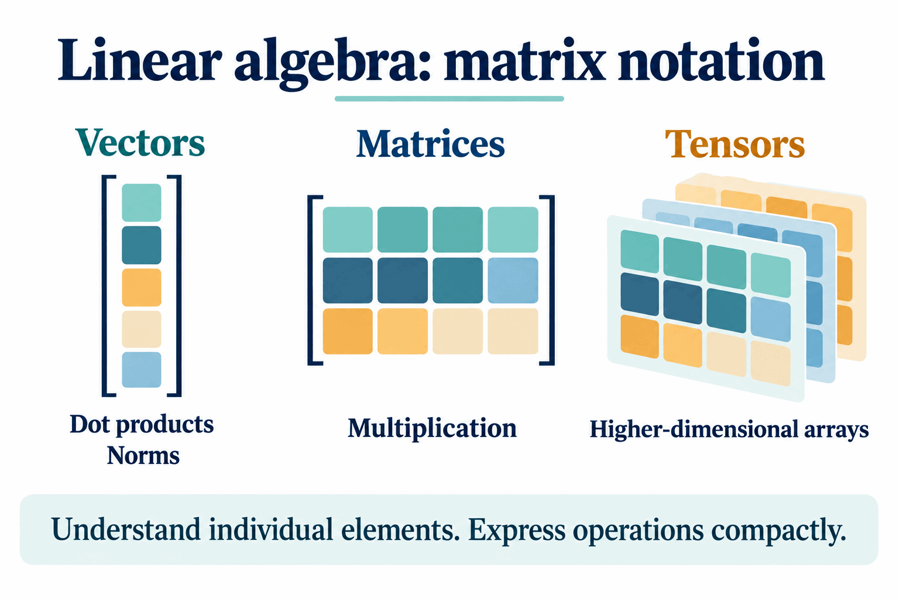

# Deep Learning Prerequisites

What background do you need to have success in a course on deep learning?

Deep learning depends on a number of concepts from computer science and math, so there are prerequisites in both fields. If you have taken courses in **data structures, linear algebra, and multivariable calculus**, you are good to go. But it is worth going into a bit more detail about how each of these will come up and what is important to success in a deep learning class.

## Data structures and programming

To begin with, this is upper-level undergraduate computer science, so a decent amount of programming background is assumed. The number-one reason data structures is a prerequisite is to ensure that you have done at least that much programming in the past.

We will also sometimes be interested in **algorithmic efficiency** and related concepts you would have encountered in data structures.

The lessons will mostly use **pseudocode**, or express computations mathematically. In the assignments, however, you will be programming in both **Python and Julia**.

Why use two different programming languages? The reason for Python is the availability of the best, most popular deep-learning libraries for this course. Specifically, you will get practice with **TensorFlow and PyTorch** along the way.

Julia is the course's choice for translating between mathematics and computation. When we express ideas about deep learning mathematically and then want to write code that implements them, doing that in Julia will make it easiest for us to understand what is going on **under the hood of our neural networks**.

## How much mathematical background do you need?

We will use concepts from linear algebra and multivariable calculus. However, in both cases, the concepts we will use are a **small fraction** of what is generally taught in those courses.

If, for example, you have taken only one of these classes, it should be possible to catch up on the concepts you need from the other relatively quickly, without falling behind at the beginning of the semester.

## Linear algebra: being comfortable with matrix notation

From linear algebra, the main thing we need is to be comfortable with **matrix notation**.

In deep learning, we will do lots of operations on vectors, matrices, and even higher-dimensional arrays, which we will call **tensors**. We will break those operations down and look at what is happening to individual elements. But we also need to express those operations compactly using matrix and vector notation.

You therefore need to be comfortable doing matrix–vector products, applying functions to matrices and vectors, and operations such as **dot products and norms**. The board groups these under vectors—dot products and norms—and matrices—multiplication.

An example of the sorts of operations we might see very soon is:

1.  Multiply a **3 × 5 matrix** by a **five-element vector**.
2.  Apply some function to the result.
3.  Take a difference with another **three-element vector**.
4.  Take a norm.

The compact expression on the board is:

  

The written expression includes the **square of the norm**. The explanation walks through the operations without evaluating a numerical example.

If you are comfortable with all of those operations, that is most of what we need from linear algebra for this class.

## Multivariable calculus: gradients

From multivariable calculus, the key concept we will use all semester is **gradients**.

We will need to evaluate the gradient of many different functions. Gradients are made up of **partial derivatives**, so we need to be comfortable taking partial derivatives. Of course, that relies on the rules learned in basic calculus, such as the **product rule and the quotient rule**. The board also includes the **chain rule**.

The example on the board is:

  

The sort of operation we will be doing soon is constructing the **gradient vector containing the partial derivative of this function with respect to each element of the vector w**.

The board uses a minus sign in the denominator, as reproduced here. The gradient is presented as an example of the operation you should be ready to perform; its derivatives are not worked out in this lesson.

If these operations make sense to you, that is most of what we need from multivariable calculus to do deep learning.

## Catching up or refreshing your background

For either multivariable calculus or linear algebra, if you have not had a full course on the topic—or if you are feeling a bit rusty and want to brush up—there are playlists with videos by **Grant Sanderson** to help you get up to speed.

Both playlists contain videos for an entire course in the subject. The specific videos most important for the concepts we will actually use are highlighted in the course resources:

- **Linear algebra:** videos **1, 3, 4, 5, 8, 9, and 13** in the [suggested linear-algebra playlist](https://www.youtube.com/watch?v=fNk_zzaMoSs&list=PLZHQObOWTQDPD3MizzM2xVFitgF8hE_ab).
- **Multivariable calculus:** videos **15, 16, 17, 19, 20, 24, 30, 31, and 32** in the [suggested multivariable-calculus playlist](https://www.youtube.com/watch?v=TrcCbdWwCBc&list=PLSQl0a2vh4HC5feHa6Rc5c0wbRTx56nF7).

If these concepts are unfamiliar, or if it has been a little while since you have used them, go through those videos to make sure you are ready for the activities in the first week of class.

------------------------------------------------------------------------

Source: [Deep Learning Prerequisites (DL 02), Professor Bryce](https://www.youtube.com/watch?v=RrM8Tn4-AJE), Davidson CSC 381, Fall 2022.
