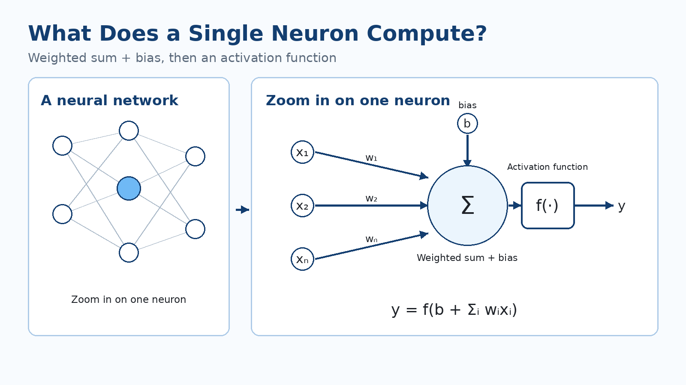
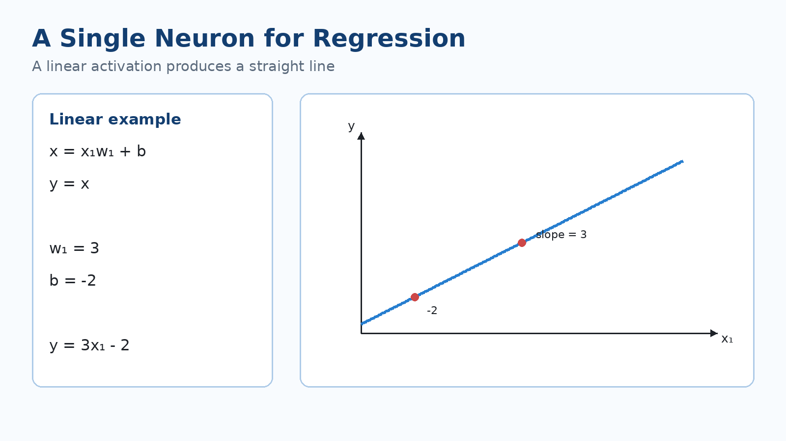
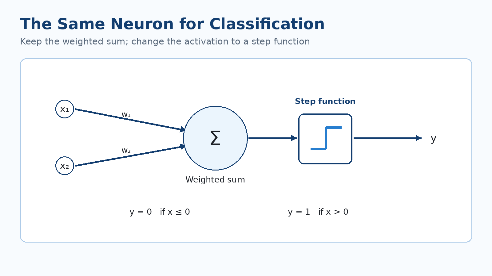
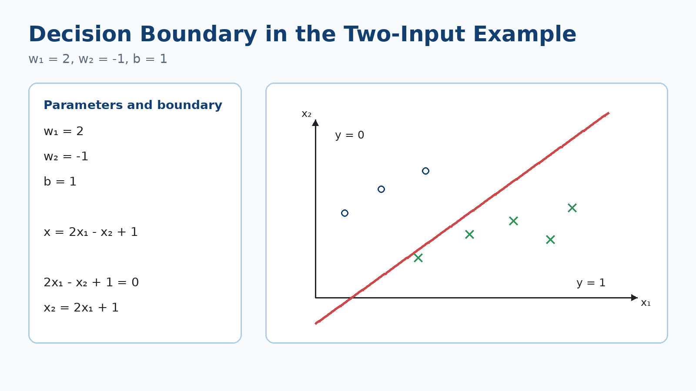
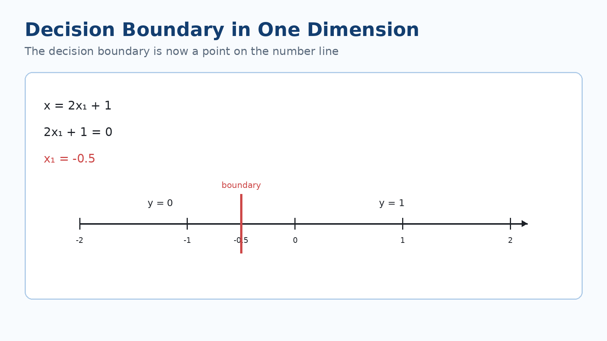
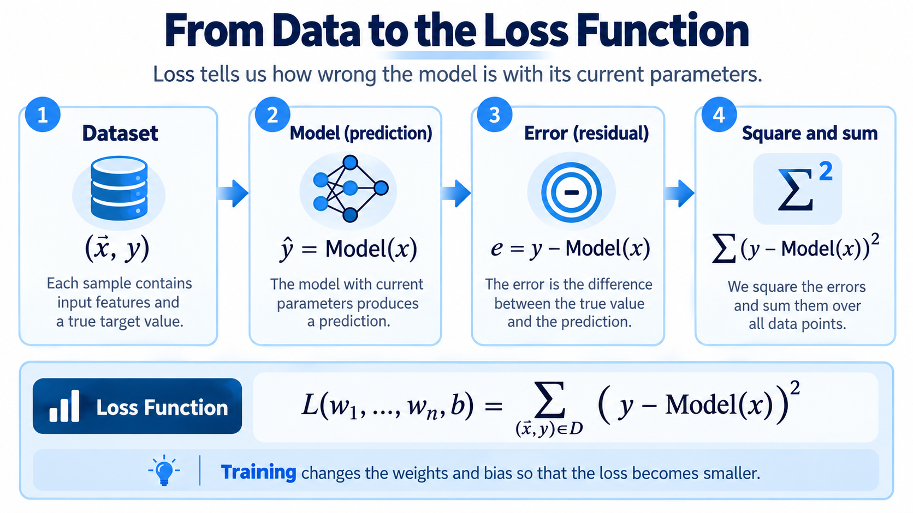

# What Can a Single Neuron Compute?

Neural networks can become very large: many neurons, connections, and layers. But to understand what the whole network is doing, we first zoom in on **just one neuron** and ask:

**What does this one neuron compute, and what kinds of models can we build from that computation?**

---

## The basic computation of one neuron

Suppose the neuron receives the inputs

$$
x_1,\;x_2,\;\ldots,\;x_n
$$

and each input has a corresponding weight:

$$
w_1,\;w_2,\;\ldots,\;w_n
$$

The neuron multiplies each input by its own weight, adds all those products together, and then adds one more parameter called the **bias**, $b$. The result then goes into the **activation function** $f$.

So the neuron's computation can be written as:

$$
y=f\left(b+\sum_{i=1}^{n}w_i x_i\right)
$$

There are two stages:

1. First compute the **weighted sum of the inputs plus the bias**.
2. Then pass that number through the **activation function** to produce the output $y$.

The weights determine how much, and in which direction, each input affects the result. The bias is a separate parameter that lets the linear part of the neuron shift instead of depending only on products of inputs and weights.

The key idea is that this same simple structure can behave differently depending on the activation function. We will use this one neuron first for **Regression** and then for **Classification**.

---

## A neuron for Regression

Start with just one input, $x_1$. The weighted sum plus bias is:

$$
x=x_1w_1+b
$$

Now choose a completely linear activation function:

$$
y=x
$$

Therefore:

$$
y=x_1w_1+b
$$

This is exactly the equation of a straight line.

In this case, **the weight $w_1$ determines the slope of the line**, and **the bias $b$ determines where the line crosses the $y$-axis**.

For example, if

$$
w_1=3
$$

and

$$
b=-2
$$

then the neuron computes:

$$
y=3x_1-2
$$

So when we draw this relationship, we get a straight line with slope $3$ and intercept $-2$.

That is why a single neuron with a linear activation function, in the simplest case, does what we expect from a **linear regression model**.

If there are more inputs, the computation is the same:

$$
y=b+w_1x_1+w_2x_2+\cdots+w_nx_n
$$

We simply have one weight for each input component. The output is still a numerical value.

---

## The same neuron for Classification

Now keep the weighted-sum computation, but change the activation function.

With two inputs:

$$
x=x_1w_1+x_2w_2+b
$$

This time, instead of setting the output directly equal to $x$, use a **step function**:

$$
y=
\begin{cases}
0 & x\le 0\\
1 & x>0
\end{cases}
$$

The neuron first computes a number. If that number is zero or negative, the output is $0$; if it is positive, the output is $1$.

So the same neuron that produced a continuous value for Regression can now decide between **two classes** simply by changing the activation function.

---

## Where is the boundary between class 0 and class 1?

The step function changes its output exactly where its input crosses zero. So the decision boundary is where:

$$
x_1w_1+x_2w_2+b=0
$$

Use the example from the lesson:

$$
w_1=2,\qquad w_2=-1,\qquad b=1
$$

Then the value before the activation function is:

$$
x=2x_1-x_2+1
$$

Set that expression equal to zero to find the decision boundary:

$$
2x_1-x_2+1=0
$$

which can also be written as

$$
x_2=2x_1+1
$$

This line divides the input plane $(x_1,x_2)$ into two parts.

On one side of the line:

$$
2x_1-x_2+1\le 0
$$

and therefore:

$$
y=0
$$

On the other side:

$$
2x_1-x_2+1>0
$$

and therefore:

$$
y=1
$$

So the line is not drawn randomly through the data; **its position comes directly from the weights and the bias.**

If the weights or bias change, the location of this line changes. Learning the weights and bias in this Classification model means learning where the boundary between the two classes should be.

---

## What if there is only one input?

The same idea is even simpler in one dimension.

Suppose:

$$
x=2x_1+1
$$

The decision boundary is where:

$$
x=0
$$

So:

$$
2x_1+1=0
$$

and therefore:

$$
x_1=-0.5
$$

In two dimensions, the decision boundary was a **line**. Here, because we have only one input axis, the decision boundary is just a **point** on that axis.

The two sides of that point belong to the two different outputs of the step function. The idea is the same: the boundary lies wherever the weighted sum plus bias becomes zero.

This example also shows that the number of input components determines how many weights the neuron needs. If the input vector has $n$ components, the neuron needs $n$ weights.

---

## The main question: where do the weights and bias come from?

In the examples above, we chose the weights and bias ourselves:

$$
w_1=3,\; b=-2
$$

or

$$
w_1=2,\; w_2=-1,\; b=1
$$

But in a real problem, we do not want to guess these numbers by hand. We want the model to **learn them from data**.

Suppose a dataset contains examples of the form:

$$
(\vec{x},y)
$$

For each example:

- $\vec{x}$ is the input;
- $y$ is the correct answer, or target, for that input.

Using its current weights and bias, the neuron makes a prediction for the same input:

$$
\hat y=\text{Model}(\vec{x})
$$

Now we can compare the model's prediction with the true answer.

---

## Loss Function: how wrong is the model?

For training, we need a number that tells us **how wrong the model is on the dataset** with its current parameters. That number is the **Loss Function**.

For each example, the difference between the true answer and the model's prediction is:

$$
y-\text{Model}(\vec{x})
$$

In this example, square that difference:

$$
\left(y-\text{Model}(\vec{x})\right)^2
$$

Then add it over all examples in the dataset:

$$
L(w_1,\ldots,w_n,b)=
\sum_{(\vec{x},y)\in D}
\left(y-\text{Model}(\vec{x})\right)^2
$$

Notice how the loss is written:

$$
L(w_1,\ldots,w_n,b)
$$

The Loss depends on the weights and the bias.

If we change the weights and bias, the model prediction changes. When the prediction changes, the difference from the true answer changes, so the Loss changes too.

So training the neuron can be viewed as:

**Find values of $w_1,\ldots,w_n,b$ that make the Loss as small as possible.**

The smaller the Loss, the better the model's predictions match the training data.

One important question remains:

**How do we change the weights and bias so that the Loss decreases?**

That question leads to the next topic: **Gradient Descent**.
