**One Neuron**

# How to train your neuron

A single neuron first forms a weighted sum of its inputs, adds a bias, and then applies an activation function. With a step function as the activation, it can act as a binary classifier. With a linear activation, it can act as a regressor. The next question is how to choose the weights and bias so that the model fits the data.

The model is trained by measuring its loss on a data set and then using the gradient of that loss to change the parameters. The loss depends explicitly on the neuron’s weights and bias.

L(w1,…,wn,b) = Σj=1N ( yj − f(x⃗j) )²

In computations it is common to divide this by the number of data points and use mean squared error. For the derivation, it is cleaner to work with the sum of squared errors so that a factor of 1/N does not have to be carried through every derivative.

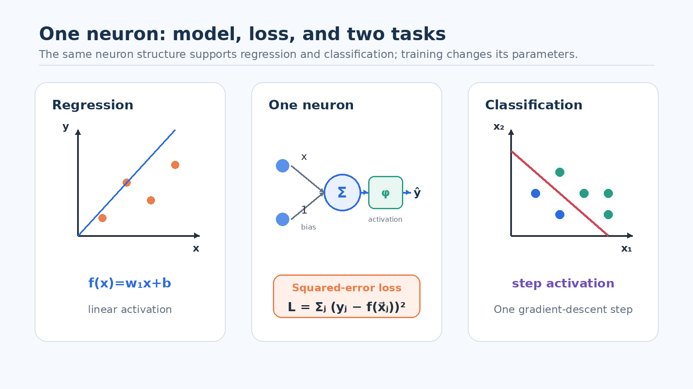

*The board begins with the one-neuron computation, the regression and classification cases, and the squared-error loss written as a function of the model parameters.*

## A small regression example

Start with a four-point, one-dimensional regression data set. The current neuron has weight w1=2 and bias b=−2, so its output is the straight line

f(x) = 2x − 2.

At the four inputs x=1,2,3,4, the model therefore predicts 0,2,4,6. The desired outputs are 1,3,2,4. The pointwise errors y−f(x) are 1,1,−2,−2.

| x | target y | prediction f(x) | error y−f(x) |
| --- | --- | --- | --- |
| 1 | 1 | 0 | 1 |
| 2 | 3 | 2 | 1 |
| 3 | 2 | 4 | −2 |
| 4 | 4 | 6 | −2 |

L(2,−2) = (1−0)² + (3−2)² + (2−4)² + (4−6)² = 10.

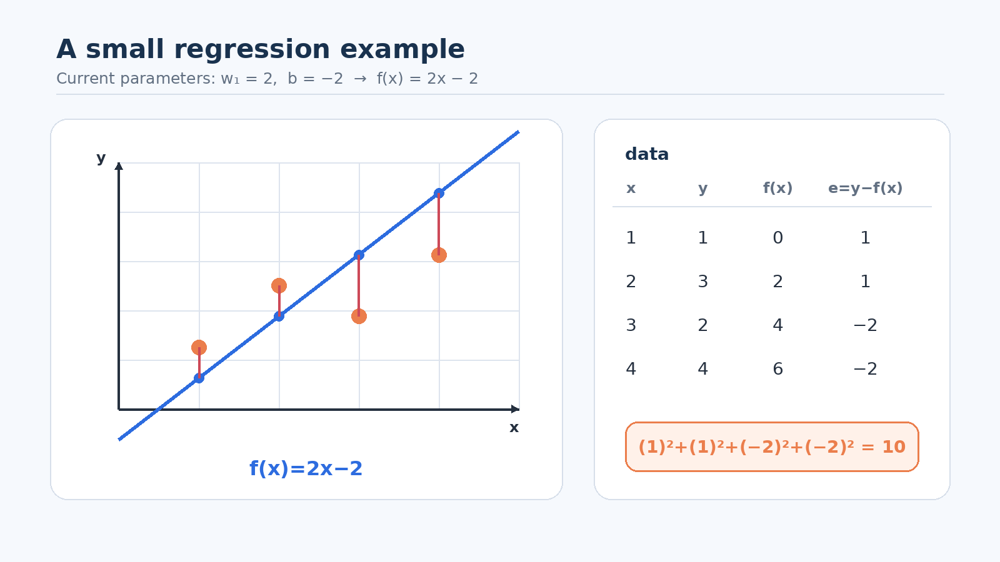

*The four residuals are written directly into the sum of squared errors; their squares add to 10.*

The goal is to minimize this loss. Calculus tells us that the gradient points in the direction of steepest increase, so the direction that decreases the loss is the negative gradient. Because this neuron has two parameters, the gradient has two components: one partial derivative with respect to w1, and one with respect to b.

## Deriving the gradient in the general case

Instead of deriving only this particular example, take the loss for an arbitrary neuron and an arbitrary data set. There is one partial derivative for every model parameter. For an arbitrary weight wi, differentiation passes through the summation, and the chain rule is applied to each squared term.

∂L/∂wi = −2 Σj=1N ( yj − f(x⃗j) ) · ∂f(x⃗j)/∂wi.

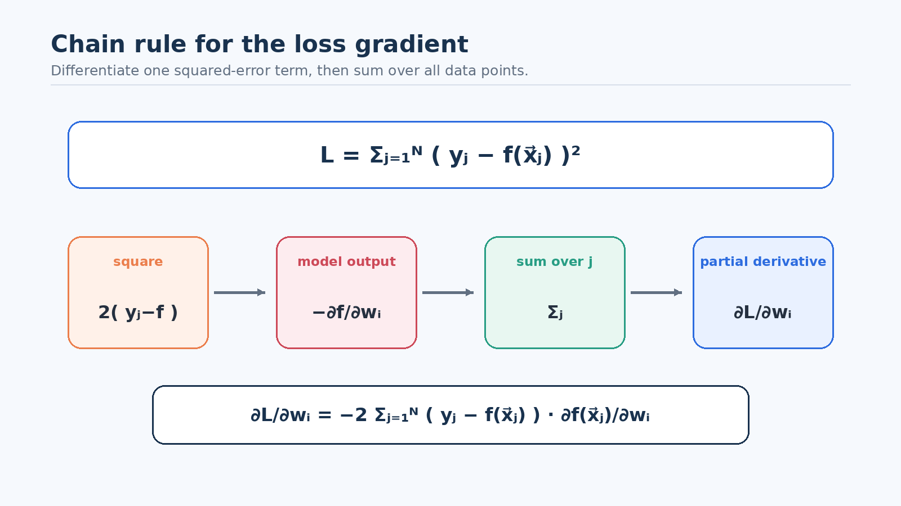

*The square contributes the factor of 2; differentiating the inside contributes a minus sign because yj is constant and the model output is subtracted.*

The activation function cannot yet be differentiated in one universal way because different neurons can use different activations. But every neuron begins with the same weighted sum. For data point j, write the pre-activation weighted sum as xj (without the vector mark):

xj = b + Σk=1n wkxj,k.

Only one term in that sum contains wi. Therefore

∂xj/∂wi = xj,i, and ∂xj/∂b = 1.

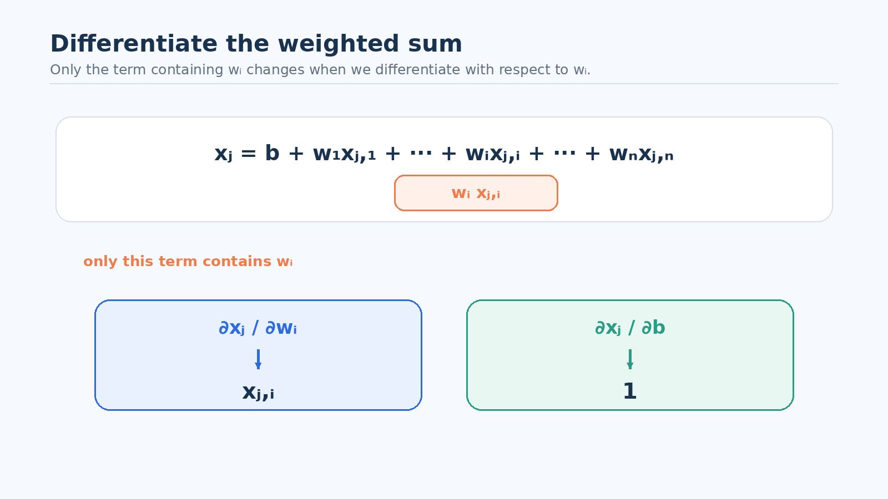

*The derivative of the weighted sum with respect to weight wi leaves exactly the corresponding input component xj,i; the bias derivative is 1.*

The repeated quantity yj−f(x⃗j) is exactly the unsquared difference already computed in the loss calculation. Name it the error ej. Then

ej = yj − f(x⃗j), so ∂L/∂wi = −2 Σ ej · ∂f(x⃗j)/∂wi.

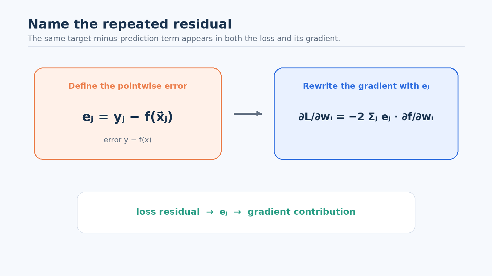

*The board labels the target-minus-prediction difference as ej, tying the gradient calculation directly back to the residuals used in the loss.*

## Applying the gradient to the linear regressor

For the linear activation, the derivative of the activation is 1. The chain rule therefore leaves only the corresponding input component when differentiating with respect to a weight. For w1:

∂L/∂w1 = −2 Σ ejxj,1 = −2[1·1 + 1·2 − 2·3 − 2·4] = 22.

For the bias, the weighted-sum derivative is 1:

∂L/∂b = −2 Σ ej = −2[1 + 1 − 2 − 2] = 4.

So the gradient at w1=2, b=−2 is

∇L = [22, 4]T.

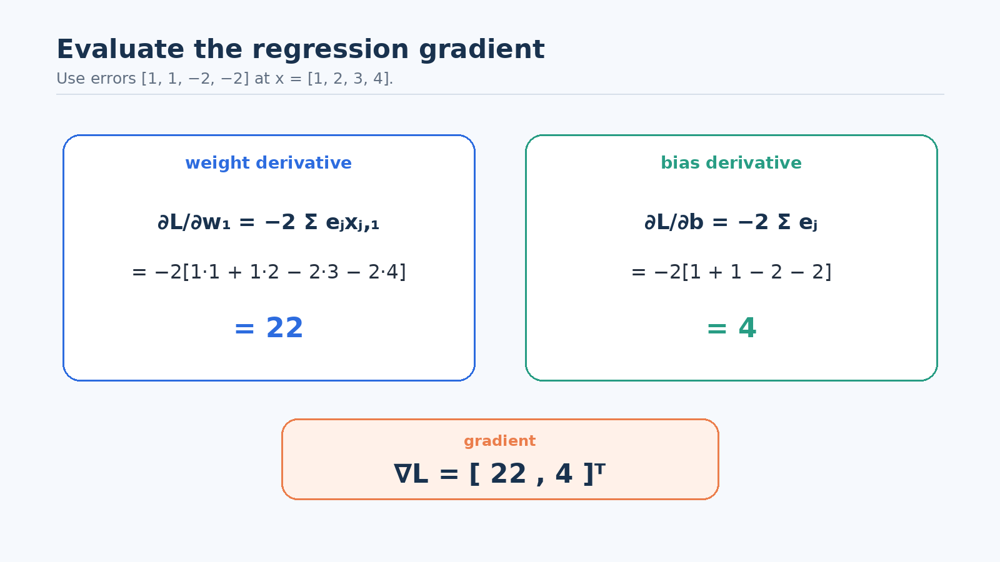

*The board evaluates both partial derivatives numerically and combines them into the gradient vector [22,4].*

## What the gradient means geometrically

The loss is a function of the model parameters. Here its two inputs are w1 and b. Every point in the (w1,b) plane corresponds to a different line the neuron could compute. For example, w1=−3 and b=2 would define a different linear neuron. Our current point is (2,−2), where the loss is 10.

Imagine the loss value rising out of this parameter plane as a surface. At any point, the gradient points in the direction in which that surface rises most steeply. To decrease the loss, move in the opposite direction.

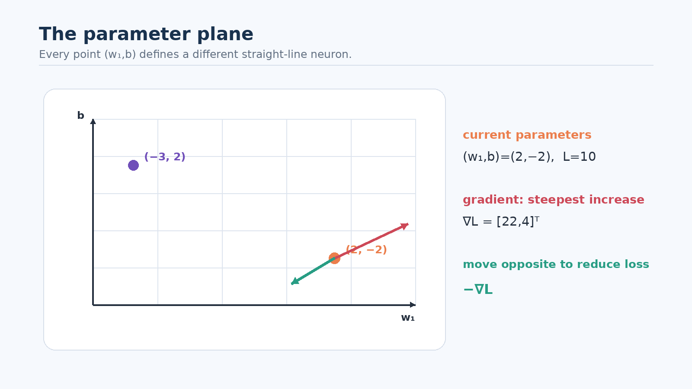

*The parameter plane is drawn with w1 horizontally and b vertically; each point stands for one possible parameterization of the neuron.*

Take a small step by subtracting a multiple of the gradient:

[w1, b]T ← [w1, b]T − η∇L.

The multiplier η is the step size. With η=0.01, subtract 0.22 from the weight and 0.04 from the bias:

w1: 2 → 1.78, b: −2 → −2.04.

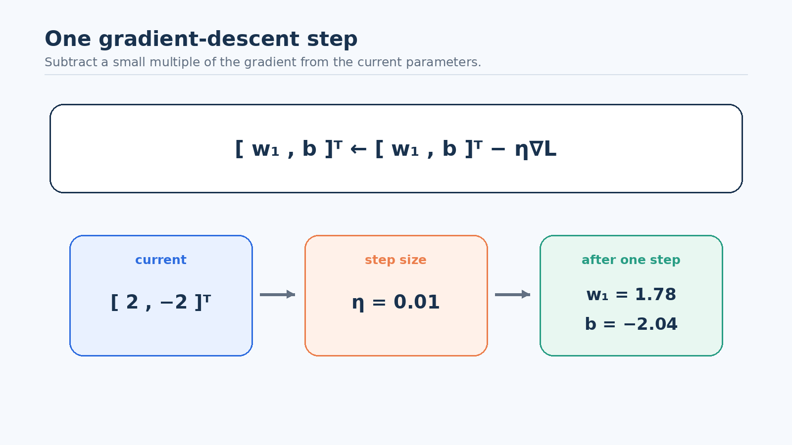

*The update direction is drawn on the parameter plane and η=0.01 is written beneath the numerical gradient.*

With the new parameters, evaluate the loss again, calculate another gradient, and take another step. Repeating this process improves the model.

The loss surface for this example is much steeper in the weight direction than in the bias direction. That matches the model: changing the weight alters the slope and can change the errors quickly across the whole x-range, while changing the bias only nudges the line up or down.

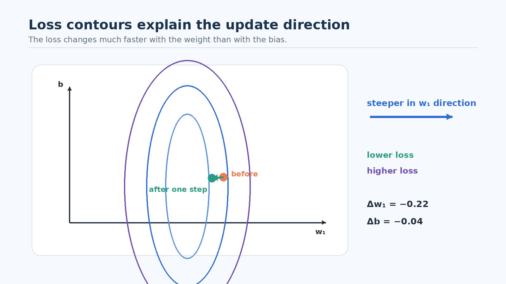

*Elliptical contour lines are sketched around the low-loss region, elongated to show very different steepness in the two parameter directions.*

After the first step, the bias is slightly smaller, so the intercept shifts down. The weight decreases much more, so the line’s slope is reduced. Visually, the fitted line is shifted slightly downward and tilted to the right, which better matches the four data points.

## Why the step-function classifier cannot be trained this way

Trying to apply the same gradient calculation to the step activation runs into an immediate problem: the derivative of a step function is zero almost everywhere. That makes the gradient carry essentially no useful information about how the parameters should move.

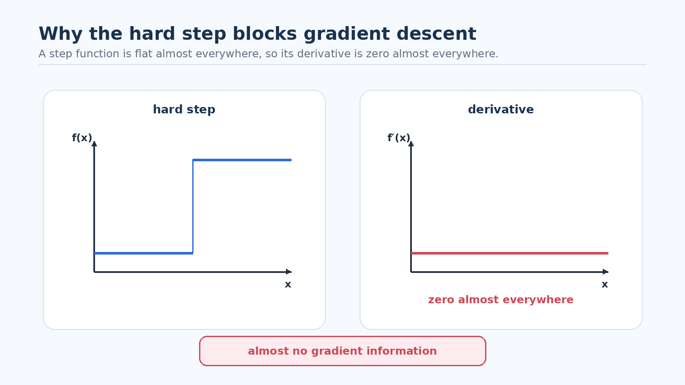

*The lesson returns to the classification half of the board after completing the regression gradient-descent picture.*

The solution is to replace the hard step by a smooth approximation: the sigmoid function.

σ(x) = 1 / (1 + e−x).

When x is large and positive, e−x is tiny, so σ(x) approaches 1. When x is very negative, e−x is huge, the denominator grows without bound, and σ(x) approaches 0. Between the two extremes there is a smooth transition.

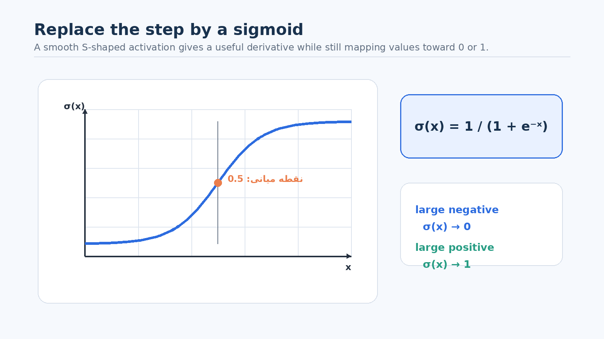

*The hard step is replaced on the board by a smooth S-shaped curve, with σ(x)=1/(1+e−x) written above it.*

## Classification with the sigmoid

A classification boundary can still be drawn where the weighted sum changes from negative to positive. But close to that boundary, the sigmoid output is around 0.5; only far from the boundary does it become close to 0 or 1. That is sensible: points lying almost exactly on the boundary should not receive the same confidence as points well inside one side.

Use the neuron with w1=1, w2=1, and b=−4. The six data points on the board are:

| x1 | x2 | target y | weighted sum x1+x2−4 | σ(weighted sum) |
| --- | --- | --- | --- | --- |
| 1 | 2 | 0 | −1 | 0.27 |
| 2 | 1 | 0 | −1 | 0.27 |
| 2 | 3 | 1 | 1 | 0.73 |
| 3 | 2 | 1 | 1 | 0.73 |
| 4 | 1 | 1 | 1 | 0.73 |
| 4 | 2 | 1 | 2 | 0.88 |

With the original hard step, these weighted sums would produce predictions 0,0,1,1,1,1, so every point except the one on the wrong side of the drawn dividing line is classified as shown. With the sigmoid, those same weighted sums become graded outputs: for −1,

σ(−1)=1/(1+e)≈0.27;

for +1,

σ(1)=1/(1+e−1)≈0.73;

and for +2,

σ(2)≈0.88.

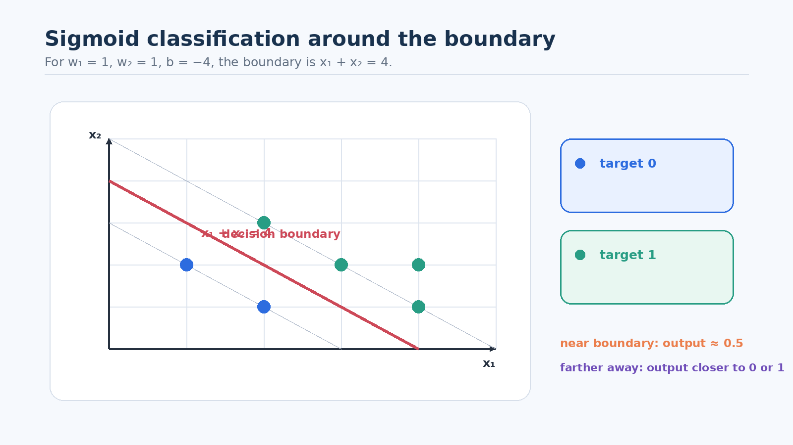

*The same linear boundary remains, but the smooth activation changes how strongly points near and far from that boundary are scored.*

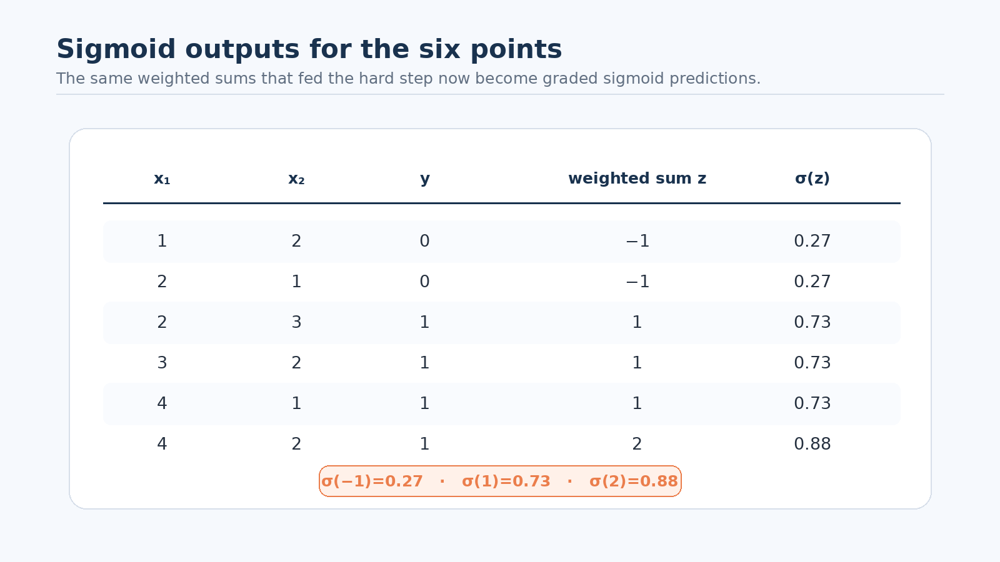

*The right-hand table is filled with sigmoid outputs such as 0.27, 0.73, and 0.88 for the six data points.*

The loss can still be formed from squared differences between the target values and these predictions. The immediate need, however, is the gradient, so the sigmoid itself must be differentiated.

## Derivative of the sigmoid

Start from σ(x)=1/(1+e−x). Using the quotient rule, the derivative is

dσ/dx = e−x / (1+e−x)².

This expression can be rearranged into a particularly useful form:

σ′(x) = σ(x)(1−σ(x)).

The algebra for showing the equality is left as a check, but this identity is what makes the next gradient expression compact.

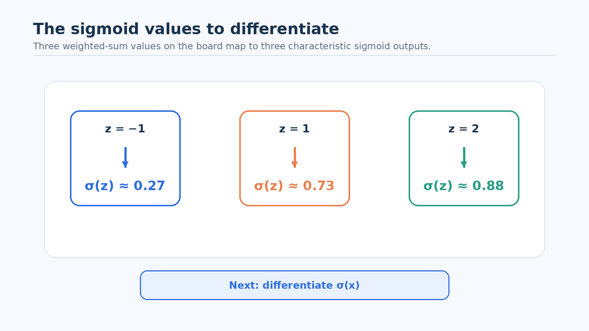

*The numerical sigmoid outputs are in place just before the derivative is derived.*

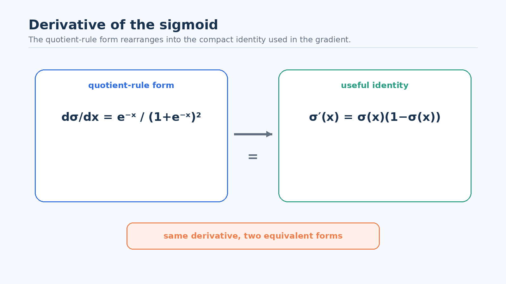

*The quotient-rule derivative is written and identified with σ(x)(1−σ(x)).*

## Gradient for the sigmoid classifier

The same general squared-error derivative is used. Consider one weight first; the other weight and the bias follow the same pattern:

∂L/∂wi = −2 Σj=1N ej · ∂f(x⃗j)/∂wi.

Now f is the sigmoid applied to the weighted sum. Passing the chain rule through the sigmoid gives the sigmoid derivative evaluated at that weighted sum, multiplied by the derivative of the weighted sum. The latter is again just the corresponding input component xj,i.

∂L/∂wi = −2 Σj=1N ej σ(xj)(1−σ(xj)) xj,i.

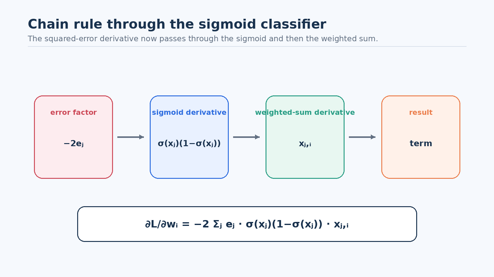

*The classifier derivative begins with exactly the same error term and chain-rule structure used for regression.*

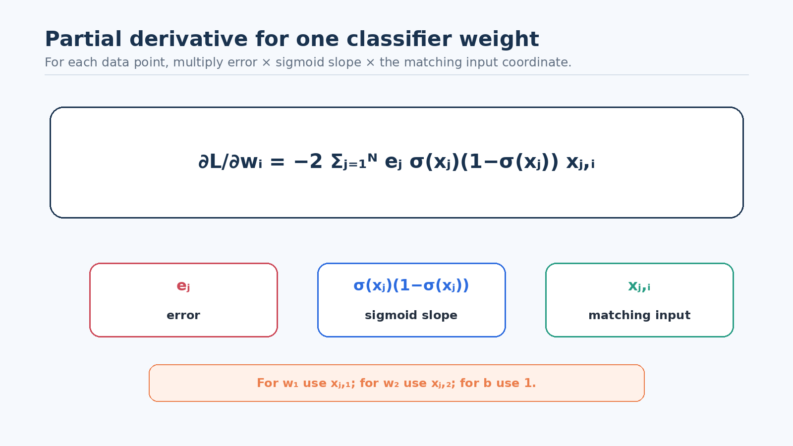

*The finished expression multiplies each error by σ(xj)(1−σ(xj)) and the input component associated with the chosen weight.*

For w1, use the first coordinate of each data point; for w2, use the second coordinate. For the bias, the weighted-sum derivative is 1, so the xj,i factor disappears. Putting the three partial derivatives together gives the gradient vector for (w1,w2,b).

Again, the gradient points toward increasing loss. Subtract a small multiple of it from the current parameters, recompute the gradient using the updated weights and bias, take another step, and continue.

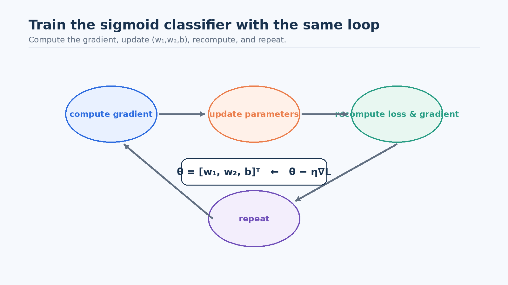

*The completed classification derivative remains on the board while the update process is tied back to the same gradient-descent loop used for regression.*

## The same idea in higher dimensions

Nothing essential in the derivation depends on having one regression input or two classification inputs. If the input has more coordinates, the neuron simply has more weights. The formula for each partial derivative stays the same; it is applied once for every weight to build the full gradient vector.

For regression, this produces linear regression using a single neuron trained by gradient descent. For classification, replacing the step activation by a sigmoid produces logistic regression—again using only a single neuron and gradient descent.

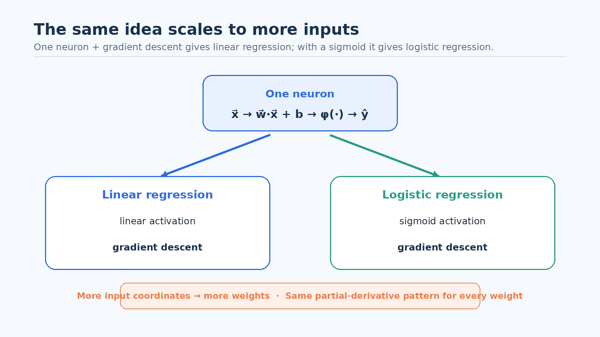

*The final board contains the regression update, the loss-surface sketch, the sigmoid activation, its derivative, and the classifier-gradient formula side by side.*

---

[Source: https://www.youtube.com/watch?v=HU91yMSTU0Y](https://www.youtube.com/watch?v=HU91yMSTU0Y)
