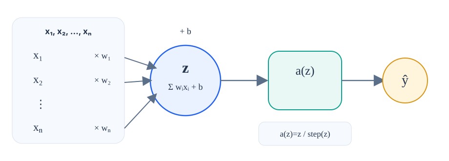
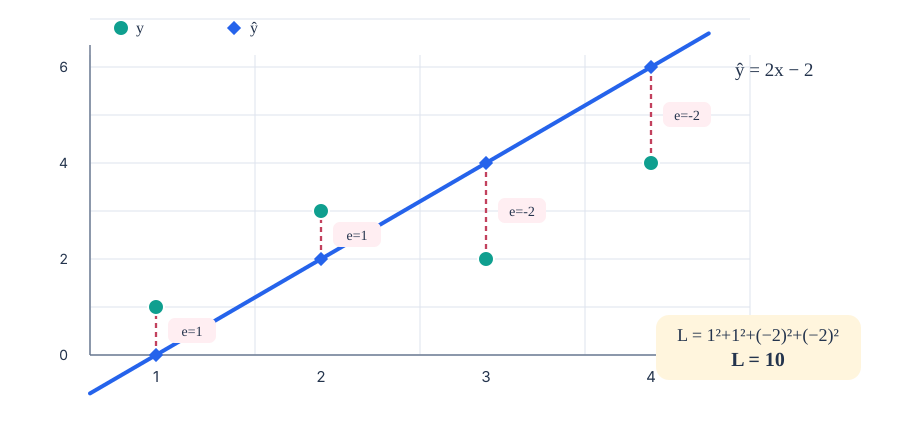
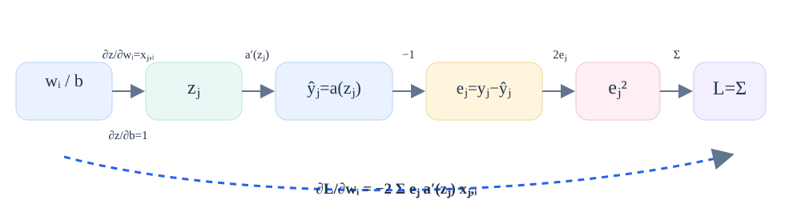
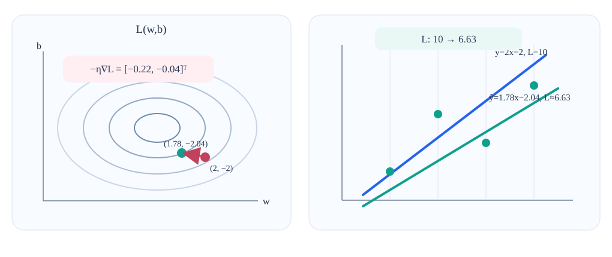
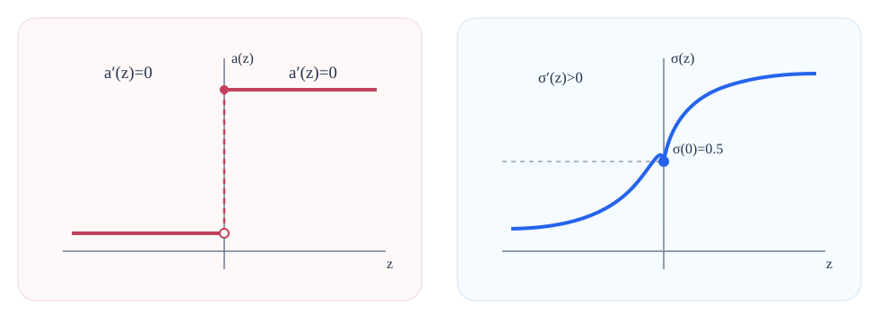
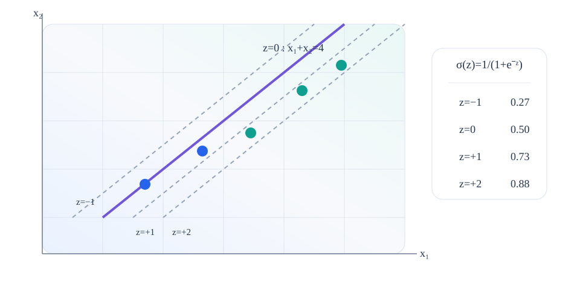
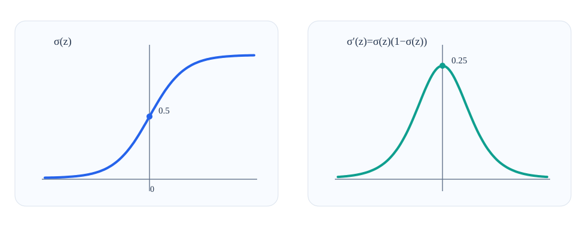
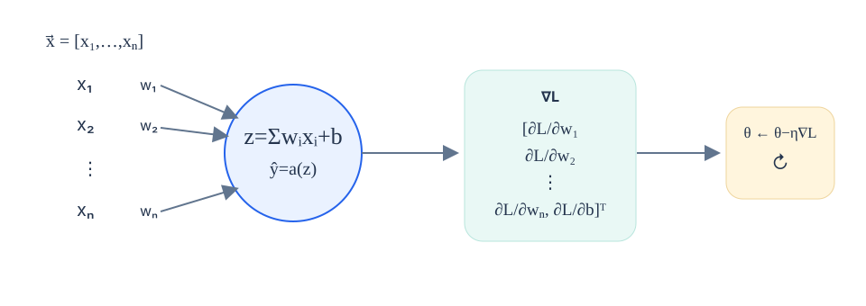

**Deep Learning · One-neuron training**

# How to train your neuron

A single neuron can already compute a line for regression or a boundary for classification. Training is the process of choosing its weights and bias so those predictions fit the data better. This lesson builds that process from one concrete regression example, turns it into gradient descent, and then carries the same reasoning into sigmoid classification.

1. Compute
2. Measure error
3. Differentiate
4. Update
5. Repeat

## 1. Start with what one neuron actually computes

Before we can train parameters, we need to separate the neuron’s fixed computation from the values that training is allowed to change.

For one input example x⃗=[x₁,…,xₙ], the neuron first forms a **weighted sum**. Each input coordinate is multiplied by its own weight, and then a bias is added:

z = w₁x₁ + w₂x₂ + ··· + wₙxₙ + b = Σᵢ wᵢxᵢ + b

The intermediate value z is often called the **pre-activation**. The neuron then applies an activation function a and produces the prediction ŷ:

ŷ = a(z)

*Read the figure left to right: the **weights and bias are the trainable parameters**; the weighted sum z and prediction ŷ are values recomputed for each example.*

### Linear activation

a(z)=z. The output can be any real number, so one neuron behaves like a linear regressor.

### Hard-step activation

The output jumps between 0 and 1. That can make a binary classifier, but the jump will later create a problem for gradient-based training.

> **Key distinction:** training does not change the neuron’s formula. It changes w₁,…,wₙ,b inside that formula.

## 2. Turn “wrong” into a number: the loss

“Make the model better” is too vague for an algorithm. We need one number that gets smaller when predictions improve.

Suppose the training set contains N examples. Example j has input vector x⃗ⱼ, target yⱼ, and prediction f(x⃗ⱼ). The lesson uses the **sum of squared errors**:

L = Σⱼ₌₁ᴺ ( yⱼ − f(x⃗ⱼ) )²

For each example, the difference yⱼ−f(x⃗ⱼ) is the signed prediction error. Squaring it does two useful things: positive and negative errors both add positive loss, and larger mistakes are penalized more strongly.

> **Why not the mean squared error?** The more familiar MSE divides the same sum by N. The video drops the factor 1/N during the derivation because it only scales every gradient component by the same constant. The learning logic is unchanged.

## 3. Make the training problem concrete with four regression points

A tiny dataset lets us see every prediction, every residual, and the exact loss before we do any calculus.

Use one-dimensional inputs x=1,2,3,4 with targets y=1,3,2,4. The current neuron has one weight and one bias:

w₁=2, b=−2 ⇒ ŷ = 2x−2

| example | x | target y | prediction ŷ | residual e=y−ŷ | e² |
| --- | --- | --- | --- | --- | --- |
| 1 | 1 | 1 | 0 | +1 | 1 |
| 2 | 2 | 3 | 2 | +1 | 1 |
| 3 | 3 | 2 | 4 | −2 | 4 |
| 4 | 4 | 4 | 6 | −2 | 4 |
| **sum** |  |  |  |  | **10** |

*The dashed vertical gaps are the residuals. They are not all the same sign, but after squaring they contribute 1+1+4+4=10 to the loss.*

> **The training question is now precise** We are currently at L=10. Which small changes to w₁ and b will make the next loss smaller?

## 4. Derivatives turn that question into a direction

A derivative tells us how a quantity responds to a small change. With several trainable parameters, we need one derivative for each parameter.

A **partial derivative** such as ∂L/∂wᵢ asks: if we nudge only wᵢ while holding the other parameters fixed, which way does the loss move and how strongly? Collecting all partial derivatives gives the **gradient**.

Rather than differentiating only the four-point example, derive the result for an arbitrary weight wᵢ. For one training example the dependency is nested: the parameter changes zⱼ, which changes the prediction, which changes the residual, which changes the squared error. The **chain rule** multiplies those local effects along the path.

*The chain rule is easier to remember as a path: wᵢ → zⱼ → ŷⱼ → eⱼ → eⱼ² → L. Multiply the derivative on each link, then sum over the training examples.*

∂L/∂wᵢ = −2 Σⱼ eⱼ · a′(zⱼ) · xⱼ,ᵢ

∂L/∂b = −2 Σⱼ eⱼ · a′(zⱼ)

Two small facts explain the final factors. In the weighted sum zⱼ=Σᵢwᵢxⱼ,ᵢ+b, only one term contains the particular weight wᵢ, so ∂zⱼ/∂wᵢ=xⱼ,ᵢ. The bias is added directly, so ∂zⱼ/∂b=1.

> This is the central reusable formula of the lesson. **The only factor that changes when we change activation functions is a′(z).**

## 5. Apply the general gradient to the linear regressor

For a linear activation, the activation derivative is simply 1, so the general expression becomes a short numerical calculation.

Because a(z)=z, we have a′(z)=1. Using the residuals [1,1,−2,−2] from the table:

∂L/∂w₁ = −2[1·1 + 1·2 + (−2)·3 + (−2)·4] = 22

∂L/∂b = −2[1 + 1 − 2 − 2] = 4

∇L = [ 22, 4 ]ᵀ

The gradient points toward the *steepest increase* of loss in parameter space. That wording matters: if we want the loss to go down, we must move in the opposite direction.

## 6. Gradient descent takes a small step downhill

A point in parameter space represents one complete model. Changing the point changes the line the neuron draws in data space.

For this regressor, the parameter space has two axes: w₁ and b. Every pair (w₁,b) defines one line ŷ=w₁x+b and therefore one loss value on the four training points. If loss is imagined as height above the parameter plane, the gradient points uphill.

**Gradient descent** updates the parameters by subtracting a small multiple of the gradient:

[ w₁, b ]ᵀ_new = [ w₁, b ]ᵀ_old − η∇L

The scalar η (eta) is the **step size**, often called the learning rate. With η=0.01:

w₁ = 2 − 0.01·22 = 1.78, b = −2 − 0.01·4 = −2.04

*The left panel shows the parameter move; the right panel shows what that same move does to the regression line. The slope decreases noticeably, the intercept moves slightly downward, and the loss drops from 10 to about 6.63.*

This closes the loop that the derivative was designed for: after one gradient step, the model is already better on the training set. We now recompute predictions, recompute the gradient at the new point, take another step, and continue.

> **Why must the gradient be recomputed?** The gradient describes the slope *at the current parameter values*. Once the parameters move, the local slope generally changes too.

## 7. Classification creates one new obstacle: the hard step has no useful slope

The training machinery we just built depends on derivatives. A hard 0/1 step breaks that machinery.

A hard-step activation is constant on each side of its jump. Its derivative is therefore zero almost everywhere, and at the jump the ordinary derivative is undefined. If a′(z)=0, the general gradient formula collapses to zero and provides no useful direction for moving the weights.

*The replacement must preserve the useful “near 0 versus near 1” behavior while giving us a smooth, differentiable transition. The sigmoid does exactly that.*

σ(z) = 1 / (1 + e−z)

When z is very negative, the output approaches 0. When z is very positive, it approaches 1. At z=0, the output is exactly 0.5. Unlike the hard step, the middle region changes smoothly.

## 8. The sigmoid keeps the same decision boundary but softens the score around it

The geometric boundary still comes from the weighted sum. The activation only changes how sharply we turn that weighted sum into an output.

Use the two-input neuron from the lesson: w₁=1, w₂=1, and b=−4. Its pre-activation is

z = x₁ + x₂ − 4

The points satisfying z=0 lie on the line x₁+x₂=4. That is the decision boundary. A hard step would jump from one class value to the other exactly there. Sigmoid keeps the same boundary but gives intermediate scores near it.

*Parallel lines have the same weighted sum z, so every point on the same line receives the same sigmoid score. The lesson’s reference values are σ(−1)≈0.27, σ(1)≈0.73, and σ(2)≈0.88.*

> **What changed—and what did not?** The boundary z=0 did not move. What changed is the output around the boundary: a smooth score now tells us whether a point is barely or strongly on one side.

## 9. Differentiate the sigmoid so it can participate in the same chain rule

We now need the one missing ingredient in the general gradient formula: a′(z) for the sigmoid.

Starting from σ(z)=1/(1+e−z), differentiation gives

σ′(z) = e−z / (1+e−z)²

The useful simplification is to recognize the same denominator twice:

σ(z) = 1/(1+e−z) and 1−σ(z)=e−z/(1+e−z)

σ′(z) = σ(z)[1−σ(z)]

*The derivative is expressed using a quantity the neuron already computed: σ(z). That makes the classifier gradient compact and easy to reuse.*

The right-hand plot also gives the correct intuition: the sigmoid is most sensitive to small changes around its transition region and much less sensitive when it is already near 0 or 1.

## 10. Reuse the same gradient formula for the sigmoid classifier

Nothing about the loss or gradient-descent update has changed. We only substitute the sigmoid derivative for the activation derivative.

The general result was

∂L/∂wᵢ = −2 Σⱼ eⱼ · a′(zⱼ) · xⱼ,ᵢ

For sigmoid, a′(zⱼ)=σ(zⱼ)[1−σ(zⱼ)]. Therefore:

∂L/∂wᵢ = −2 Σⱼ eⱼ · σ(zⱼ)[1−σ(zⱼ)] · xⱼ,ᵢ

∂L/∂b = −2 Σⱼ eⱼ · σ(zⱼ)[1−σ(zⱼ)]

**eⱼ** (current prediction error) × **σ(zⱼ)[1−σ(zⱼ)]** (local sigmoid slope) × **xⱼ,ᵢ** (input attached to weight wᵢ) × **weight-gradient contribution** (then sum over examples and multiply by −2)

This factorization is the important conceptual picture. A training example changes a particular weight strongly only when three things line up: there is error to correct, the activation has useful slope at that example, and the corresponding input coordinate carries that weight into the weighted sum.

## 11. The training loop is now the same for regression and classification

Once we can differentiate the chosen activation, training becomes a repeated four-step cycle.

1. **Predict** — Compute each z and prediction ŷ.

2. **Measure** — Compute residuals and the current loss L.

3. **Differentiate** — Compute one partial derivative for every weight and for the bias.

4. **Update** — Move parameters by −η∇L, then return to step 1.

> **What “learning” means here** The neuron does not invent a new computation each round. Its computation stays the same; the numerical values of the weights and bias are repeatedly adjusted so the loss becomes smaller.

## 12. More input dimensions only make the gradient longer

The derivation did not depend on having exactly one regression input or exactly two classification inputs.

If an input vector has more coordinates, the neuron simply has more weights. Every weight gets its own partial derivative, and those derivatives are stacked into a larger gradient vector. The bias still contributes one additional component.

*Increasing the input dimension changes the *length* of the parameter and gradient vectors, not the training logic.*

With a linear activation, this is a gradient-trained linear regressor. With a sigmoid activation, it has the form of logistic regression. In this lesson both are trained with the same squared-error setup so the shared chain-rule structure stays visible.

## The central idea to carry forward

- A neuron first computes a weighted sum and an activation.
- A loss converts prediction quality into one number.
- The gradient tells how that loss changes with every trainable parameter.
- Because the gradient points uphill, gradient descent moves in the opposite direction.
- The activation function matters during training because its derivative becomes one link in the chain rule.

---

[Source: https://www.youtube.com/watch?v=HU91yMSTU0Y](https://www.youtube.com/watch?v=HU91yMSTU0Y)
