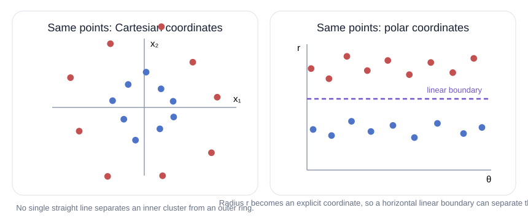

**Deep Learning • DL 05**

# The Data Analysis Pipeline

A neural network is never the whole machine-learning system. Data must be gathered, cleaned, represented numerically, passed through a model, and then converted into a useful prediction. This lesson follows that entire path—from observations of the world to predictions about the world.

**The big picture**

## A model is one stage inside a larger system

In a deep learning class, it is natural to focus intensely on neural networks. But a neural network—or any machine-learning model—is always part of a larger system. Before data can arrive at the model, it must be collected and processed into a form the model can understand. After the model produces an output, that output often still needs decoding, presentation, validation, or other analysis.

The useful metaphor is a **data analysis pipeline**: a sequence of stages through which information passes. The overall goal is to turn **observations of the world** into **predictions about the world**. Thinking in pipeline form forces us to notice not just the model, but also what enters it, what leaves it, and what assumptions are introduced at every handoff.

1. Observations

2. **Collect & clean** — amount • coverage • bias • missing values • labels

3. **Pre-process** — numerical encoding • representation • normalization • train/test split

4. **Neural network** — or another machine-learning model

5. **Post-process & analyze** — decode • de-normalize • present • validate • tune

6. Predictions

What data do we have? / What numbers will the model receive? / Learn a mapping / Turn model output into something useful / Use the result

*The network is deliberately drawn as one box among several: good predictions depend on every handoff, not only on the model.*

Different problems will use different versions of this pipeline. A standardized or simulated data set may let us skip parts of collection or cleaning. A real-world application usually cannot. The rest of the lesson walks through the stages that commonly appear.

**Stage 1**

## Data collection: get the right observations

Machine learning requires data to train on, so the first practical question is: *what observations can we collect that actually describe the problem we want the model to solve?* Sometimes the data set already exists. For a new application, however, collection is part of the modeling problem.

### How much data?

Deep learning has benefited enormously from training on very large data sets, so **enough data** matters. But there can also be **too much data** for the computing resources available. Especially if we are still exploring what is possible, working first with a smaller, manageable subset can be much more practical than processing everything immediately.

### Representative data: coverage, rare cases, and bias

A data set is **representative** when it reflects the kinds of examples and conditions the model will face in the real problem. For a classifier, a **class** is one of the categories the model must distinguish, and every required class needs adequate coverage.

Coverage alone is not enough. An **outlier** is an unusual example compared with most of the data; some outliers are exactly the cases a deployed system must handle correctly. The lesson’s example is computer vision for a self-driving car: the system should be able to recognize an Amish buggy and understand that its motion differs from ordinary car traffic. A data set can be large and still omit that important situation.

**Systematic bias** is a repeated mismatch between the collected data and the wider world. If almost every training photograph is taken on a sunny day, an image classifier may struggle when the weather is cloudy. In health or education, a model may also learn patterns that look individual in the data but actually reflect broader social structures. Identifying and correcting bias is therefore a difficult, ongoing research problem—not a box that can be checked once.

#### Coverage

All classes the classifier must recognize need representation.

#### Important rare cases

ordinary traffic + an Amish buggy

A rare example can matter greatly even if it appears infrequently.

#### Systematic bias

Too many sunny examples → trouble on cloudy cases

A repeated imbalance in collection conditions can carry into the model.

*“Representative” is broader than simply “large”: the data must cover the kinds of situations the deployed model will actually encounter.*

> **Why cleaning comes next:** even a well-chosen collection can contain missing measurements, irrelevant fields, inconsistent shapes, or labels that do not line up with the intended task. Before asking a neural network to learn, we need to decide what a valid training example actually looks like.

**Stage 2**

## Data cleaning: make examples consistent and meaningful

A **feature** is one measurable or represented aspect of an example—such as blood pressure in a health record or a pixel value in an image. Cleaning asks whether the features and labels in the collected data are usable enough for learning.

### Missing features

Some features may exist for one example and be absent for another. If most health records contain blood-pressure readings but some do not, we have two separate decisions: whether blood pressure should remain part of the model input, and, if it remains, how the missing cases should be represented.

### Extraneous features

Some stored fields may have no meaningful connection to the target problem. A patient ID number, for example, may distinguish records for administrative purposes without representing a real property we want the model to learn. Including such a field can add randomness or invite spurious correlations instead of helping the model discover the underlying relationships.

### Dimension mismatch

A model also needs a consistent input structure. Images in one data set may have different resolutions or aspect ratios. That does not mean they are unusable; it means the pipeline needs an explicit strategy for turning those differently shaped examples into inputs a single model can accept.

### Adequate labels for supervised learning

**Supervised learning** trains a model from examples paired with desired targets or **labels**. Labels therefore have to mean exactly what we want the model to learn. The lesson’s example is American Sign Language (ASL). If we only have video of signing, producing accurate labels for every segment may require enormous human effort. If the video shows an interpreter and we also have a transcript of the spoken English, that transcript still may not correspond one-to-one with what was signed. A convenient label is not automatically a correct label.

#### Missing feature

`patient_042: blood_pressure = —`

→ Decide whether the feature stays, and how missing cases will be represented.

#### Extraneous feature

`patient_ID = 817392`

→ Ask whether this number carries information about the real problem. If not, do not let it distract the model.

#### Dimension mismatch

`image A: 640×480 / image B: 1024×1024`

→ A single model expects a consistent input structure, so differing sizes/aspect ratios require a deliberate strategy.

#### Adequate label

`ASL video ⇄ English transcript?`

→ For supervised learning, the target must correspond to what the model is actually supposed to learn.

*Cleaning is a set of modeling decisions, not a single “make the data neat” operation. Each mismatch changes what the model can safely learn from.*

> **The handoff to pre-processing:** after collection and cleaning, we may finally have examples that represent the problem well. The next question is different: how should those examples be encoded so a neural network can learn from them effectively?

**Stage 3**

## Pre-processing: turn usable data into effective model input

Neural networks operate on numbers. More precisely, they receive structures such as a **vector** (an ordered list of numbers) or a **matrix** (a rectangular grid of numbers). Pre-processing converts the cleaned examples into that numerical form and, when useful, changes the representation or scale.

### Numerical encoding is not just “assign some numbers”

The difficulty depends strongly on the data type. Images are comparatively convenient because computers already store them as arrays of pixel values. Text is different. Character encodings such as ASCII do convert letters into numbers, but those numbers are storage codes—not a representation designed to expose linguistic meaning to a neural network.

#### Images already arrive as numbers

```
20 55 90 130
45 85 140 190
70 120 175 225
110 155 205 250
```

A computer already stores an image through pixel values, so the native representation is naturally close to what a neural network needs.

#### Character codes are numbers, but not a useful meaning-space

```
"cat" → [99, 97, 116]
"dog" → [100, 111, 103]
```

ASCII assigns numbers to characters so computers can store text. Those numbers do not, by themselves, express the relationships in language that a model needs to learn. The same text therefore needs a more useful numerical representation.

*The question is not merely “can the data be written as numbers?” but “do those numbers expose useful structure for the learning problem?”*

This leads to the next idea: sometimes the same underlying observation becomes much easier for a simple model to learn after we change how it is represented.

**Pre-processing • representation**

## Alternate representations can make a hard boundary simple

Start with a linear classifier. In two dimensions, a **linear decision boundary** is a straight line used to separate one class from another. If the data forms an inner group surrounded by an outer ring, no single straight line in the original (x₁, x₂) coordinates can separate the classes cleanly.

But the same point can be described in another coordinate system. In **polar coordinates**, each point is described by its distance from the origin, r, and its angle, θ. The conversion is:

<p align="center" dir="ltr"><font size="5">r = √(x₁² + x₂²) and θ = atan2(x₂, x₁)</font></p>

Once r is explicit, “inner” versus “outer” can be separated by a simple threshold on radius. In an (r, θ) plot, that threshold is a straight horizontal line—exactly the sort of boundary a linear model can represent.



**Original description** — (x₁, x₂) — two coordinates per point

**Expanded description** — (x₁, x₂, r, θ) — four features describing the same point

*Nothing about the observations changed. Only their representation changed — and a simple linear separator became possible.*

For another data set, neither coordinate system by itself might make the classes easy to separate. We can then **expand the representation**: instead of replacing (x₁, x₂), keep those two features and add r and θ. The point has not become a different observation; we have simply described it with four numerical features instead of two. As problems become more complex, choosing or constructing a useful representation can matter enormously.

**Pre-processing • scale**

## Normalization: put numerical values on a convenient scale

Numerical representation raises another issue: **scale**. A data set might contain pixel values from 0 to 255, counts of people, or monetary values that are much larger. The lesson emphasizes that neural-network computations are often easier to work with when input values occupy a more compact numerical range.

**Normalization** means transforming the original values to a more convenient scale. For a simple 8-bit pixel example, dividing by 255 maps the interval from 0–255 to approximately 0–1:

<p align="center" dir="ltr"><font size="5">x′ = x / 255 →</font></p>

0 → 0 / 128 → 0.502 / 255 → 1

*A concrete pixel example of “squashing” a range. Other data may use other normalization rules; the lesson’s main point is to put values on a scale that is convenient for the network, then reverse the transform later when real-world units are needed.*

The transform belongs to the pipeline. If the model predicts a normalized quantity but the final user needs the original real-world scale, post-processing must **de-normalize**—apply the inverse transformation—before presenting or using the result.

**Pre-processing • evaluation setup**

## Training set and test set: preserve unseen data

A model can fit the examples it has already seen and still fail on new ones. To find out whether the learned pattern transfers beyond the training examples, some data must be kept away from the training process and used later for evaluation.

The **training set** is the portion used to fit the model. The **test set**, in the terminology used in this lesson, is held back so the model can be evaluated on examples it did not train on.

#### Hold back data before training

training portion — the model is allowed to learn from this / held out

**Train the model** — fit parameters using the training data

**Evaluate later on unseen data** — ask whether the learned behavior carries beyond the examples it saw

*The essential safeguard is separation: evaluation data must not simply be the same examples used to fit the model. The details of splitting and tuning are deferred to the next lesson.*

The next lesson develops the details of data splitting, validation, and model tuning. At this point, the crucial idea is simply that honest evaluation requires genuinely unseen data.

**Stage 4**

## Post-processing: turn raw model output into the prediction you actually need

The network’s output is usually numerical, but the thing we care about may be a category, a value in real-world units, a visualization for a person, or an input to another algorithm. **Post-processing** bridges that gap.

### Decode categorical outputs

Suppose the desired prediction is one label among several categories. During training, a categorical label can be encoded as a **one-hot vector**: one component corresponds to each possible class, with the correct class marked by 1 and the others by 0. A model output may be close to that target rather than exactly equal to zeros and ones, so decoding selects the corresponding predicted label.

**Categorical label** — class C

**Training target** — [0, 0, 1]

**Decoded prediction** — class C

*One-hot encoding gives the network a numerical target. Post-processing turns the output vector back into the class label a person or downstream system actually needs.*

### Restore scale and communicate confidence

If a target was normalized before training, the prediction may need to be de-normalized. The lesson also points out that post-processing can communicate how confident the system is in different predictions. The whiteboard names **confidence intervals** as one possible form of uncertainty information: a range used to express how uncertain an estimate is. The exact method depends on the task; the general question is what information the receiver needs in order to use the prediction responsibly.

### Design the output for its next destination

A prediction interpreted by a person has different needs from a prediction passed to another computation. A doctor-support system may need plots or other visualizations that make the model’s result understandable. A self-driving system may need the detected object encoded in exactly the format expected by the next decision-making component.

**model prediction**

**For a human** — Example from the lesson: support a doctor making a diagnosis. **Post-processing priority:** make the prediction comprehensible—plots, visual summaries, useful confidence information.

**For another computation** — Example from the lesson: a detected vehicle becomes part of a self-driving car’s decision process. **Post-processing priority:** use the representation and structure required by the next algorithmic step.

*“Useful output” depends on who—or what—receives the prediction next.*

**Stage 5**

## Analysis: check the system and improve it

After training, the work is not finished. We need to ask whether the model is working and what changes might improve it. The lesson’s whiteboard lists **validation**, **hyper-parameter tuning / model selection**, **statistical summarization**, and **mathematical modeling** as examples of analysis.

The held-back data created during pre-processing becomes useful here: it gives us evidence about how the trained model behaves on examples that were not used to fit it. This is an important pipeline connection—an earlier design choice determines what analysis is possible later.

> **The pipeline is connected, not a set of independent boxes.** Collection determines what the model can ever learn. Cleaning determines which signals are trustworthy. Representation can make a simple model possible or impossible. The split determines whether later evaluation is meaningful. Post-processing determines whether the output is actually usable.

### A final way to read the pipeline

- **1. What did we observe?** Choose data that represents the real task, including important rare cases and possible sources of bias.

- **2. What is a valid example?** Resolve missing, irrelevant, mismatched, and poorly labeled data.

- **3. What numbers will the model see?** Choose an encoding, representation, scale, and train/test split.

- **4. What does the model output mean?** Decode or de-normalize it and present it in a form useful to the next human or computation.

That is the central lesson: deep learning is not only about the neural network. The network sits inside a sequence of practical decisions that begins with observations and ends with predictions that can be evaluated and used.

---

[Source: https://www.youtube.com/watch?v=Usl7m15bsT0](https://www.youtube.com/watch?v=Usl7m15bsT0)
