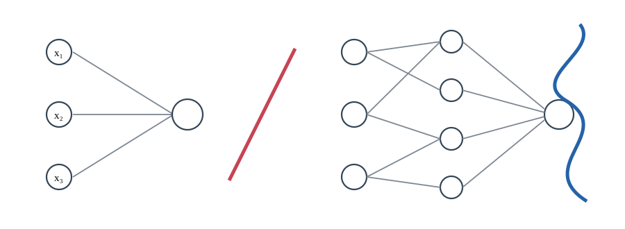
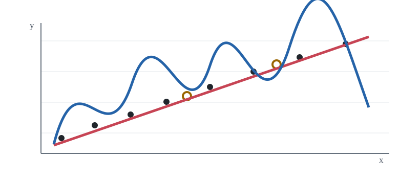
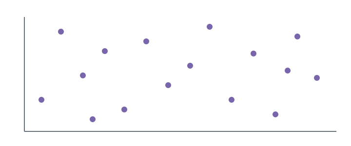

**Deep Learning · Lesson 06**

# Model Selection & Out-of-Sample Validation

In machine learning, as in science, a model is evaluated by making new predictions and testing them on new data. This lesson develops the practical logic for using the data we have to compare models, tune hyperparameters, detect overfitting, and measure whether a trained model can generalize beyond the examples it saw during training.

## Model selection starts by asking what a model is capable of representing

Everything in this lesson falls under **model selection**: choosing among different machine-learning approaches and deciding which one is most suitable for a particular problem. But before comparing models experimentally, we need to know what options are even possible. That leads to the model’s **hypothesis space**.

For a given machine-learning model, the hypothesis space is the set—or type—of functions the model could represent. Training does not create an arbitrary function from nothing. It searches among the functions the model is capable of expressing and adjusts the model so that one of those functions represents the data well.

#### What creates a model’s hypothesis space?

**Input representation** — How the examples are encoded; this can fix the number of input dimensions.

**Required output** — Classification requires a class-like output; regression requires a continuous value.

**Model / algorithm** — The model class restricts which mappings from inputs to outputs can be represented.

> **Result:** the model can search only among functions that satisfy all of these constraints.

*The hypothesis space is not “every possible function.” It is the set of functions that remain possible after the problem representation and the chosen model impose their constraints.*

The problem itself already narrows the possibilities. The input representation can determine how many input dimensions the model must accept. The required output also matters: in **classification**, the output represents a class or category, while in **regression**, the output is a continuous numerical value. After those problem constraints, the chosen learning algorithm imposes still more restrictions on the possible input-to-output mappings.

#### Same input and output format, different flexibility

**Single sigmoid neuron** — With three inputs it still produces a linear decision boundary—a plane in three-dimensional input space.

**Larger neural network** — It can keep the same inputs and output while representing more complicated ways of dividing the input space.

*The number of inputs and outputs does not by itself determine the hypothesis space. The internal model structure matters too.*

A single sigmoid-neuron classifier is a useful example of a rigid hypothesis space. With three input variables it can only create a **linear decision boundary**—a plane that separates the three-dimensional input space. A larger neural network can keep the same three inputs and the same classification output while representing much more complicated boundaries. Thinking about the hypothesis space therefore gives us a first check on whether a model is even flexible enough for the problem we want to solve.

## After choosing a model family, separate parameters from hyperparameters

> **Where the lesson goes next:** choosing a model family does not finish the selection problem. Even within one family, some quantities are learned from data and others must be chosen around the training process. Those two kinds of choices need different treatment.

**Model parameters** are the quantities that training updates from the data. That is the central idea of machine learning: we do not know the exact function we want in advance, so we let the data determine parameter values. In the single-neuron models used earlier, the parameters are the weights and the bias. In a larger neural network the idea is unchanged—there are simply many more weights and biases, distributed across the neurons.

**Hyperparameters** are tunable choices that are not themselves updated by gradient descent. The step size, also called the **learning rate**, is one example: it controls how far gradient descent moves in the negative-gradient direction at each update. The number of training iterations is another: the optimizer may need many updates to converge, but the planned number of iterations is a choice we make around the training procedure.

#### Two levels of choice: parameters inside training, hyperparameters outside training

INNER LOOP — learned from data — **Model parameters** — Start with weights and bias values → Gradient descent uses the training data → Weights and biases are updated

OUTER LOOP — chosen or tuned — **Hyperparameters** — Choose learning rate, iteration count, architecture, activation… → Train a model with those choices → Evaluate the result and try another setting

*Training adjusts parameters. Hyperparameter tuning changes the conditions under which training happens.*

As models become more complicated, the list of hyperparameters grows. For a neural network, choices can include the number of nodes, how the nodes are connected, and which activation function hidden nodes use. Some hyperparameters have large effects; others matter only on particular problems. Either way, they create additional options that must be compared.

## Model selection and hyperparameter tuning are fundamentally the same experimental problem

Suppose several model classes look plausible, or several hyperparameter values might work. We need a systematic way to try those options and determine which is more effective. **Model selection** asks which plausible model class represents the data best. **Hyperparameter tuning** asks which hyperparameter settings lead to the best result.

The boundary between those labels is not always clean. A different neural-network architecture might be described as a different class of model. In another context, changing the number and connectivity of nodes might simply be described as changing hyperparameters within one model family. The name is less important than the experiment we must perform.

#### Model selection becomes an experiment

**Choose one candidate** — A model class or a set of hyperparameter values

**Train on the training set** — Only model parameters are fit to these examples

**Evaluate on unseen data** — Measure how well the trained candidate generalizes

> **Then compare candidates.** The same experimental logic applies whether the “option” is called a different model or a different hyperparameter setting.

*This is why model selection and hyperparameter tuning are fundamentally the same kind of problem in the lesson: both require comparing plausible choices by experiment.*

## The key idea: keep some data out of training so you can test generalization

> **What problem remains?** We cannot decide among candidates by looking only at how well they fit the same data used to train them. The real goal is performance on new examples, so we need an experiment that imitates that situation.

Split the available dataset—including both inputs and their target outputs—into a **training set** and a separate portion that the model does not train on. Train each candidate only on the training portion, then use the held-out portion for **out-of-sample validation**. “Out of sample” here means that those examples did not participate in fitting the model parameters.

#### A simple held-out experiment

Training ≈ 80% / Held out ≈ 20%

**Training portion** — Used to fit the weights, biases, and other learned parameters.

**Held-out portion** — Not used to fit parameters; it tests predictions on examples the model did not see during training.

*An 80/20 split is a rule of thumb, not a law. Its purpose is to reserve enough unseen data to make a meaningful generalization check.*

For example, suppose the choice is between two learning rates. Train one model on the training set with the first learning rate and a second model on the same training set with the other learning rate. Then evaluate both trained models on the held-out examples. Now the comparison asks the question we actually care about: *which choice makes better predictions on data it did not see during training?*

This is why generalization matters so much. If no new data were ever going to arrive, there would be little reason to learn a model for prediction in the first place. The purpose of the learned model is to make good predictions on new cases. Reserving data lets us test that purpose directly instead of merely assuming that a low training error will carry over to new examples.

## Overfitting shows why the held-out experiment is necessary

**Overfitting** means that a model has become too specific to the particular training set. Consider one-dimensional inputs and one-dimensional outputs represented as points. Two candidate models are fit to the same training observations.

#### Why training error alone can be misleading

**If you judge only the training set** — The blue curve can look ideal because it passes through every observed training point.

**If you judge the held-out points** — The held-out points reveal which curve actually predicts unseen examples more closely.

training points · held-out points · simpler red model · blue model fitted to every training point

*The exact curves are illustrative, but the lesson’s logic is experimental: leave data out, train without it, and use those withheld points to test which candidate generalizes better.*

If the only goal were to reproduce the training set, the highly curved blue model could look perfect because it passes through every training point. The simpler red model has visible training error. But for a new input that was not part of training, the red model may give the better prediction. The blue curve has contorted itself to match the details of the observed sample.

That intuition is useful, but the lesson’s stronger point is that intuition is not enough. Instead of debating which curve “looks more reasonable,” randomly leave some points out. Train both candidate models on the remaining points, then measure which one predicts the points that were held back more accurately. That turns the generalization question into an experiment.

> **Rule of thumb from the lesson:** an 80/20 split—roughly 80% for training and 20% held out—is a sensible starting point. It is not universally optimal; some datasets and models require a different split.

## When tuning hyperparameters, find the useful range before searching finely

The comparison does not have to involve only two candidates. We can evaluate many values of a hyperparameter. Sometimes it is practical to test every value in a small, discrete set. But with several hyperparameters, trying every combination becomes expensive very quickly.

The recommended first move is therefore to establish a **plausible range** for each important hyperparameter. Suppose the current learning rate is 0.01. Before testing tiny changes around that number, change it by a factor of ten: try values such as 0.001, 0.01, and 0.1. A factor-of-ten change is an **order-of-magnitude** change. If even these large changes barely affect the result, fine-grained differences inside that range are unlikely to deserve much attention yet.

It can even be useful to push a parameter far enough that training behaves dramatically differently—or effectively “breaks.” That helps locate the bounds of the region worth exploring.

#### Search broadly before tuning finely

0.0001 / 0.001 / 0.01 / 0.1 / 1

**Systematic grid** — A regular grid can spend many trials changing every coordinate in the same predetermined pattern.

**Random combinations** — When several hyperparameters interact, random sampling reaches more diverse combinations quickly and can reveal a promising region for a finer search.

*The lesson recommends first pushing each important hyperparameter across a broad range—even far enough to see training behave very differently—then concentrating the search where it matters.*

If several hyperparameters interact, changing one at a time can miss useful combinations. First establish a sensible range for each parameter, then sample combinations from those ranges. Randomization lets you cover a more diverse set of combinations quickly and can help identify regions where a finer search is worth the cost.

## With enough tuning, you can overfit the held-out set too

> **Why the simple two-way split eventually stops being enough:** every time we compare settings on the same held-out data and choose the winner, information from that held-out set influences the next choice. With many trials, the selection process can adapt to that particular set.

This is a subtler form of overfitting. The individual model parameters were never trained on the held-out examples, but the *model-selection decisions*—which architecture, which learning rate, which hyperparameter combination—are being optimized according to performance on those examples. The held-out set is no longer completely independent of the decisions that produced the final model.

#### When tuning is extensive, use three separate roles

Training / Validation / Test

**Training set** — Fits model parameters.

**Validation set** — Chooses the model class and hyperparameters. It may be consulted repeatedly during tuning.

**Test set** — **untouched until the end** Checks the final selected model on data that played no role in training or selection.

*Repeatedly choosing settings because they score well on one held-out set makes those choices adapt to that set. The validation set absorbs that selection pressure; the test set stays fresh for the final check.*

This motivates a three-way split. The **training set** fits the model parameters. The **validation set** is used to compare model classes and hyperparameters during selection. The **test set** stays untouched until the final choice has been made, so it can check whether that final selected model still generalizes.

> **Terminology bridge:** earlier, with only one held-out portion, that portion can reasonably be called the test set. Once it is consulted repeatedly for tuning, it is better understood as a validation set, and a new untouched test set is reserved for the final evaluation.

## Cross-validation reduces dependence on one particular random split

Sometimes we do not want our conclusion to depend too heavily on one specific random division of the data. Cross-validation repeats the train/held-out experiment using different subsets and averages the resulting performance. In that way, different parts of the dataset take turns being unseen evaluation data.

The lesson illustrates **four-fold cross-validation**. Divide the data into four equal-sized subsets. On the first run, train on three quarters and hold out the remaining quarter. Repeat the process four times so that each quarter is held out exactly once.

#### Four-fold cross-validation: every quarter is held out once

|   | Fold 1 | Fold 2 | Fold 3 | Fold 4 |
| --- | --- | --- | --- | --- |
| Run 1 | held out | train | train | train |
| Run 2 | train | held out | train | train |
| Run 3 | train | train | held out | train |
| Run 4 | train | train | train | held out |

average score = (s₁ + s₂ + s₃ + s₄) / 4

Each s is the out-of-sample score from one run. Averaging reduces dependence on one lucky or unlucky split.

*Cross-validation reuses the data efficiently, but it costs more computation because the model must be retrained for every fold.*

Average the four out-of-sample scores. That makes it less likely that an apparently strong or weak result was caused mainly by one unusually easy or difficult held-out subset. The tradeoff is computation: four-fold cross-validation requires training the same candidate four times on four slightly different training sets.

For that reason, cross-validation is not automatically the best choice for every project. Often a simple training/test split—or, when there is substantial tuning, a training/validation/test split—is sufficient. The important improvement is the underlying principle: **do not consume all available data for training and leave yourself with no independent way to test whether the model generalizes.**

**Fit** — Use training data to learn model parameters.

**Select** — Use held-out/validation data to compare model and hyperparameter choices.

**Verify** — When selection is extensive, keep a final test set untouched until the end.

---

[Source: https://www.youtube.com/watch?v=fBP0-OhOPz0](https://www.youtube.com/watch?v=fBP0-OhOPz0)
