**Feed-Forward Neural Networks · DL 07**

# Computing with Neural Networks

We are moving from individual neurons to multi-layer neural networks. The central questions are: **How does a network compute a prediction?** and **why do hidden layers help at all?** The lesson answers those questions by following one 4–3–3–2 feed-forward network from its local neuron computations all the way to the loss and the gradient used for training.

**Compute** — Follow activations from input to output.

**Represent** — See why non-linear hidden units add expressive power.

**Train** — Collect all weights and biases into one parameter vector and define its loss.

## From one neuron to a network

A multi-layer network does not introduce a new kind of computation inside each node. Every **non-input neuron** still performs the same two operations as a single neuron: it forms a weighted sum, then passes that number through an activation function. What changes is where the inputs come from. Instead of coming directly from the data, they can be activations produced by neurons in the preceding layer.

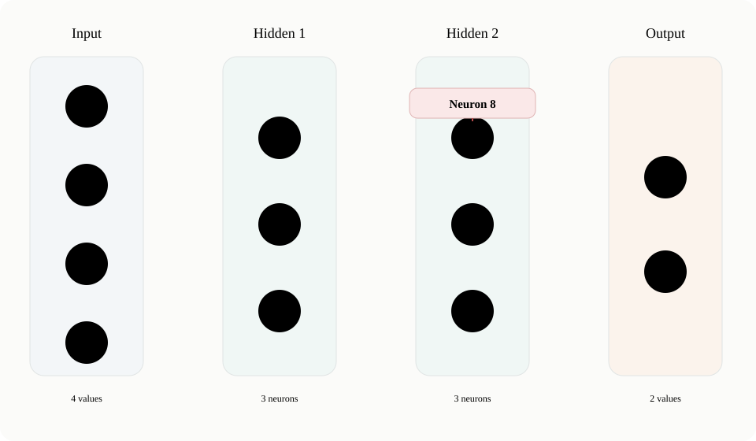

*A 4–3–3–2 network. Input nodes 1–4 hold the four components of a data point; hidden neurons 5–10 transform those values; output neurons 11–12 produce the two components of the prediction. Neuron 8 and its incoming/outgoing connections are highlighted.*

**Weight & bias** — A weight scales an incoming activation. A bias is a learned offset added after the weighted inputs are summed.

Focus on neuron 8. Its three inputs are the activations a5, a6, a7. Each incoming activation is multiplied by the weight on its edge, and the neuron also has its own bias.

x8 = b8 + ∑i=57 aiwi→8

Here **x8** means the weighted sum (the value before the activation function), not one of the original input features.

The activation function for neuron 8 then produces:

a8 = f8(x8)

That activation is no longer just an answer from one neuron. It becomes data for the next layer: in this network, a8 is sent to output neurons 11 and 12.

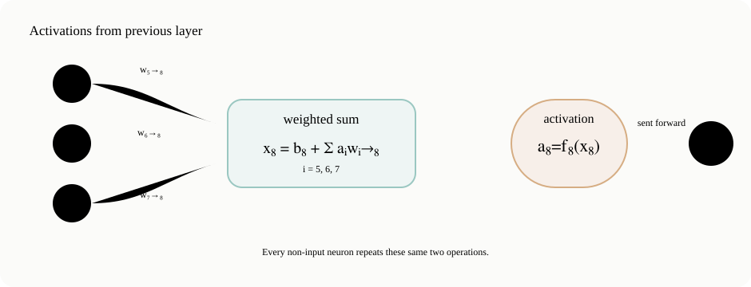

*The local computation at neuron 8: previous activations enter a weighted sum, the activation function transforms that sum, and the resulting activation is passed forward. Every non-input neuron repeats this pattern.*

**Activation** — The number a neuron outputs after its activation function. Once produced, that number can serve as an input to neurons in the next layer.

## Activation functions inside the network

With a single-neuron model, a linear output can be used for regression and a sigmoid output can be used for classification. In a multi-layer network, many neurons are *internal*: their outputs are intermediate values rather than the final prediction. That makes other activation functions useful as well.

The lesson compares four common choices. The derivative is shown because gradient descent eventually needs the slope of each activation function when it computes how the loss changes with the network parameters.

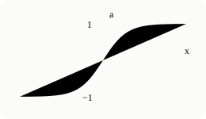

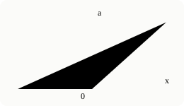

#### Linear

a = x d a / d x = 1

Passes the weighted sum through unchanged.

#### Sigmoid

a = 1/(1+e−x) d a / d x = a(1−a)

Smoothly compresses values into the interval 0 to 1.

#### Hyperbolic tangent

a = tanh(x) d a / d x = 1−a2

A smooth S-shaped function whose output ranges from −1 to 1.

#### ReLU

a = max(0,x) d a / d x = 0 if a=0; 1 if a>0

Outputs zero on the negative side and behaves linearly on the positive side.

Notice that the derivatives are written in terms of the activation value a whenever convenient. That is useful computationally: a feed-forward pass already produces and stores these activation values, and the later gradient calculation can reuse them.

> **ReLU at exactly zero.** The mathematical derivative is not uniquely defined at x=0. The lesson uses the common computational convention of taking the derivative there as 0.

## How a feed-forward prediction is computed

The word **feed-forward** describes the direction of computation: information moves from the input layer through the hidden layers to the output layer. There is no loop that sends a later activation back into an earlier layer during the prediction itself.

Start with one data point. If that observation has four components, those four numbers are placed in input nodes 1–4. These input nodes are best thought of as storage locations: they do not form weighted sums or apply activation functions.

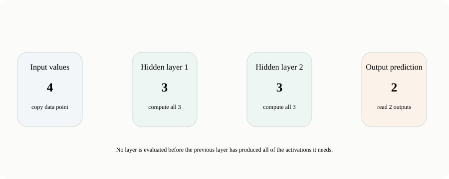

*Prediction proceeds layer by layer. A layer is evaluated only after the previous layer has produced all of the activations it needs.*

**1. Load the point** Set a₁,…,a₄ equal to the four input values.

**2. First hidden layer** Compute neurons 5, 6, and 7 from those four values.

**3. Second hidden layer** Use the stored activations from 5–7 to compute 8, 9, and 10.

**4. Output layer** Use activations 8–10 to compute the two final outputs, 11 and 12.

The boundary sizes are fixed by the task: this network accepts a four-dimensional observation and produces a two-dimensional output. These architectural choices are part of the **hypothesis-space specification**—the set of functions the model is allowed to represent. The two middle layers each have three neurons, so their hidden-layer sizes are [3,3]; the number and connectivity of these middle units strongly affect how complicated a function the network can represent.

**Hidden layer** — A layer between the input and output. Its activations are internal representations: they help compute the prediction but are not themselves the model's final output.

Why store every activation instead of immediately discarding it? Two reasons. The next layer needs those values as inputs, and the gradient calculation used during training will need many of them again.

## Why bother with hidden layers?

At this point the network can map four numbers to two numbers—but that alone does not show why hidden layers are useful. Why not use two separate single-neuron models, one for each output?

The answer depends on the activation functions. If every hidden unit is linear, stacking layers does not create a fundamentally more complicated function.

If f and g are linear, then f(g(x)) is also linear.

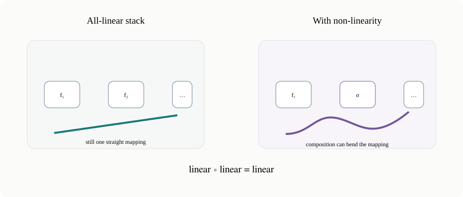

*Stacking linear transformations still gives one linear transformation. A non-linear activation breaks that collapse, so compositions of layers can represent shapes that a single linear map cannot.*

A one-dimensional example shows the idea without a formal proof. If g(x)=dx+e and f(u)=cu+q, then:

f(g(x)) = c(dx+e)+q = (cd)x + (ce+q)

The result is still just a line with a new slope and intercept. Extra linear layers can change the coefficients, but not the kind of function represented. This is why the lesson's key conclusion is that **hidden layers become representationally interesting when non-linear activations are inserted between linear weighted sums.**

> **What remains to show?** Non-linearity prevents the layers from collapsing into one linear map. The next question is how powerful that can be. The lesson answers with a familiar discrete example: Boolean logic.

## How much can non-linearity represent?

A sigmoid neuron behaves like a smooth version of a step: for sufficiently negative input its output is near 0, and for sufficiently positive input its output is near 1. To reason cleanly about Boolean logic, temporarily replace the sigmoid by an exact step function.

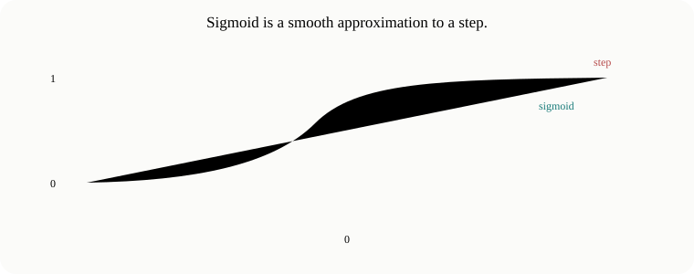

*The sigmoid is a smooth approximation to a 0/1 step. This motivates using an ideal step neuron to reason about Boolean operations, then returning to sigmoid as a differentiable approximation.*

For the Boolean constructions, let the neuron first compute

s = w₁x₁ + w₂x₂ + b

and let the idealized activation output 1 when s>0 and 0 otherwise. The set of points where s=0 is the **decision boundary**: points on opposite sides of that line receive different outputs.

The second theorem used in the lesson is that **AND, OR, and NOT are sufficient building blocks for Boolean logic**. If neurons can implement those operations, compositions of such neurons can implement any finite Boolean function.

### AND

For AND(x₁,x₂), only the input (1,1) should produce 1. Using w₁=w₂=1 and b=-1.5 gives s=x₁+x₂-1.5. That sum is positive only when both binary inputs are 1.

### OR

For OR(x₁,x₂), every binary point except (0,0) should produce 1. Keep the two weights at 1 and move the boundary by changing the bias to -0.5: now s=x₁+x₂-0.5.

### NOT

NOT has one input. We want input 0 to produce 1 and input 1 to produce 0, so the output must reverse as x₁ increases. With the same zero-threshold convention used above, w₁=-1 and b=+0.5 give s=-x₁+0.5: positive at 0, negative at 1.

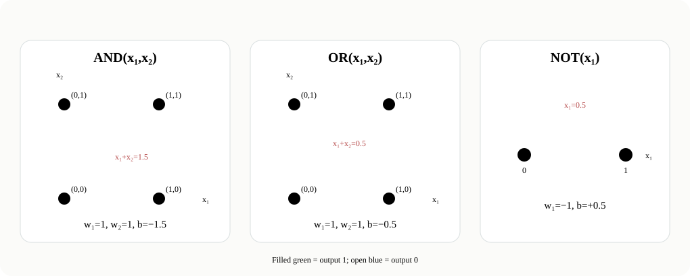

*AND and OR are linearly separable in the binary x₁–x₂ plane. NOT is a one-dimensional threshold problem. The red boundaries are exactly where the weighted sum equals zero.*

| Gate | Weighted sum | What the boundary isolates |
| --- | --- | --- |
| AND | s=x₁+x₂−1.5 | Only (1,1) |
| OR | s=x₁+x₂−0.5 | Everything except (0,0) |
| NOT | s=−x₁+0.5 | 0 on the positive side, 1 on the negative side |

With an exact step activation these gates are exact. A sigmoid is smooth rather than discontinuous, so sigmoid neurons *approximate* the same gate-like behavior. Multiplying a gate’s weights and bias by the same large positive factor leaves its decision boundary unchanged while making the sigmoid transition sharper around that boundary.

## From Boolean circuits to the networks we actually train

The Boolean argument is about **representational possibility**: non-linear neurons can be composed into complicated computations. It does not mean that practical neural networks are normally designed by manually assigning one neuron to AND, another to OR, and so on.

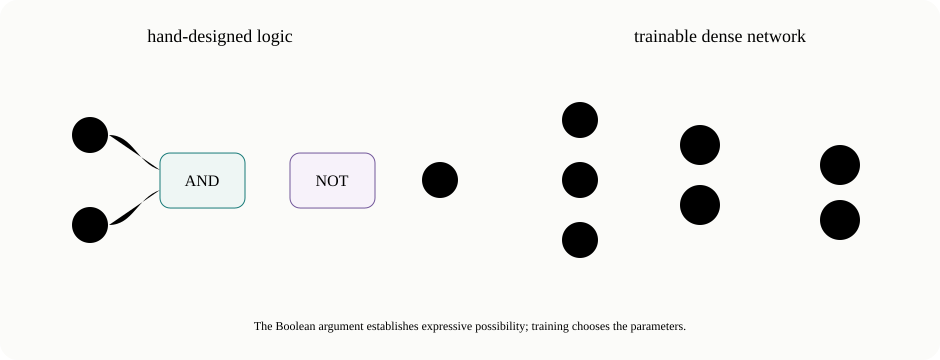

*The logic-gate picture shows that compositions can be expressive. The architecture used for learning instead keeps dense layers and lets gradient descent choose the many weights and biases from data.*

The goal is to choose an architecture and then **train** it: adjust its parameters so that its predictions fit the data. A common and convenient architecture for this is exactly the one already drawn—layers of neurons, with each layer densely connected to the next.

## What are the parameters of the whole network?

For one neuron, the adjustable parameters are its incoming weights and its bias. For the whole network, the parameter set is simply **all weights on all edges plus all biases of all non-input neurons.**

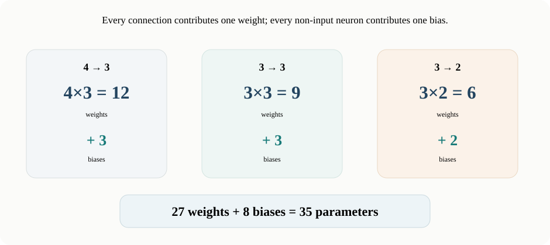

*Counting parameters layer by layer in the 4–3–3–2 network: 27 edge weights and 8 neuron biases, for 35 adjustable parameters in total.*

**12 + 9 + 6 = 27** weights

**3 + 3 + 2 = 8** biases

**27 + 8 = 35** parameters

Put those values into one long vector, called θ. Its exact ordering is a bookkeeping choice; what matters is that every adjustable weight and bias appears once.

θ = [w1→5, w1→6, …, w10→12, b5, …, b12]T   ∈ ℝ35

Training therefore needs one direction of change for each of those 35 numbers. That direction comes from the gradient of a loss function.

## The loss function with more than one output

A **loss** is a number that measures how far the model's prediction is from the target. With one output neuron, the loss compares one activation with one **target**—the desired output supplied by the training data. With two output neurons, both output errors must contribute.

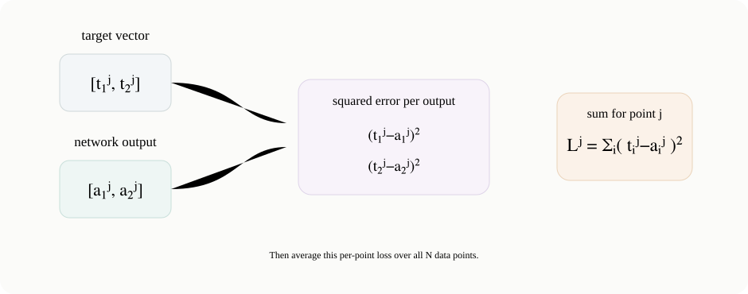

*For one data point j, compare every output activation with its corresponding target, square the differences, and sum over output dimensions. Then average the per-point losses over the dataset.*

For data point j, the lesson generalizes squared error by summing over the output neurons:

Lj(θ, dataj) = ∑i ∈ outputs (tij − aij)2

Subscript i tells us which output neuron; superscript j tells us which data point.

Then take the mean over all N data points:

L(θ, dataset) = (1/N) ∑j=1N Lj(θ, dataj)

> **Small two-output check.** If the target is [1,0] and the network outputs [0.8,0.3], the per-point loss is (1−0.8)² + (0−0.3)² = 0.13. Both output dimensions contribute to the one loss value for that point.

## Gradient descent on all 35 parameters

The **gradient** is a vector of partial derivatives of the dataset loss—one derivative for every component of θ. Because θ has 35 components, the gradient has 35 components too.

∇L = [∂L/∂w1→5, ∂L/∂w1→6, …, ∂L/∂b11, ∂L/∂b12]T

The gradient points in the direction of increasing loss. Gradient descent takes a small step in the opposite direction. If the step size (learning rate) is η, the update is:

θ ← θ − η∇L(θ)

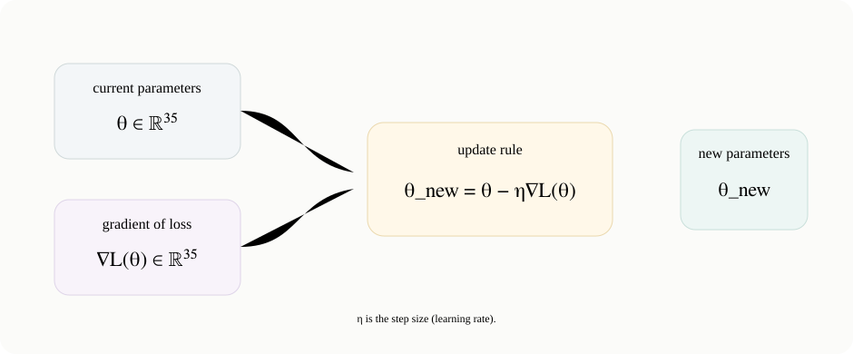

*The parameter vector and its gradient have the same 35-component shape. Gradient descent moves every weight and bias a small distance opposite the loss gradient.*

Repeating this process changes all weights and biases so that the network loss can decrease. The remaining computational question is important: *how do we efficiently obtain all 35 partial derivatives through multiple layers?*

> **That is the handoff to backpropagation.** The feed-forward pass stores the activations. Backpropagation uses those stored values to efficiently propagate derivative information backward through the network and build the gradient needed for the next gradient-descent update.

---

[Source: https://www.youtube.com/watch?v=AsyPA69QBks](https://www.youtube.com/watch?v=AsyPA69QBks)
