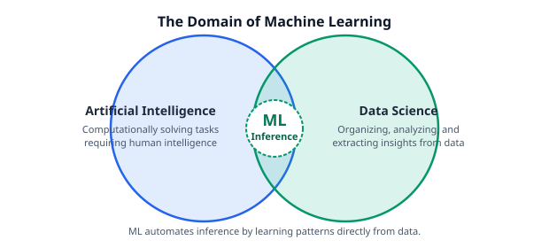
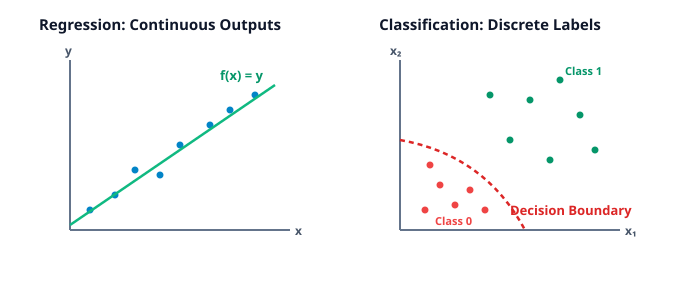
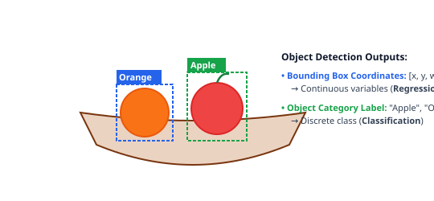
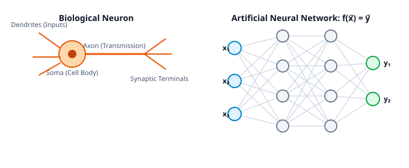
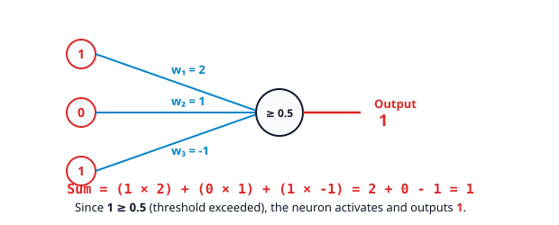
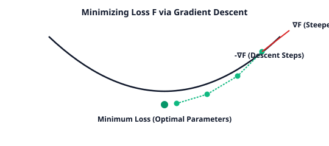
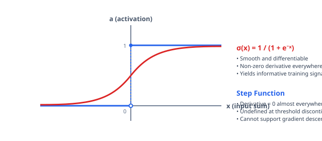
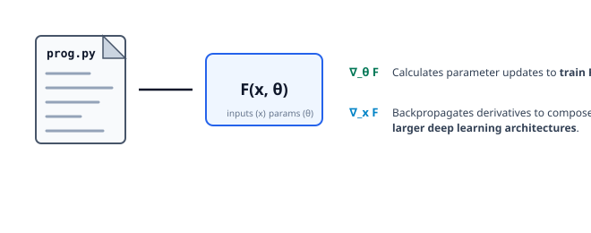

# یادگیری عمیق: مبانی و اصول اصلی

**منبع:** [What is Deep Learning? (DL 01)](https://www.youtube.com/watch?v=DrhJLHiia7g)

یادگیری عمیق (Deep Learning) زیربنای فناوری‌های مدرنی مانند تشخیص چهره برای بازکردن قفل دستگاه، فهم خودکار گفتار در دستیارهای مجازی و سیستم‌های پیشنهاددهنده شخصی‌سازی‌شده است.

**تعریف:** **یادگیری عمیق (Deep Learning)** کاربرد **شبکه‌های عصبی (Neural Networks)** و **برنامه‌نویسی مشتق‌پذیر (Differentiable Programming)** برای انجام **یادگیری ماشین (Machine Learning)** است.

---

## ۱. یادگیری ماشین (Machine Learning) چیست؟

یادگیری ماشین (ML) در محل تلاقی **هوش مصنوعی (Artificial Intelligence / AI)** و **علم داده (Data Science)** قرار می‌گیرد:
* **علم داده (Data Science):** فرایند سازمان‌دهی، تحلیل و استخراج کاربرد و ارزش از داده.
* **هوش مصنوعی (Artificial Intelligence):** حل مسائل محاسباتی‌ای که معمولاً به هوش انسانی نیاز دارند.
* **یادگیری ماشین (Machine Learning):** انجام خودکار استنتاج‌های هوشمندانه مستقیماً از داده.

### تغییر پارادایم نسبت به مهندسی نرم‌افزار کلاسیک
* **علوم کامپیوتر کلاسیک:** مهندس منطق الگوریتمی صریح را به‌صورت دستی می‌نویسد تا از ورودی‌های مشخص، خروجی محاسبه شود.
* **یادگیری ماشین:** نمونه‌های داده هم ورودی‌ها و هم خروجی‌های مورد انتظار را تعریف می‌کنند. الگوریتم یادگیری ماشین نگاشت تابعی زیربنایی بین آن‌ها را به‌صورت خودکار استنتاج می‌کند.

---

## ۲. انواع اصلی مسائل در یادگیری ماشین

بیشتر مسائل یادگیری ماشین در دو دسته بنیادی قرار می‌گیرند:

1. **رگرسیون (Regression):** استنتاج تابعی مانند $f(x) = y$ که ورودی‌های پیوسته را به خروجی‌های پیوسته نگاشت می‌کند. در رگرسیون خطی، این کار متناظر با یافتن خط بهترین برازش میان نقاط داده است.
2. **طبقه‌بندی (Classification):** اختصاص یک برچسب دسته‌ای گسسته به هر ورودی. در طبقه‌بندی دودویی، این کار متناظر با ایجاد یک مرز تصمیم است که ورودی‌های دارای برچسب $0$ را از ورودی‌های دارای برچسب $1$ جدا می‌کند.

### مثال ترکیبی: تشخیص اشیا (Object Recognition)
مسائل پیچیده اغلب رگرسیون و طبقه‌بندی را با هم ترکیب می‌کنند. در تشخیص اشیا:
* **ورودی:** تصویر خام که به‌صورت یک شبکه دوبعدی از شدت پیکسل‌ها نمایش داده می‌شود.
* **بخش رگرسیون:** پیش‌بینی مختصات مکانی پیوسته $(x, y, \text{width}, \text{height})$ برای کادر محدودکننده (Bounding Box) پیرامون هر شیء شناسایی‌شده.
* **بخش طبقه‌بندی:** اختصاص یک برچسب دسته‌ای گسسته، مانند `"orange"`، `"apple"` یا `"basket"`، به هر شیء تشخیص‌داده‌شده.

---

## ۳. الهام زیستی و شبکه‌های عصبی مصنوعی

شبکه‌های عصبی مصنوعی از نظر مفهومی از نورون‌های زیستی در سیستم عصبی الهام گرفته‌اند:
* **نورون‌های زیستی:** سلول‌ها سیگنال‌های ورودی را از طریق دندریت‌ها دریافت می‌کنند. اگر مجموع تحریک کافی باشد، سلول یک پتانسیل عمل را در طول آکسون شلیک می‌کند و در سیناپس‌ها انتقال‌دهنده‌های عصبی را به نورون‌های مجاور آزاد می‌کند. اتصال‌ها می‌توانند تحریکی باشند و شلیک را تقویت کنند، یا مهاری باشند و آن را کاهش دهند.
* **شبکه‌های عصبی مصنوعی:** گره‌ها نماینده نورون‌ها هستند و یال‌های جهت‌دار نماینده اتصال‌های سیناپسی‌اند. هر یال یک **وزن (Weight)** عددی $w$ دارد:
  * **وزن مثبت ($w > 0$):** اتصال تحریکی.
  * **وزن منفی ($w < 0$):** اتصال مهاری.
  * **قدر مطلق وزن ($|w|$):** شدت یا قدرت اتصال.

---

## ۴. محاسبه یک نورون مصنوعی

یک نورون مصنوعی، مجموع وزن‌دار ورودی‌های خود را محاسبه می‌کند و بررسی می‌کند آیا این مجموع به آستانه فعال‌سازی داخلی می‌رسد یا خیر:

### محاسبه نمونه:
1. **جمع وزن‌دار:**
   $$\text{Input Sum} = (1 \times 2) + (0 \times 1) + (1 \times -1) = 2 + 0 - 1 = 1$$
2. **بررسی آستانه:**
   $$\text{Threshold} = 0.5$$
   چون $1 \ge 0.5$، شرط برقرار است و نورون خروجی فعال‌سازی **$1$** تولید می‌کند.

### فاصله گرفتن از عصب‌شناسی
یادگیری عمیق الزاماً به واقع‌گرایی زیستی پایبند نیست. در حالی که عصب‌شناسی پیچیدگی‌های زیست‌شیمیایی انعطاف‌پذیری سیناپسی را بررسی می‌کند، یادگیری عمیق نورون مصنوعی را یک سازوکار ریاضی کاربردی می‌داند که برای تقریب تابعی داده بهینه می‌شود.

---

## ۵. آموزش با Gradient Descent و مسئله تابع فعال‌سازی

برای آموزش یک شبکه عصبی مصنوعی روی داده‌های برچسب‌دار، پارامترها یا وزن‌ها به‌صورت تکراری با **نزول گرادیان (Gradient Descent)** تنظیم می‌شوند:
* در حساب برداری، گرادیان ($\nabla$) یک تابع در جهت **بیشترین افزایش** آن اشاره می‌کند.
* حرکت در جهت مخالف گرادیان ($-\nabla$) مسیر **بیشترین کاهش** را مشخص می‌کند و امکان کمینه‌کردن تابع زیان/خطا را می‌دهد.

### محدودیت تابع پله‌ای (Step Function)
یک نورون آستانه‌ای مانند یک تابع پله‌ای ناپیوسته عمل می‌کند:
$$\text{Output}(x) = \begin{cases} 0 & \text{if } x < 0.5 \\ 1 & \text{if } x \ge 0.5 \end{cases}$$

مشتق این تابع پله‌ای برای بهینه‌سازی اطلاعات مفیدی فراهم نمی‌کند:
* در هر نقطه‌ای که $x \ne 0.5$ باشد، شیب صفر است: $\frac{d}{dx}\text{Output}(x) = 0$.
* در مرز آستانه ($x = 0.5$)، تابع ناپیوسته است و مشتق تعریف نمی‌شود.
* وقتی مشتق‌ها همه‌جا صفر باشند، Gradient Descent نمی‌تواند جهت مناسب برای تغییر وزن‌ها را تعیین کند.

### راه‌حل: فعال‌سازی هموار Sigmoid
برای ممکن‌کردن آموزش مبتنی بر گرادیان، تابع پله‌ای با یک منحنی S شکلِ پیوسته و مشتق‌پذیر به نام **تابع سیگموید (Sigmoid)** جایگزین می‌شود:
$$\sigma(x) = \frac{1}{1 + e^{-x}}$$

چون فعال‌سازی Sigmoid هموار و پیوسته است، مشتق‌های غیرصفر می‌توانند با استفاده از قانون زنجیره‌ای و پس‌انتشار (Backpropagation) در لایه‌های شبکه منتقل شوند و Stochastic Gradient Descent (SGD) را ممکن کنند.

---

## ۶. برنامه‌نویسی مشتق‌پذیر (Differentiable Programming)

یادگیری عمیق از شبکه‌های استانداردِ گره‌های خطیِ متصل فراتر می‌رود و به پارادایم گسترده‌تر **برنامه‌نویسی مشتق‌پذیر** تعمیم می‌یابد:

* یک نورون یک زیرروال پارامتری ساده را اجرا می‌کند: ابتدا ضرب داخلی وزن‌دار و سپس یک فعال‌سازی غیرخطی را محاسبه می‌کند.
* در برنامه‌نویسی مشتق‌پذیر، هر روال عمومی $F(x, \theta)$ که با پارامترهای $\theta$ روی ورودی‌های $x$ تعریف شده باشد، می‌تواند جزئی از یک سیستم یادگیری باشد؛ به شرطی که بتوان مشتق‌ها را از میان آن محاسبه کرد:
  * **$\nabla_\theta F$ (گرادیان نسبت به پارامترها):** الگوریتم‌های بهینه‌سازی را در زمان آموزش هدایت می‌کند تا $\theta$ تنظیم شود و خطای پیش‌بینی کاهش یابد.
  * **$\nabla_x F$ (گرادیان نسبت به ورودی‌ها):** اجازه می‌دهد سیگنال گرادیان از میان $F$ به ماژول‌های قبلی بازگردد و ادغام سرتاسری در معماری‌های بزرگ‌تر ممکن شود.

---

## ۷. جمع‌بندی و نقشه مفهومی

* **پایه اصلی:** صورت‌بندی‌های ساده شبکه عصبی، اهداف یادگیری نظارت‌شده (Regression در برابر Classification) و حساب گرادیان.
* **مقیاس‌پذیری:** معماری‌های عمیق چندلایه، الگوریتم‌های Backpropagation و چارچوب‌های نرم‌افزاری تولیدی.
* **ارزیابی و نقد:** شناخت محدودیت‌های مدل، سوگیری‌های سیستمی، محدودیت‌های داده و حالت‌های شکست در سامانه‌های دنیای واقعی.
