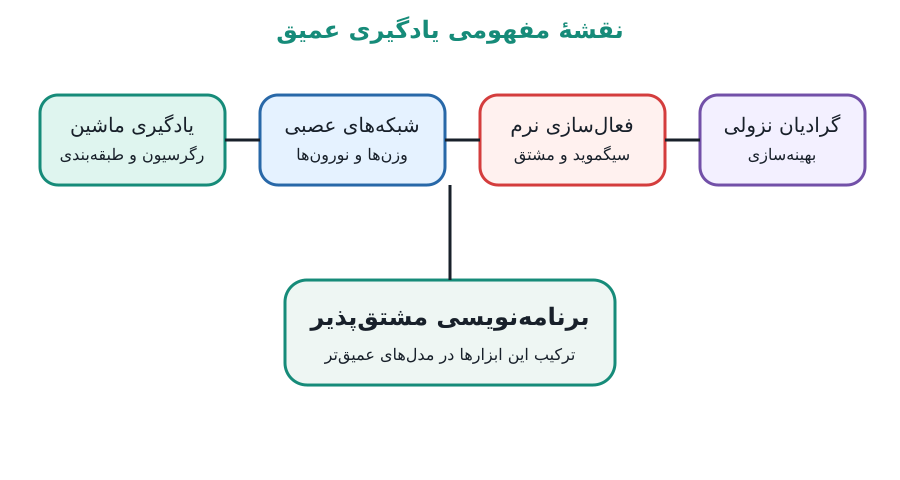
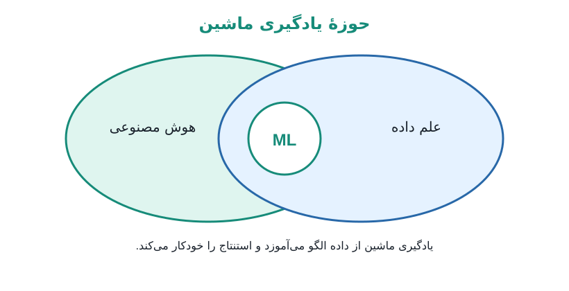
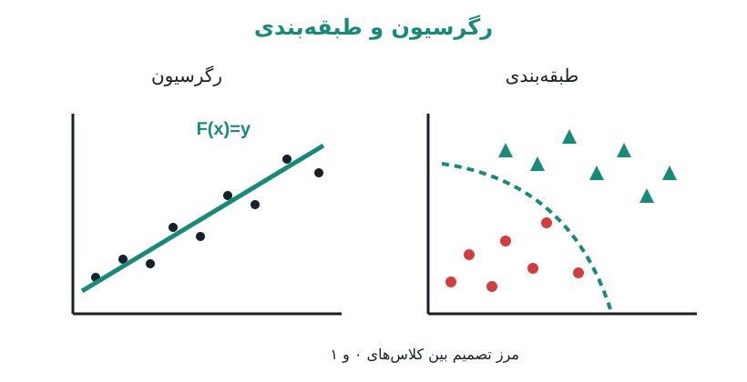
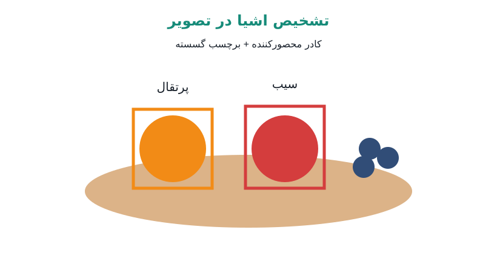
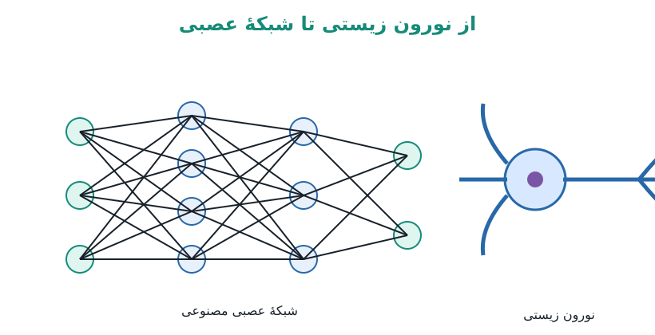
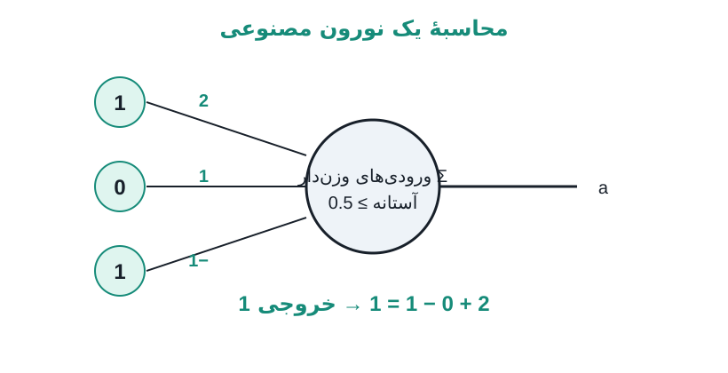
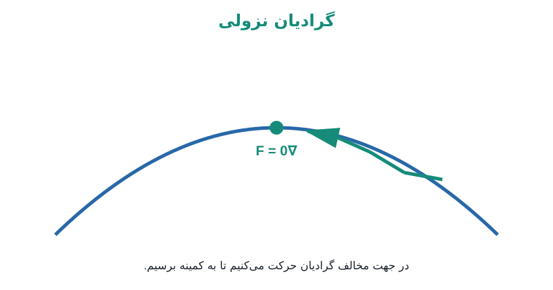
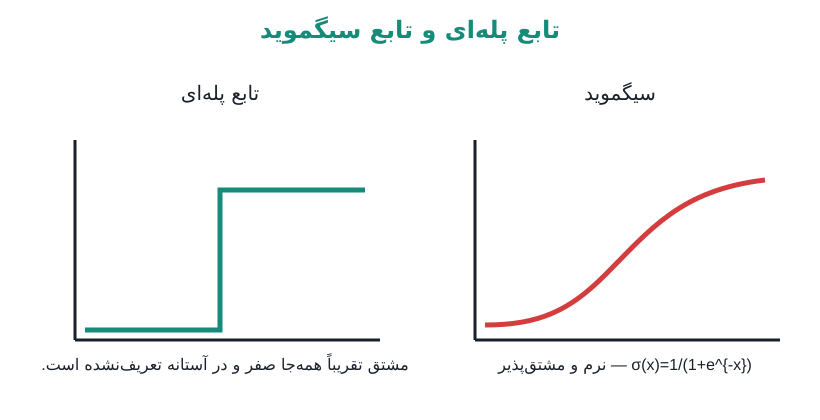
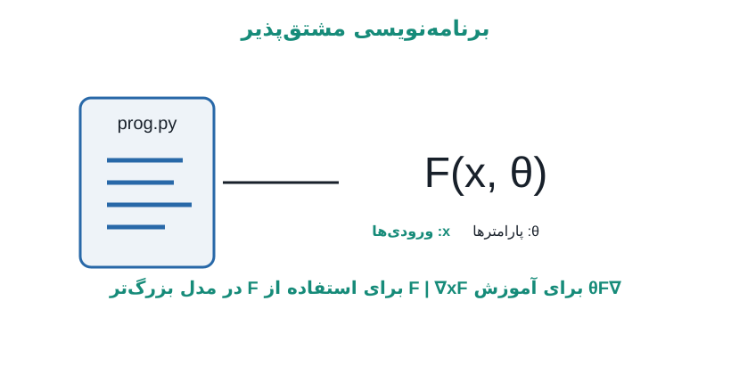

**یادگیری عمیق · DL 01**

# یادگیری عمیق چیست؟

سلام، به یادگیری عمیق خوش آمدید. من برایس هستم و هیجان‌زده‌ام که به شما کمک کنم یکی از داغ‌ترین موضوعات علوم کامپیوتر را یاد بگیرید. سؤال شروع ساده است: یادگیری عمیق چیست و چرا باید به آن علاقه‌مند باشیم؟

یادگیری عمیق هر روز در اطراف ما حضور دارد. الگوریتم‌هایی که هنگام باز کردن قفل یک دستگاه چهرهٔ شما را تشخیص می‌دهند، وقتی با یک دستیار دیجیتال حرف می‌زنید گفتار شما را می‌فهمند، یا در پلتفرم موردعلاقه‌تان به شما محتوا پیشنهاد می‌کنند، همگی بر پایهٔ یادگیری عمیق هستند.

تعریفی که در این درس از آن استفاده می‌کنیم این است:

> **یادگیری عمیق یعنی استفاده از شبکه‌های عصبی و برنامه‌نویسی مشتق‌پذیر برای انجام یادگیری ماشین.**

اما همین تعریف فوراً سؤال‌های بیشتری ایجاد می‌کند: شبکهٔ عصبی چیست و یادگیری ماشین چیست؟

مسیر درس، یادگیری ماشین، شبکه‌های عصبی، تابع فعال‌سازی، گرادیان نزولی و برنامه‌نویسی مشتق‌پذیر را به هم متصل می‌کند.

## یادگیری ماشین

اگر بخواهیم یادگیری ماشین را دسته‌بندی کنیم، در نقطهٔ تلاقی **هوش مصنوعی** و **علم داده** قرار می‌گیرد. علم داده دربارهٔ سازمان‌دهی، تحلیل و استفادهٔ مناسب از داده است. هوش مصنوعی دربارهٔ حل محاسباتی مسئله‌هایی است که وقتی انسان آن‌ها را حل می‌کند، ظاهراً به هوش نیاز دارند.

پس یادگیری ماشین یعنی این‌که به‌طور خودکار و با استفاده از داده، استنتاج‌های هوشمند انجام دهیم.

یادگیری ماشین در هم‌پوشانی هوش مصنوعی و علم داده قرار داده می‌شود.

این موضوع به یک تغییر دیدگاه نسبت به کاری که معمولاً در علوم کامپیوتر انجام می‌دهیم نیاز دارد. معمولاً الگوریتمی طراحی می‌کنیم که مسئله را مستقیماً حل کند. اما در یادگیری ماشین، نمونه‌های داده ورودی‌ها و خروجی‌های مسئله را تعریف می‌کنند و ما الگوریتم‌هایی پیاده‌سازی می‌کنیم که وظیفه‌شان این است راه‌حل مسئله را از مجموعه‌داده استنتاج کنند.

## رگرسیون و طبقه‌بندی

به‌طور کلی، بیشتر مسئله‌های یادگیری ماشین را می‌توان به دو دسته تقسیم کرد: **رگرسیون** و **طبقه‌بندی**.

**رگرسیون:** هدف این است تابعی را استنتاج کنیم که ورودی‌های پیوسته را به خروجی‌های پیوسته نگاشت می‌کند. ساده‌ترین مثال نشان‌داده‌شده رگرسیون خطی است: خطی را انتخاب کنیم که رابطهٔ میان ورودی‌ها و خروجی‌های نقاط مجموعه‌داده را بهترین شکل توصیف کند.

**طبقه‌بندی:** هدف این است به هر نقطهٔ ورودی یک برچسب گسسته بدهیم. مثال ساده، استنتاج یک مرز تصمیم است که ناحیهٔ دارای برچسب ۰ را از ناحیهٔ دارای برچسب ۱ جدا می‌کند.

هم رگرسیون و هم طبقه‌بندی می‌توانند بسیار پیچیده‌تر از این مثال‌های دوبعدی شوند و بسیاری از مسئله‌های جالب، جنبه‌هایی از هر دو را با هم ترکیب می‌کنند.

### تشخیص اشیا هر دو ایده را با هم ترکیب می‌کند

یکی از وظایف کلاسیک یادگیری عمیق، تشخیص اشیاست. ورودی یک تصویر است که به‌صورت شبکه‌ای از پیکسل‌ها نمایش داده می‌شود. برای هر شیء موجود در تصویر، خروجی شامل یک کادر محصورکننده با مختصات پیوسته است و در کنار آن یک برچسب که مشخص می‌کند آن شیء در کدام‌یک از چند دستهٔ گسسته قرار دارد.

کادر محصورکننده مختصات پیوسته می‌دهد، در حالی که «orange» و «apple» برچسب‌های گسسته هستند.

ابتدا با مثال‌های ساده شروع می‌کنیم تا اصول کار را یاد بگیریم و بعد خیلی زود به سراغ مسئله‌های بسیار هیجان‌انگیزتری می‌رویم که با یادگیری عمیق قابل حل هستند.

## شبکه‌های عصبی: مدل محاسباتی

در یادگیری عمیق، این نوع مسئله‌ها را با استفاده از شبکه‌های عصبی و برنامه‌نویسی مشتق‌پذیر حل می‌کنیم. شبکهٔ عصبی یک مدل محاسباتی است که به‌شکل بسیار کلی و آزاد از رفتار نورون‌های مغز الهام گرفته است.

نورون‌ها فعال می‌شوند و سیگنال‌های الکتریکی می‌فرستند؛ نورون‌های دیگر این سیگنال‌ها را دریافت می‌کنند و ممکن است در نتیجه خودشان نیز فعال شوند. بعضی اتصال‌ها قوی‌تر از بقیه‌اند؛ بعضی جفت نورون‌ها تمایل دارند با هم فعال شوند و بعضی رابطهٔ مهاری دارند.

ایدهٔ زیستی به یک گراف تبدیل می‌شود: گره‌ها نورون‌ها را نشان می‌دهند و یال‌های جهت‌دار اتصال میان آن‌ها را.

این ایده به یک مدل ریاضی منجر می‌شود که در آن هر یال جهت‌دار یک **وزن** عددی دارد و قدرت اتصال را نشان می‌دهد. وزن مثبت یعنی نورون دوم توسط نورون اول تحریک می‌شود و وزن منفی یعنی اثر اتصال مهاری است.

هر نورون می‌تواند ورودی‌های وزن‌دار همسایه‌هایش را با هم جمع کند تا تعیین شود که آیا فعال خواهد شد یا نه.

در این مثال سه ورودی داریم. وزن‌ها ۲، ۱ و منفی ۱ هستند و آستانهٔ فعال‌سازی داخل نورون به‌صورت $≥ 0.5$ نوشته شده است.

همسایهٔ بالایی با مقدار فعال‌سازی ۱ و وزن ۲ فعال است، بنابراین اثر مثبت قوی‌تری دارد. ورودی وسط مقدار فعال‌سازی ۰ و وزن ۱ دارد. همسایهٔ پایینی نیز فعال است، اما وزن آن منفی ۱ است؛ بنابراین فعال بودن آن احتمال فعال شدن نورون ما را کاهش می‌دهد.

برای تعیین فعال شدن نورون، مقدار فعال‌سازی هر همسایه را در وزن مربوط به آن ضرب می‌کنیم و حاصل‌ها را با هم جمع می‌کنیم:

$$
(1)(2) + (0)(1) + (1)(-1) = 2 + 0 - 1 = 1
$$

بعد این مجموع را با آستانهٔ فعال‌سازی مقایسه می‌کنیم. چون $1 > 0.5$، نورون فعال می‌شود و خروجی ۱ می‌دهد.

نتیجهٔ محاسبه روی تخته $2 + 0 − 1 = 1$ است و خروجی نورون نیز ۱ می‌شود.

## جایی که یادگیری عمیق از عصب‌شناسی جدا می‌شود

از این نقطه یادگیری عمیق از عصب‌شناسی فاصله می‌گیرد. پژوهش‌های جالب زیادی دربارهٔ نحوهٔ واقعی فعال شدن نورون‌ها و چگونگی تغییر اتصال‌های میان آن‌ها وجود دارد، اما در این درس از آن پژوهش‌ها استفاده نمی‌کنیم. در عوض، شبکهٔ عصبی را به‌عنوان یک ابزار عملی برای انجام یادگیری ماشین در نظر می‌گیریم.

برای این کار باید راهی داشته باشیم که شبکهٔ عصبی را با استفاده از نمونه‌های یک مجموعه‌داده آموزش دهیم. ایدهٔ کلیدی این آموزش **گرادیان نزولی** است.

از حساب دیفرانسیل می‌دانیم که گرادیان یک تابع همیشه در جهت بیشترین افزایش تابع اشاره می‌کند. پس می‌توانیم از این اطلاعات جهت‌دار برای کمینه کردن تابع استفاده کنیم؛ یعنی در جهت مخالف حرکت کنیم.

گرادیان اطلاعات جهت را می‌دهد و در نقطهٔ کمینه روی شکل $∇F = 0$ نوشته شده است.

به‌زودی خیلی عمیق‌تر وارد این موضوع می‌شویم. فعلاً نکتهٔ کلیدی این است که چون برای آموزش به گرادیان نیاز داریم، باید بتوانیم فعال‌سازی‌های شبکهٔ عصبی را مشتق بگیریم.

## مشکل تابع فعال‌سازی: تابع پله‌ای

فعال شدن این نورون را به‌صورت تابعی از مجموع ورودی‌هایش در نظر بگیرید. چون آستانه ۰٫۵ است، تابع برای همهٔ مقادیر کمتر از ۰٫۵ خروجی صفر می‌دهد. در ۰٫۵ ناگهان بالا می‌رود و از آن‌جا به بعد خروجی یک می‌شود. بنابراین فعال‌سازی نورون با یک **تابع پله‌ای** توصیف می‌شود.

ابتدا محل آستانه و سطح پایین تابع مشخص می‌شود.

تابع کامل در آستانه از ۰ به ۱ جهش می‌کند.

> **مشکل:** مشتق این تابع پله‌ای تقریباً هیچ اطلاعات مفیدی نمی‌دهد. هر جا تابع تخت است مشتق صفر است و در همان نقطه‌ای که ناپیوستگی داریم، مشتق تعریف نشده است.

اگر قرار است با گرادیان‌ها شبکهٔ عصبی را آموزش دهیم، به تابع فعال‌سازی‌ای نیاز داریم که مشتق‌های بهتری داشته باشد.

## یک جایگزین نرم: سیگموید

اولین نمونهٔ یک تابع فعال‌سازی بهتر، تقریب نرم تابع پله‌ای است که **سیگموید** نام دارد.

جهش ناگهانی با یک گذار نرم جایگزین می‌شود.

فرمول روی تخته به‌صورت $σ(x) = 1/(1 + e^{−x})$ نوشته می‌شود.

$$
σ(x) = 1 / (1 + e^{−x})
$$

در چند جلسهٔ بعد ابزارهای لازم برای مشتق‌گیری از تابع‌های فعال‌سازی و انتقال این مشتق‌ها در سراسر شبکه را توسعه می‌دهیم. این کار ما را آماده می‌کند تا با **گرادیان نزولی تصادفی** یک شبکهٔ عصبی را برای مسئله‌های رگرسیون و طبقه‌بندی آموزش دهیم.

## برنامه‌نویسی مشتق‌پذیر

بسیاری از ایده‌هایی که برای آموزش یک شبکهٔ عصبی می‌بینیم کاربرد گسترده‌تری دارند. می‌توان یک نورون را مثل یک برنامهٔ بسیار ساده دید: مجموع وزن‌دار را حساب می‌کند و سپس یک تابع فعال‌سازی را اعمال می‌کند. می‌توانیم تصور کنیم برنامه‌های جالب‌تر نیز همین نقش را داشته باشند.

این ما را به ایدهٔ **برنامه‌نویسی مشتق‌پذیر** می‌رساند. اگر بتوانیم تابعی بنویسیم که روی ورودی‌های عددی کار کند و با پارامترهای عددی تنظیم شود، و اگر بتوانیم مشتق‌های آن تابع را محاسبه کنیم، آن تابع نیز می‌تواند وارد مدل‌های یادگیری عمیق شود.

یک برنامه تابع $F(x, θ)$ را محاسبه می‌کند. روی تخته نوشته شده است که $∇_{θ}F$ به ما اجازه می‌دهد $F$ را آموزش دهیم و $∇_{x}F$ کمک می‌کند $F$ را در یک مدل بزرگ‌تر یادگیری عمیق به‌کار ببریم.

## مسیر ادامهٔ درس

با ساده‌ترین شبکه‌های عصبی ممکن شروع می‌کنیم تا اصول یادگیری ماشین و ریاضیات پشت گرادیان نزولی تصادفی را دقیق بررسی کنیم. بعد به‌تدریج پیچیدگی را اضافه می‌کنیم تا به شبکه‌های عصبی عمیق و برنامه‌های مشتق‌پذیر عمومی برسیم.

در طول مسیر با کتابخانه‌های قدرتمند یادگیری عمیق زیاد تمرین خواهیم کرد و محدودیت‌ها و جنبه‌های منفی هم مدل‌های خاص و هم یادگیری عمیق به‌طور کلی را به‌صورت گسترده بررسی می‌کنیم.

**تا پایان ترم باید آماده باشید که مدل‌های یادگیری عمیق را برای طیف گسترده‌ای از مسئله‌های هیجان‌انگیز دنیای واقعی طراحی کنید، به‌کار ببرید، ارزیابی کنید و مورد نقد قرار دهید.**

تختهٔ کامل مسیر کلی را به هم متصل می‌کند: یادگیری ماشین ← شبکه‌های عصبی ← فعال‌سازی‌های مشتق‌پذیر و گرادیان‌ها ← برنامه‌نویسی مشتق‌پذیر.

---

Source: [https://www.youtube.com/watch?v=DrhJLHiia7g](https://www.youtube.com/watch?v=DrhJLHiia7g)
