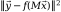
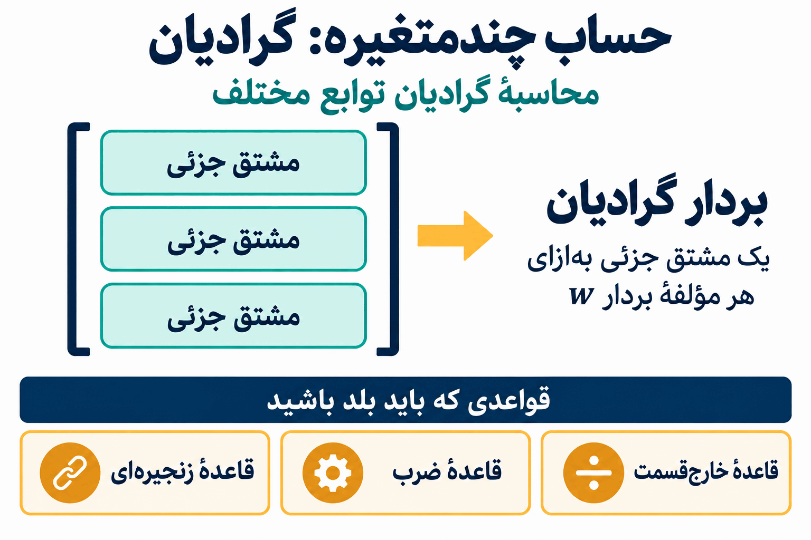
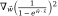

# پیش‌نیازهای یادگیری عمیق

برای موفقیت در یک درس یادگیری عمیق، به چه پیش‌زمینه‌ای نیاز دارید؟

یادگیری عمیق به مجموعه‌ای از مفاهیم علوم کامپیوتر و ریاضیات وابسته است؛ بنابراین، در هر دو زمینه پیش‌نیازهایی دارد. اگر درس‌های **ساختمان داده‌ها، جبر خطی و حساب چندمتغیره** را گذرانده‌اید، آماده‌اید. اما بهتر است کمی دقیق‌تر بررسی کنیم که هرکدام از این مباحث کجا به کار می‌آیند و چه چیزهایی برای موفقیت در این درس اهمیت دارند.

## ساختمان داده‌ها و برنامه‌نویسی

برای شروع، این درس از درس‌های سطح بالای کارشناسی علوم کامپیوتر است؛ پس فرض بر این است که تجربهٔ قابل‌قبولی در برنامه‌نویسی دارید. مهم‌ترین دلیل پیش‌نیاز بودن ساختمان داده‌ها این است که مطمئن شویم دست‌کم به‌اندازهٔ گذراندن آن درس، قبلاً برنامه‌نویسی کرده‌اید.

گاهی هم به **کارایی الگوریتم‌ها** و مفاهیم مرتبطی می‌پردازیم که در ساختمان داده‌ها با آن‌ها آشنا شده‌اید.

در آموزش‌ها بیشتر از **شبه‌کد** استفاده می‌کنیم، یا محاسبات را به‌صورت ریاضی بیان می‌کنیم. اما در تکالیف، با هر دو زبان **پایتون و جولیا** برنامه خواهید نوشت.

چرا از دو زبان برنامه‌نویسی استفاده می‌کنیم؟ دلیل انتخاب پایتون این است که بهترین و پرکاربردترین کتابخانه‌های یادگیری عمیقِ موردنیاز این درس در پایتون در دسترس هستند. به‌طور مشخص، در طول درس با **TensorFlow و PyTorch** تمرین خواهید کرد.

برای تبدیل ریاضیات به محاسبات، زبان انتخابی این درس جولیاست. وقتی ایده‌های یادگیری عمیق را به‌صورت ریاضی بیان می‌کنیم و بعد می‌خواهیم کدی بنویسیم که آن‌ها را پیاده‌سازی کند، انجام این کار در جولیا کمک می‌کند راحت‌تر بفهمیم **در پشت صحنهٔ شبکه‌های عصبی ما چه می‌گذرد**.

## چقدر پیش‌زمینهٔ ریاضی لازم دارید؟

از مفاهیم جبر خطی و حساب چندمتغیره استفاده خواهیم کرد. بااین‌حال، در هر دو مورد، مفاهیمی که نیاز داریم فقط **بخش کوچکی** از مطالبی هستند که معمولاً در آن درس‌ها تدریس می‌شوند.

مثلاً اگر فقط یکی از این دو درس را گذرانده‌اید، باید بتوانید مفاهیم موردنیاز از درس دیگر را نسبتاً سریع یاد بگیرید، بدون اینکه در ابتدای ترم از درس عقب بمانید.

## جبر خطی: راحت بودن با نمادگذاری ماتریسی

مهم‌ترین چیزی که از جبر خطی نیاز داریم، راحت بودن با **نمادگذاری ماتریسی** است.

در یادگیری عمیق، عملیات زیادی روی بردارها، ماتریس‌ها و حتی آرایه‌هایی با ابعاد بالاتر انجام می‌دهیم؛ این آرایه‌ها را **تانسور** می‌نامیم. عملیات را باز می‌کنیم و می‌بینیم برای تک‌تک مؤلفه‌ها چه اتفاقی می‌افتد. اما لازم است بتوانیم همان عملیات را با استفاده از نمادگذاری برداری و ماتریسی، به‌شکل فشرده هم بیان کنیم.

بنابراین باید در ضرب ماتریس در بردار، اعمال تابع روی ماتریس‌ها و بردارها، و عملیاتی مثل **ضرب داخلی و نُرم** راحت باشید. روی تخته، ضرب داخلی و نُرم زیر عنوان بردارها آمده‌اند و ضرب زیر عنوان ماتریس‌ها قرار گرفته است.

نمونه‌ای از عملیاتی که ممکن است خیلی زود با آن روبه‌رو شویم، این است:

1.  یک **ماتریس ۳ در ۵** را در یک **بردار پنج‌مؤلفه‌ای** ضرب کنیم.
2.  تابعی را روی حاصل اعمال کنیم.
3.  تفاضل آن را با یک **بردار سه‌مؤلفه‌ای** دیگر به دست آوریم.
4.  نُرم را محاسبه کنیم.

شکل فشردهٔ عبارتی که روی تخته نوشته شده، این است:

عبارت نوشته‌شده شامل **مربع نُرم** است. در توضیح، مراحل انجام عملیات مرور می‌شوند، اما مثال عددی محاسبه نمی‌شود.

اگر با همهٔ این عملیات راحت هستید، بخش عمدهٔ جبر خطی موردنیاز این درس را می‌دانید.

## حساب چندمتغیره: گرادیان

مفهوم اصلی حساب چندمتغیره که در تمام طول ترم از آن استفاده می‌کنیم، **گرادیان** است.

باید گرادیان توابع مختلف زیادی را محاسبه کنیم. گرادیان از **مشتق‌های جزئی** تشکیل می‌شود؛ بنابراین لازم است در محاسبهٔ مشتق جزئی راحت باشیم. این کار هم به قواعدی متکی است که در حساب مقدماتی یاد گرفته‌ایم، مانند **قاعدهٔ ضرب و قاعدهٔ خارج‌قسمت**. **قاعدهٔ زنجیره‌ای** نیز روی تخته آمده است.

مثالی که روی تخته نوشته شده، این است:

یکی از کارهایی که به‌زودی انجام خواهیم داد، ساختن **بردار گرادیانی است که مشتق جزئی این تابع نسبت به هر مؤلفهٔ بردار w را در خود دارد**.

در مخرجِ عبارت روی تخته، علامت منفی به کار رفته و اینجا هم همان علامت حفظ شده است. گرادیان به‌عنوان نمونه‌ای از عملیاتی مطرح می‌شود که باید برای انجام آن آماده باشید؛ مشتق‌های آن در این درس محاسبه نمی‌شوند.

اگر این عملیات برایتان قابل‌فهم هستند، بخش عمدهٔ حساب چندمتغیرهٔ موردنیاز برای یادگیری عمیق را می‌دانید.

## جبران کمبود پیش‌زمینه یا مرور مطالب

اگر در جبر خطی یا حساب چندمتغیره یک درس کامل نگذرانده‌اید، یا احساس می‌کنید مطالب را کمی فراموش کرده‌اید و می‌خواهید مرور کنید، فهرست‌هایی از ویدیوهای **گرنت سندرسون** برای آماده شدن شما در نظر گرفته شده‌اند.

هر دو فهرست شامل ویدیوهای یک دورهٔ کامل در آن موضوع هستند. ویدیوهایی که برای مفاهیم مورد استفاده در این درس اهمیت بیشتری دارند، در منابع درس مشخص شده‌اند:

- **جبر خطی:** ویدیوهای **۱، ۳، ۴، ۵، ۸، ۹ و ۱۳** از [فهرست پیشنهادی جبر خطی](https://www.youtube.com/watch?v=fNk_zzaMoSs&list=PLZHQObOWTQDPD3MizzM2xVFitgF8hE_ab).
- **حساب چندمتغیره:** ویدیوهای **۱۵، ۱۶، ۱۷، ۱۹، ۲۰، ۲۴، ۳۰، ۳۱ و ۳۲** از [فهرست پیشنهادی حساب چندمتغیره](https://www.youtube.com/watch?v=TrcCbdWwCBc&list=PLSQl0a2vh4HC5feHa6Rc5c0wbRTx56nF7).

اگر این مفاهیم برایتان ناآشنا هستند، یا مدتی از آخرین باری که از آن‌ها استفاده کرده‌اید می‌گذرد، این ویدیوها را مرور کنید تا برای فعالیت‌های هفتهٔ اول کلاس آماده باشید.

------------------------------------------------------------------------

منبع: [پیش‌نیازهای یادگیری عمیق (DL 02)، پروفسور برایس](https://www.youtube.com/watch?v=RrM8Tn4-AJE)، درس CSC 381، کالج دیویدسن، پاییز ۲۰۲۲.

