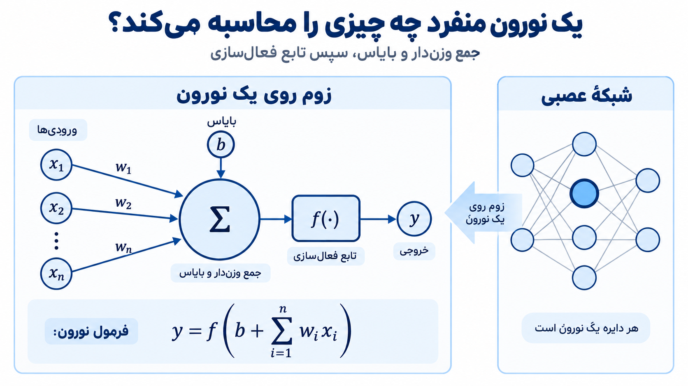
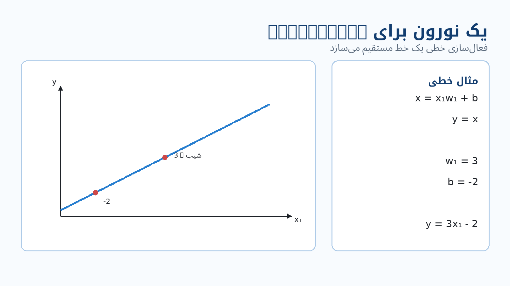
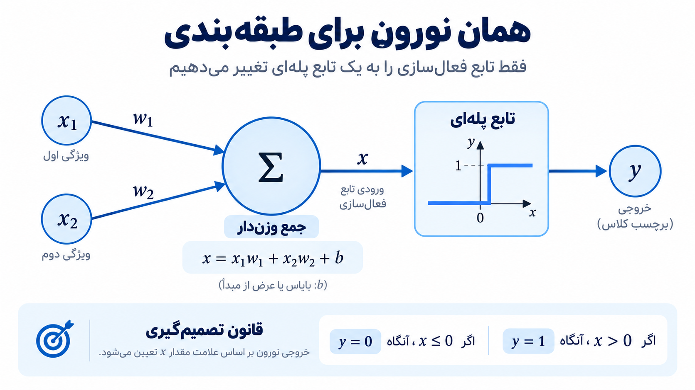
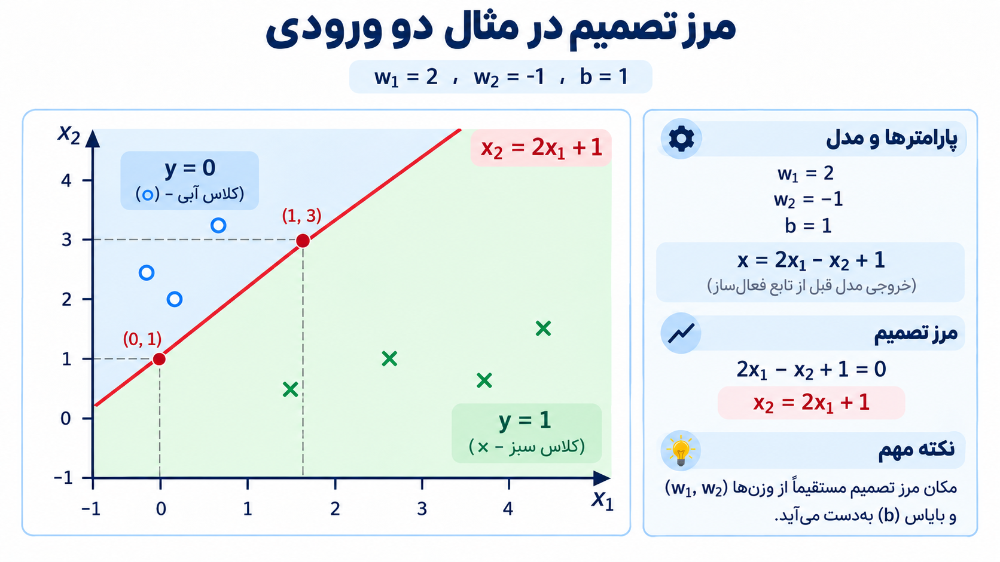
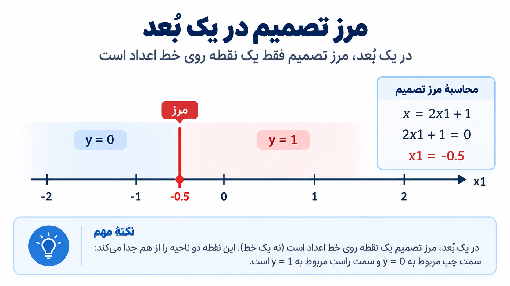
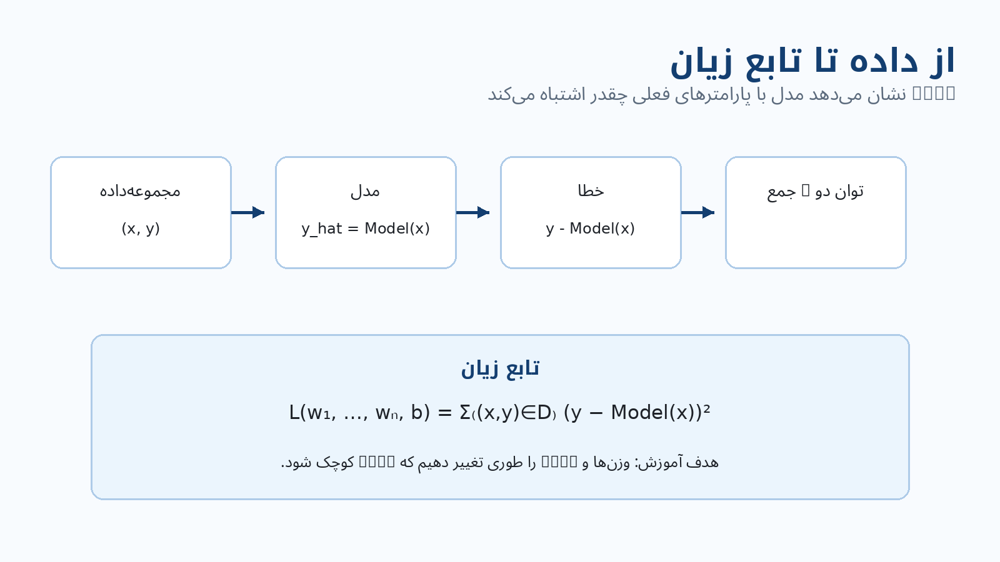

# یک نورون منفرد چه چیزی می‌تواند محاسبه کند؟

شبکه‌های عصبی می‌توانند خیلی بزرگ شوند؛ تعداد زیادی نورون، اتصال و لایه. اما برای فهمیدن اینکه کل این شبکه چه کاری انجام می‌دهد، اول روی **فقط یک نورون** زوم می‌کنیم و می‌پرسیم:

**این یک نورون چه چیزی را محاسبه می‌کند، و با همین محاسبه چه نوع مدل‌هایی می‌توان ساخت؟**

---

## محاسبه‌ی پایه‌ی یک نورون

فرض کنید نورون ورودی‌های

$$
x_1,\;x_2,\;\ldots,\;x_n
$$

را دریافت می‌کند. برای هر ورودی یک وزن متناظر داریم:

$$
w_1,\;w_2,\;\ldots,\;w_n
$$

نورون هر ورودی را در وزن خودش ضرب می‌کند، همه‌ی حاصل‌ضرب‌ها را با هم جمع می‌کند و در پایان یک پارامتر دیگر به نام **bias** یا $b$ را نیز اضافه می‌کند. سپس حاصل وارد **تابع فعال‌سازی** $f$ می‌شود.

پس محاسبه‌ی نورون را می‌توان به این صورت نوشت:

$$
y=f\left(b+\sum_{i=1}^{n}w_i x_i\right)
$$

یعنی دو مرحله داریم:

1. ابتدا **جمع وزن‌دار ورودی‌ها به‌همراه bias** محاسبه می‌شود.
2. سپس آن عدد از **تابع فعال‌سازی** عبور می‌کند و خروجی $y$ را می‌سازد.

وزن‌ها تعیین می‌کنند هر ورودی چقدر و در چه جهتی روی نتیجه اثر داشته باشد. bias نیز یک پارامتر جداست که به نورون اجازه می‌دهد خروجیِ بخش خطی فقط به حاصل‌ضرب ورودی‌ها و وزن‌ها وابسته نباشد.

نکته‌ی اصلی این است که همین ساختار ساده، بسته به تابع فعال‌سازی‌ای که انتخاب می‌کنیم، می‌تواند رفتارهای متفاوتی داشته باشد. در ادامه همین یک نورون را ابتدا به‌عنوان **Regression** و بعد به‌عنوان **Classification** می‌بینیم.

---

## یک نورون برای Regression

برای شروع، فقط یک ورودی $x_1$ در نظر بگیرید. جمع وزن‌دار به‌همراه bias برابر است با:

$$
x=x_1w_1+b
$$

حالا تابع فعال‌سازی را کاملاً خطی انتخاب می‌کنیم:

$$
y=x
$$

در نتیجه:

$$
y=x_1w_1+b
$$

این دقیقاً معادله‌ی یک خط است.

در این حالت، **وزن $w_1$ شیب خط** را مشخص می‌کند و **bias یعنی $b$ محل تقاطع خط با محور $y$** را تعیین می‌کند.

برای مثال، اگر

$$
w_1=3
$$

و

$$
b=-2
$$

باشد، نورون محاسبه می‌کند:

$$
y=3x_1-2
$$

پس اگر این رابطه را روی نمودار رسم کنیم، یک خط مستقیم با شیب $3$ و عرض از مبدأ $-2$ داریم.

به همین دلیل یک نورون منفرد با فعال‌سازی خطی، در ساده‌ترین حالت، همان کاری را انجام می‌دهد که از یک **مدل رگرسیون خطی** انتظار داریم.

اگر ورودی‌های بیشتری داشته باشیم، محاسبه همان است:

$$
y=b+w_1x_1+w_2x_2+\cdots+w_nx_n
$$

فقط به‌جای یک وزن، به تعداد مؤلفه‌های ورودی وزن خواهیم داشت. خروجی همچنان یک مقدار عددی است.

---

## همان نورون برای Classification

حالا محاسبه‌ی جمع وزن‌دار را نگه می‌داریم، اما تابع فعال‌سازی را عوض می‌کنیم.

برای دو ورودی داریم:

$$
x=x_1w_1+x_2w_2+b
$$

ولی این‌بار به‌جای اینکه خروجی را مستقیماً برابر $x$ قرار دهیم، از یک **تابع پله‌ای** استفاده می‌کنیم:

$$
y=
\begin{cases}
0 & x\le 0\\
1 & x>0
\end{cases}
$$

پس نورون اول یک عدد محاسبه می‌کند. اگر آن عدد صفر یا منفی باشد، خروجی $0$ است؛ اگر مثبت باشد، خروجی $1$ می‌شود.

یعنی همان نورونی که با فعال‌سازی خطی یک مقدار پیوسته برای Regression تولید می‌کرد، حالا با تغییر تابع فعال‌سازی می‌تواند بین **دو کلاس** تصمیم بگیرد.

---

## مرز بین کلاس ۰ و کلاس ۱ کجاست؟

تابع پله‌ای درست در نقطه‌ای خروجی‌اش را عوض می‌کند که مقدار واردشده به آن از صفر عبور کند. بنابراین مرز تصمیم جایی است که:

$$
x_1w_1+x_2w_2+b=0
$$

مثال این درس را در نظر بگیرید:

$$
w_1=2,\qquad w_2=-1,\qquad b=1
$$

در نتیجه مقدار قبل از تابع فعال‌سازی می‌شود:

$$
x=2x_1-x_2+1
$$

و مرز تصمیم را با صفر قرار دادن همین عبارت پیدا می‌کنیم:

$$
2x_1-x_2+1=0
$$

که می‌توان آن را به شکل

$$
x_2=2x_1+1
$$

نوشت.

این خط، صفحه‌ی ورودی $(x_1,x_2)$ را به دو قسمت تقسیم می‌کند.

در یک سمت خط:

$$
2x_1-x_2+1\le 0
$$

و بنابراین:

$$
y=0
$$

در سمت دیگر:

$$
2x_1-x_2+1>0
$$

و بنابراین:

$$
y=1
$$

پس آن خط به‌صورت تصادفی روی داده‌ها کشیده نشده است؛ **موقعیت خط مستقیماً از وزن‌ها و bias به دست می‌آید.**

اگر وزن‌ها یا bias تغییر کنند، محل این خط نیز تغییر می‌کند. بنابراین یادگرفتن وزن‌ها و bias در یک مدل Classification یعنی یادگرفتن اینکه مرز جداسازی کلاس‌ها کجا قرار بگیرد.

---

## اگر فقط یک ورودی داشته باشیم

همین ایده را در یک بعد ساده‌تر می‌توان دید.

فرض کنید:

$$
x=2x_1+1
$$

مرز تصمیم جایی است که:

$$
x=0
$$

پس:

$$
2x_1+1=0
$$

و در نتیجه:

$$
x_1=-0.5
$$

در دو بعد، مرز تصمیم یک **خط** بود. اینجا که فقط یک محور ورودی داریم، مرز تصمیم فقط یک **نقطه** روی آن محور است.

دو طرف این نقطه به دو خروجی متفاوت تابع پله‌ای تعلق دارند. ایده همان است: مرز جایی قرار می‌گیرد که جمع وزن‌دار به‌همراه bias برابر صفر می‌شود.

این مثال همچنین نشان می‌دهد که تعداد مؤلفه‌های ورودی تعیین می‌کند نورون چند وزن لازم دارد. اگر بردار ورودی $n$ مؤلفه داشته باشد، نورون برای آن‌ها $n$ وزن خواهد داشت.

---

## حالا مسئله‌ی اصلی: این وزن‌ها و bias را از کجا بیاوریم؟

در مثال‌های قبلی، وزن‌ها و bias را خودمان انتخاب کردیم:

$$
w_1=3,\; b=-2
$$

یا

$$
w_1=2,\; w_2=-1,\; b=1
$$

اما در یک مسئله‌ی واقعی نمی‌خواهیم این اعداد را دستی حدس بزنیم. می‌خواهیم مدل آن‌ها را از **داده** یاد بگیرد.

فرض کنید یک مجموعه‌داده شامل مثال‌هایی از شکل زیر داریم:

$$
(\vec{x},y)
$$

یعنی برای هر نمونه:

- $\vec{x}$ ورودی است؛
- $y$ جواب درست یا target همان ورودی است.

نورون با وزن‌ها و bias فعلی خودش برای همان ورودی یک پیش‌بینی می‌سازد:

$$
\hat y=\text{Model}(\vec{x})
$$

اکنون می‌توانیم پیش‌بینی مدل را با جواب واقعی مقایسه کنیم.

---

## Loss Function: مدل چقدر اشتباه کرده است؟

برای آموزش، به یک عدد نیاز داریم که نشان دهد مدل با پارامترهای فعلی **چقدر روی مجموعه‌داده اشتباه می‌کند**. این همان **Loss Function** است.

برای هر نمونه، اختلاف بین جواب واقعی و پیش‌بینی مدل برابر است با:

$$
y-\text{Model}(\vec{x})
$$

در مثالی که اینجا استفاده می‌شود، این اختلاف را به توان دو می‌رسانیم:

$$
\left(y-\text{Model}(\vec{x})\right)^2
$$

و سپس آن را برای همه‌ی نمونه‌های مجموعه‌داده جمع می‌کنیم:

$$
L(w_1,\ldots,w_n,b)=
\sum_{(\vec{x},y)\in D}
\left(y-\text{Model}(\vec{x})\right)^2
$$

به نحوه‌ی نوشتن تابع زیان دقت کنید:

$$
L(w_1,\ldots,w_n,b)
$$

یعنی مقدار Loss به وزن‌ها و bias وابسته است.

اگر وزن‌ها و bias را تغییر دهیم، پیش‌بینی مدل تغییر می‌کند؛ وقتی پیش‌بینی تغییر کند، اختلاف آن با جواب واقعی نیز تغییر می‌کند و در نتیجه مقدار Loss هم تغییر خواهد کرد.

پس آموزش نورون را می‌توان این‌طور دید:

**مقادیر $w_1,\ldots,w_n,b$ را پیدا کنیم که Loss را تا جای ممکن کوچک کنند.**

هرچه Loss کوچک‌تر باشد، پیش‌بینی‌های مدل با داده‌ی آموزشی بهتر جور هستند.

در اینجا هنوز سؤال مهمی باقی می‌ماند:

**چطور وزن‌ها و bias را تغییر بدهیم تا Loss کاهش پیدا کند؟**

این سؤال ما را به موضوع بعدی، یعنی **Gradient Descent**، می‌رساند.
