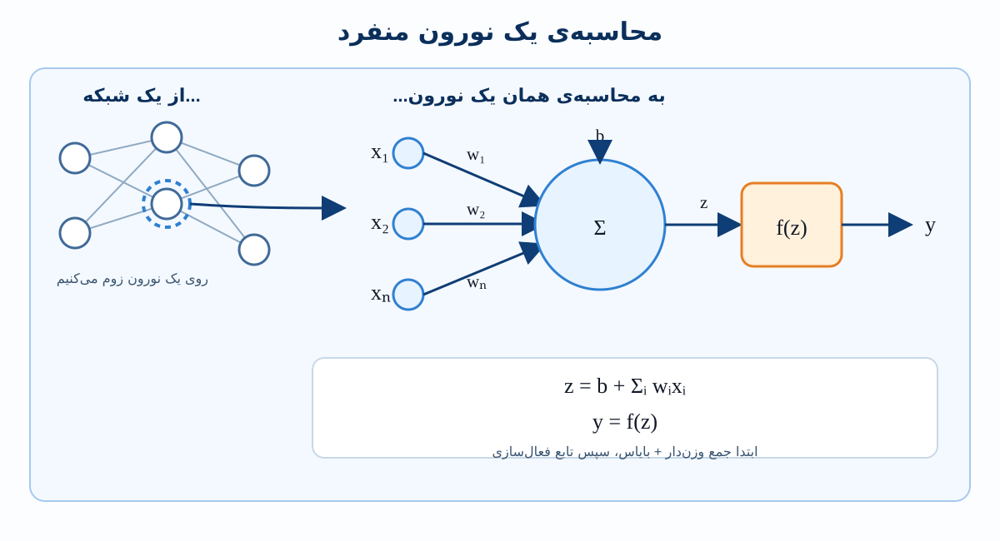
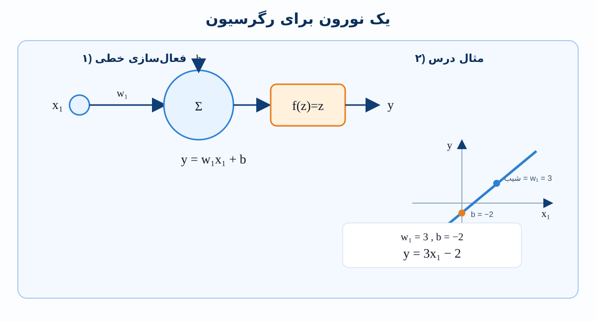
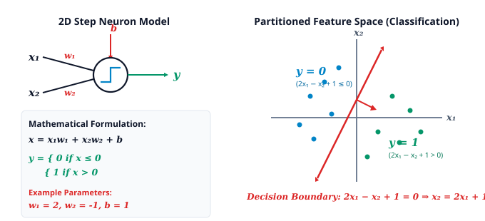
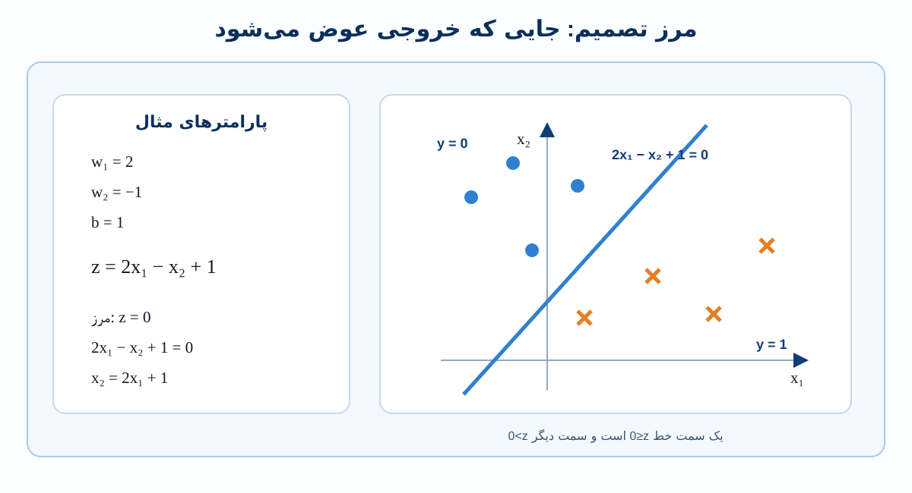
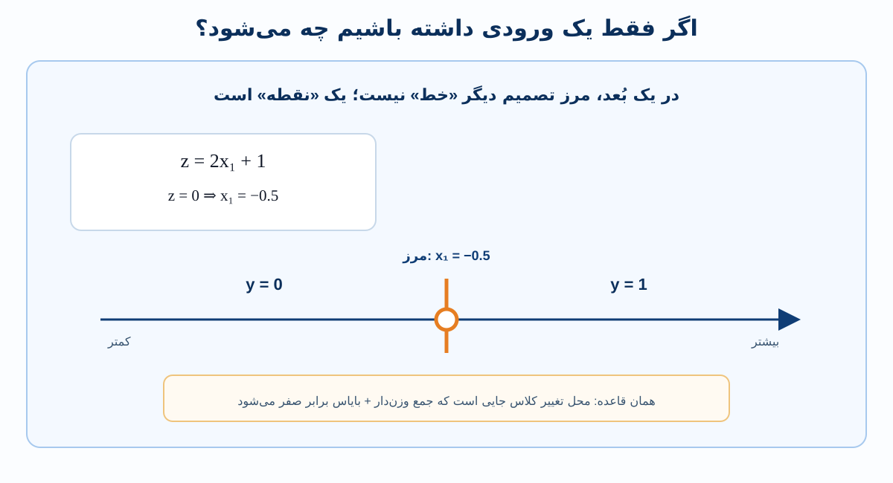
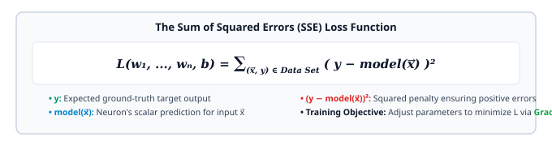

# یک نورون منفرد چه چیزی می‌تواند محاسبه کند؟

پیش از بررسی شبکه‌های عصبی عمیقی که از ده‌ها لایه متصل و میلیون‌ها پارامتر تشکیل شده‌اند، باید روی یک نورون منفرد زوم کنیم. بررسی محاسبات یک نورون نشان می‌دهد چه نوع مدل‌های بنیادی را می‌تواند بیان کند، هندسه فضاهای تصمیم آن چگونه است و برای آموزش آن به چه چارچوب ریاضی نیاز داریم.

---

## ۱. ساختار و محاسبه یک نورون منفرد

یک شبکه عصبی از لایه‌هایی از گره‌های محاسباتی متصل به هم تشکیل می‌شود. وقتی یک نورون را به‌تنهایی بررسی کنیم، برای نگاشت مقادیر ورودی به یک خروجی عددی منفرد، یک محاسبه دومرحله‌ای انجام می‌دهد:

1. **جمع خطی وزن‌دار (Linear Weighted Summation):** هر ورودی $x_i$ در وزن اتصال مربوط به خود $w_i$ ضرب می‌شود. این حاصل‌ضرب‌ها همراه با یک جمله **bias** افزایشی $b$ با هم جمع می‌شوند.
2. **نگاشت فعال‌سازی (Activation Mapping):** مجموع اسکالر حاصل از مرحله قبل از یک **تابع فعال‌سازی (Activation Function)** به نام $f(\cdot)$ عبور می‌کند تا خروجی اسکالر نهایی $y$ ساخته شود.

### نقش Bias ($b$)
جمله bias مانند یک عرض از مبدأ داخلی عمل می‌کند. اگر همه متغیرهای ورودی صفر باشند ($x_1 = x_2 = \dots = x_n = 0$)، مجموع وزن‌دار $\sum w_i x_i$ به $0$ فرو می‌ریزد. بدون bias، نورون مجبور است از مبدأ عبور کند. افزودن $b$ به نورون اجازه می‌دهد در مبدأ مقدار غیرصفر داشته باشد:
$$\text{Input Sum} = b + \sum_{i=1}^n w_i x_i$$
از نظر ریاضی، bias مانند وزنی است که به یک ورودی ثابت با مقدار $1$ متصل شده است؛ به همین دلیل در نمودار به‌صورت یک پیکان پارامتری مستقل وارد واحد پردازش می‌شود.

---

## ۲. نورون رگرسیون: فعال‌سازی خطی

وقتی هدف **رگرسیون (Regression)** باشد، یعنی پیش‌بینی یک خروجی اسکالر پیوسته، نورون از یک **تابع فعال‌سازی خطی (Linear Activation Function)** استفاده می‌کند:

### چرا از تابع همانی ساده $y = x$ استفاده می‌کنیم؟
به‌جای انتخاب یک تبدیل خطی دلخواه مانند $f(x) = mx + c$، یادگیری عمیق از فعال‌سازی همانی $y = x$ استفاده می‌کند. پارامترهای $w_1$ و $b$ از قبل آزادی کامل ریاضی برای نمایش هر شیب و هر عرض از مبدأ عمودی را فراهم می‌کنند:
$$y = m(w_1 x_1 + b) + c = (m w_1) x_1 + (m b + c) = \tilde{w}_1 x_1 + \tilde{b}$$
افزودن پارامترهای مقیاس یا انتقال اضافی درون تابع فعال‌سازی، بدون افزایش توان بیان مدل، فقط افزونگی ایجاد می‌کند.

### تعمیم به ورودی چندبعدی
اگر نورون $n$ ورودی مستقل $(x_1, x_2, \dots, x_n)$ با فعال‌سازی خطی دریافت کند:
$$y = b + \sum_{i=1}^n w_i x_i = b + \vec{w} \cdot \vec{x}$$
نورون یک نگاشت خطی $n$-بعدی را محاسبه می‌کند که یک خروجی اسکالر پیوسته یک‌بعدی تولید می‌کند. در دو بعد ($n=2$)، تابع یک صفحه تخت مایل $y = w_1 x_1 + w_2 x_2 + b$ را نمایش می‌دهد؛ در ابعاد بالاتر ($n \ge 3$)، یک ابرصفحه خطی روی فضای ویژگی ورودی تعریف می‌کند.

---

## ۳. نورون طبقه‌بندی: فعال‌سازی پله‌ای و مرزهای تصمیم

وقتی مسئله **طبقه‌بندی (Classification)** باشد، یعنی اختصاص ورودی‌ها به دسته‌های گسسته مانند کلاس $0$ در برابر کلاس $1$، مجموع خطی از یک **تابع فعال‌سازی پله‌ای هویساید (Heaviside Step Activation Function)** ناپیوسته عبور می‌کند:

$$x = b + \sum_{i=1}^n w_i x_i, \quad y = \begin{cases} 0 & \text{if } x \le 0 \\ 1 & \text{if } x > 0 \end{cases}$$

یک نورون با دو ورودی ($x_1, x_2$) و پارامترهای $w_1 = 2$، $w_2 = -1$ و $b = 1$ را در نظر بگیرید:

### هندسه مرز تصمیم
مرزی که نواحی با خروجی $0$ را از نواحی با خروجی $1$ جدا می‌کند دقیقاً جایی قرار دارد که ورودی تابع فعال‌سازی برابر صفر باشد:
$$x_1 w_1 + x_2 w_2 + b = 0$$
حل این رابطه برای $x_2$ معادله خطی صریح مرز در صفحه مختصات $(x_1, x_2)$ را می‌دهد:
$$x_2 = \left( -\frac{w_1}{w_2} \right) x_1 + \left( -\frac{b}{w_2} \right)$$
برای پارامترهای مشخص ما ($w_1 = 2, w_2 = -1, b = 1$):
$$2x_1 - x_2 + 1 = 0 \implies x_2 = 2x_1 + 1$$
هر نقطه در یک سمت این خط، مجموع داخلی $x \le 0$ تولید می‌کند و در نتیجه برچسب $0$ می‌گیرد؛ هر نقطه در سمت دیگر، $x > 0$ تولید می‌کند و برچسب $1$ می‌گیرد.

---

## ۴. پیشرفت ابعادی مرزهای تصمیم

ماهیت هندسی مرز تصمیم طبقه‌بندی به‌صورت منظم با ابعاد بردار ورودی $\vec{x}$ تغییر می‌کند:

* **ورودی یک‌بعدی ($x_1$):** فضای ویژگی یک خط یک‌بعدی است؛ مرز تصمیم یک **نقطه** منفرد با رابطه $x_1 = -\frac{b}{w_1}$ است.
* **ورودی دوبعدی ($x_1, x_2$):** فضای ویژگی یک صفحه دوبعدی است؛ مرز یک **خط** با رابطه $w_1 x_1 + w_2 x_2 + b = 0$ است.
* **ورودی سه‌بعدی ($x_1, x_2, x_3$):** فضای ویژگی یک حجم سه‌بعدی است؛ مرز یک **صفحه** با رابطه $w_1 x_1 + w_2 x_2 + w_3 x_3 + b = 0$ است.
* **ورودی $n$-بعدی ($\vec{x} \in \mathbb{R}^n$):** مرز یک **ابرصفحه آفین تخت با بعد $(n-1)$** است که فضای $n$-بعدی را به دو نیم‌فضا تقسیم می‌کند.

---

## ۵. چگونه یک نورون را آموزش دهیم: داده، انتخاب مدل و توابع زیان

### مجموعه‌داده‌های نظارت‌شده
یادگیری ماشین نظارت‌شده روی مجموعه‌داده‌ای شامل نمونه‌های تجربی ورودی-خروجی کار می‌کند:
$$\mathcal{D} = \big\{ (\vec{x}^{(1)}, y^{(1)}), \; (\vec{x}^{(2)}, y^{(2)}), \; \dots, \; (\vec{x}^{(N)}, y^{(N)}) \big\}$$
که در آن هر نمونه از یک بردار ویژگی ورودی $\vec{x}$ و خروجی هدف واقعی متناظر $y$ تشکیل شده است.

### قواعد تعیین توپولوژی مدل
ساختار فیزیکی و ابعاد مجموعه‌داده پیکربندی نورون را تعیین می‌کند:

### تابع زیان: کمی‌سازی خطای مدل
آموزش یعنی جست‌وجوی مقادیر پارامتر $(w_1, w_2, \dots, w_n, b)$ به‌گونه‌ای که پیش‌بینی‌های نورون تا حد ممکن با داده‌های آموزشی مطابقت داشته باشند.

برای سنجش میزان بدبودن مدل با پارامترهای فعلی، یک **تابع زیان (Loss Function)** به نام $L(w_1, \dots, w_n, b)$ تعریف می‌کنیم:
* در **Regression**، خطای هر نقطه فاصله عمودی یا residual بین مقدار پیش‌بینی‌شده و مقدار واقعی است:
  $$\text{Residual} = y^{(i)} - \text{model}(\vec{x}^{(i)})$$
* در **Classification**، هر زمان یک نمونه در سمت نادرست مرز تصمیم قرار بگیرد، مدل دچار خطا می‌شود.

با محاسبه اختلاف به توان دو $(y - \text{model}(\vec{x}))^2$ برای هر نمونه آموزشی و جمع‌کردن این جریمه‌ها، تابع زیان خطای کلی مدل روی کل مجموعه‌داده را به یک مقدار اسکالر واحد فشرده می‌کند.

هدف اصلی یادگیری عمیق این است که وزن‌ها و bias به‌صورت تکراری در جهتی تنظیم شوند که این مقدار loss کاهش یابد؛ فرایندی که با **Gradient Descent** انجام می‌شود.

---

## ۶. مقایسه خلاصه

| ویژگی | نورون Regression | نورون Classification |
| :--- | :--- | :--- |
| **تابع فعال‌سازی** | همانی خطی ($y = x$) | تابع پله‌ای ($0$ اگر $x \le 0$، و $1$ اگر $x > 0$) |
| **نوع خروجی** | عدد حقیقی پیوسته ($y \in \mathbb{R}$) | دسته دودویی گسسته ($y \in \{0, 1\}$) |
| **هندسه خروجی** | شیب / سطح پاسخ پیوسته | نواحی گسسته تقسیم‌شده ($y = 0$ در برابر $y = 1$) |
| **ساختار مرز** | ندارد؛ یک صفحه پیوسته را ارزیابی می‌کند | ابرصفحه $(n-1)$-بعدی ($b + \sum w_i x_i = 0$) |
| **پارامترهای قابل‌آموزش** | $n$ وزن $+ 1$ bias، در مجموع $n + 1$ | $n$ وزن $+ 1$ bias، در مجموع $n + 1$ |
| **صورت‌بندی خطا** | فاصله نقطه تا خط/سطح ($y - \hat{y}$) | نقاط طبقه‌بندی‌شده اشتباه در ناحیه نادرست |
| **هدف بهینه‌سازی** | کمینه‌کردن مجموع خطاهای مربعی: $\sum (y - \hat{y})^2$ | کمینه‌کردن loss طبقه‌بندی / نقض مرز تصمیم |
