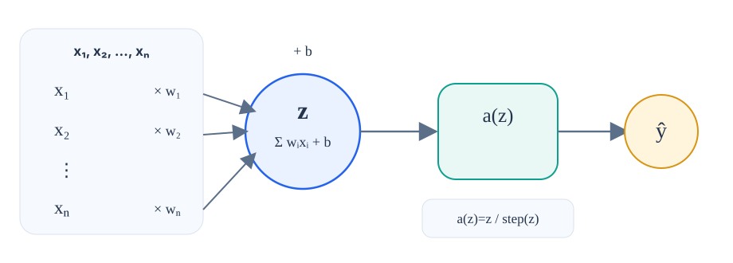
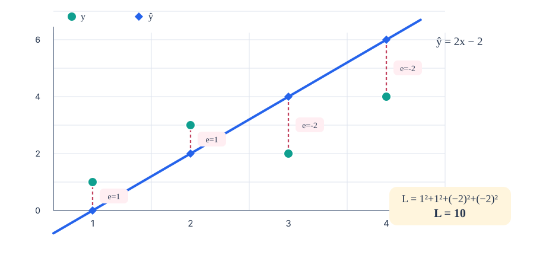
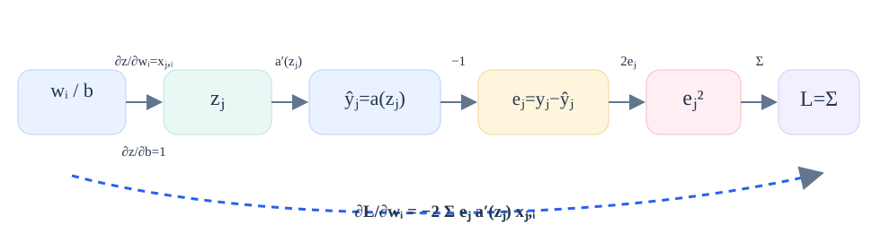
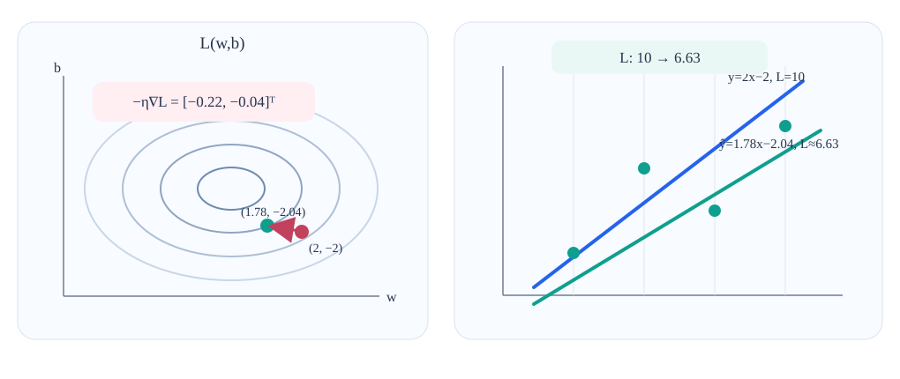
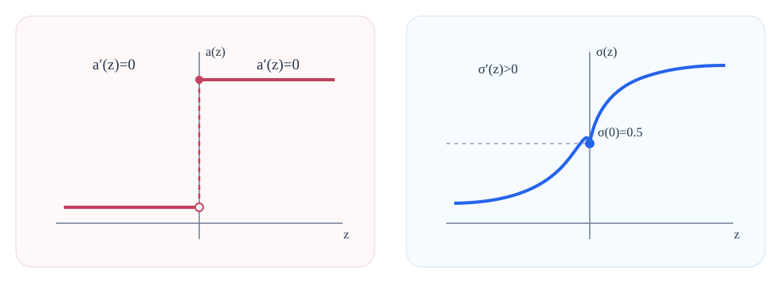
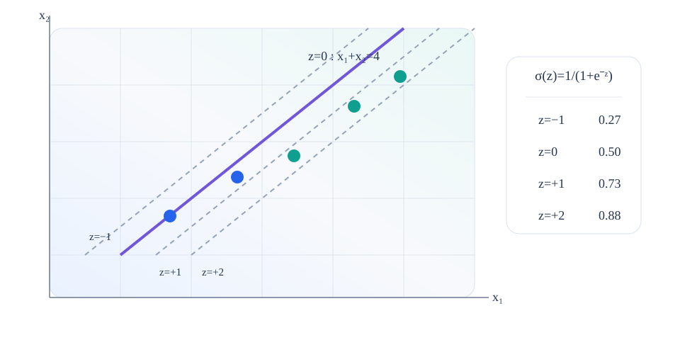
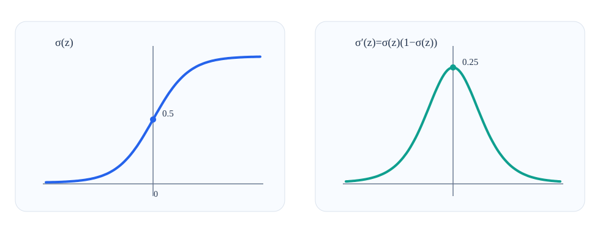
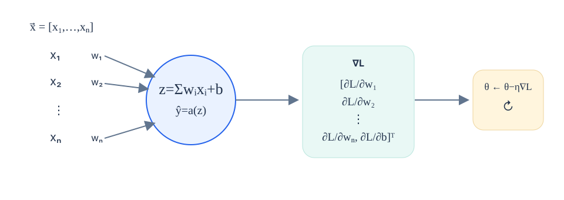

<strong>یادگیری عمیق · آموزش یک نورون</strong>

<h1 dir="rtl" align="right">چگونه نورون خود را آموزش دهیم</h1>

یک نورون منفرد می‌تواند برای رگرسیون یک خط و برای دسته‌بندی یک مرز تصمیم بسازد. «آموزش» یعنی وزن‌ها و بایاس را طوری انتخاب کنیم که پیش‌بینی‌ها بهتر با داده‌ها جور شوند. این درس از یک مثال کوچک رگرسیون شروع می‌کند، گرادیان کاهشی را قدم‌به‌قدم می‌سازد و همان منطق را به دسته‌بندی با سیگموید می‌برد.

1. محاسبه

2. اندازه‌گیری خطا

3. مشتق‌گیری

4. به‌روزرسانی

5. تکرار

<h2 dir="rtl" align="right">۱. اول دقیقاً ببینیم یک نورون چه محاسبه‌ای انجام می‌دهد</h2>

پیش از آموزش باید بین «فرمول ثابت نورون» و «اعدادی که قرار است یاد گرفته شوند» تفاوت بگذاریم.

برای یک نمونه ورودی با بردار x⃗=[x₁,…,xₙ]، نورون ابتدا یک <strong>جمع وزن‌دار</strong> می‌سازد: هر مؤلفه ورودی در وزن خودش ضرب می‌شود و در پایان بایاس اضافه می‌شود.

z = w₁x₁ + w₂x₂ + ··· + wₙxₙ + b = Σᵢ wᵢxᵢ + b

به مقدار میانی z معمولاً <strong>پیش‌فعال‌سازی</strong> (pre-activation) گفته می‌شود. سپس تابع فعال‌سازی a روی آن اعمال می‌شود و پیش‌بینی ŷ ساخته می‌شود:

ŷ = a(z)

<em>شکل را از راست به چپِ متن، اما خودِ مسیر محاسباتی را مطابق فلش‌ها دنبال کنید: <strong>وزن‌ها و بایاس پارامترهای قابل‌آموزش‌اند</strong>؛ z و ŷ برای هر نمونه دوباره محاسبه می‌شوند.</em>

<h3 dir="rtl" align="right">فعال‌سازی خطی</h3>

a(z)=z. خروجی می‌تواند هر عدد حقیقی باشد، پس نورون مانند یک رگرسور خطی رفتار می‌کند.

<h3 dir="rtl" align="right">فعال‌سازی پله‌ای</h3>

خروجی به‌صورت ناگهانی بین 0 و 1 می‌پرد. این رفتار برای دسته‌بندی دودویی مناسب است، اما بعداً خواهیم دید که برای آموزش مبتنی بر گرادیان مشکل ایجاد می‌کند.

<blockquote dir="rtl">
<strong>تمایز مهم:</strong> آموزش، فرمول نورون را عوض نمی‌کند؛ مقدارهای w₁,…,wₙ,b داخل همان فرمول را تغییر می‌دهد.
</blockquote>

<h2 dir="rtl" align="right">۲. «اشتباه بودن» را به یک عدد تبدیل می‌کنیم: تابع زیان</h2>

عبارت «مدل را بهتر کن» برای یک الگوریتم کافی نیست. به عددی نیاز داریم که وقتی پیش‌بینی بهتر می‌شود، کوچک‌تر شود.

فرض کنید مجموعه آموزشی N نمونه دارد. نمونه j دارای بردار ورودی x⃗ⱼ، مقدار هدف yⱼ و پیش‌بینی f(x⃗ⱼ) است. در این درس از <strong>مجموع خطاهای مربعی</strong> استفاده می‌کنیم:

L = Σⱼ₌₁ᴺ ( yⱼ − f(x⃗ⱼ) )²

برای هر نمونه، عبارت yⱼ−f(x⃗ⱼ) خطای علامت‌دار پیش‌بینی است. مربع‌کردن دو فایده دارد: خطاهای مثبت و منفی هر دو سهم مثبت در زیان دارند و خطاهای بزرگ‌تر با شدت بیشتری جریمه می‌شوند.

<blockquote dir="rtl">
<strong>چرا اینجا میانگین خطای مربعات را نمی‌نویسیم؟</strong> در MSE همین مجموع بر N تقسیم می‌شود. ویدئو برای مشتق‌گیری عامل 1/N را حذف می‌کند، چون همه مؤلفه‌های گرادیان را فقط با یک ثابت یکسان مقیاس می‌کند و منطق آموزش را عوض نمی‌کند.
</blockquote>

<h2 dir="rtl" align="right">۳. مسئله آموزش را با چهار نقطه رگرسیون ملموس می‌کنیم</h2>

یک داده کوچک اجازه می‌دهد همه پیش‌بینی‌ها، باقیمانده‌ها و مقدار زیان را قبل از ورود به حساب دیفرانسیل ببینیم.

ورودی‌های یک‌بعدی x=1,2,3,4 را با هدف‌های y=1,3,2,4 در نظر بگیرید. نورون فعلی فقط یک وزن و یک بایاس دارد:

w₁=2, b=−2 ⇒ ŷ = 2x−2

| نمونه | x | هدف y | پیش‌بینی ŷ | باقیمانده e=y−ŷ | e² |
| --- | --- | --- | --- | --- | --- |
| ۱ | 1 | 1 | 0 | +1 | 1 |
| ۲ | 2 | 3 | 2 | +1 | 1 |
| ۳ | 3 | 2 | 4 | −2 | 4 |
| ۴ | 4 | 4 | 6 | −2 | 4 |
| **مجموع** |  |  |  |  | **10** |

<em>فاصله‌های خط‌چین همان باقیمانده‌ها هستند. علامت آن‌ها یکسان نیست، اما پس از مربع‌شدن سهم آن‌ها در زیان برابر 1+1+4+4=10 می‌شود.</em>

<blockquote dir="rtl">
<strong>اکنون سؤال آموزش دقیق است</strong> در حال حاضر L=10 داریم. چه تغییرهای کوچکی در w₁ و b باعث می‌شود زیان بعدی کوچک‌تر باشد؟
</blockquote>

<h2 dir="rtl" align="right">۴. مشتق این سؤال را به یک «جهت حرکت» تبدیل می‌کند</h2>

مشتق نشان می‌دهد یک کمیت در برابر تغییر کوچک کمیت دیگر چگونه واکنش نشان می‌دهد. وقتی چند پارامتر داریم، برای هر پارامتر یک مشتق لازم است.

<strong>مشتق جزئی</strong> مثل ∂L/∂wᵢ می‌پرسد: اگر فقط wᵢ را کمی تغییر بدهیم و بقیه پارامترها را ثابت نگه داریم، زیان در کدام جهت و با چه شدتی تغییر می‌کند؟ مجموعه همه مشتق‌های جزئی، <strong>گرادیان</strong> را می‌سازد.

به‌جای مشتق‌گیری فقط برای مثال چهار نقطه‌ای، نتیجه را برای یک وزن دلخواه wᵢ به دست می‌آوریم. برای یک نمونه آموزشی، وابستگی‌ها تودرتو هستند: پارامتر، zⱼ را تغییر می‌دهد؛ آن پیش‌بینی را تغییر می‌دهد؛ پیش‌بینی، باقیمانده را تغییر می‌دهد و در نهایت زیان تغییر می‌کند. <strong>قاعده زنجیره‌ای</strong> اثرهای محلی این مسیر را در هم ضرب می‌کند.

<em>قاعده زنجیره‌ای را می‌توان به‌صورت یک مسیر دید: wᵢ → zⱼ → ŷⱼ → eⱼ → eⱼ² → L. مشتق هر پیوند را در پیوند بعدی ضرب می‌کنیم و در پایان روی نمونه‌ها جمع می‌زنیم.</em>

∂L/∂wᵢ = −2 Σⱼ eⱼ · a′(zⱼ) · xⱼ,ᵢ

∂L/∂b = −2 Σⱼ eⱼ · a′(zⱼ)

دو نکته کوچک عامل‌های پایانی را توضیح می‌دهد. در zⱼ=Σᵢwᵢxⱼ,ᵢ+b فقط یک جمله شامل وزن مشخص wᵢ است؛ بنابراین ∂zⱼ/∂wᵢ=xⱼ,ᵢ. بایاس مستقیماً اضافه شده، پس ∂zⱼ/∂b=1.

<blockquote dir="rtl">
این رابطه، فرمول قابل‌استفاده مجددِ اصلی درس است. <strong>وقتی تابع فعال‌سازی عوض شود، تنها عامل a′(z) در این زنجیره تغییر می‌کند.</strong>
</blockquote>

<h2 dir="rtl" align="right">۵. گرادیان کلی را روی رگرسور خطی اعمال می‌کنیم</h2>

در فعال‌سازی خطی مشتق فعال‌سازی برابر 1 است؛ بنابراین فرمول کلی به یک محاسبه عددی کوتاه تبدیل می‌شود.

چون a(z)=z است، داریم a′(z)=1. باقیمانده‌های جدول برابر [1,1,−2,−2] بودند:

∂L/∂w₁ = −2[1·1 + 1·2 + (−2)·3 + (−2)·4] = 22

∂L/∂b = −2[1 + 1 − 2 − 2] = 4

∇L = [ 22, 4 ]ᵀ

گرادیان جهت <em>تندترین افزایش</em> زیان را در فضای پارامترها نشان می‌دهد. همین عبارت دلیل علامت منفی در گرادیان کاهشی است: برای کم‌کردن زیان باید خلاف گرادیان حرکت کنیم.

<h2 dir="rtl" align="right">۶. گرادیان کاهشی یک گام کوچک به سمت پایین برمی‌دارد</h2>

هر نقطه در فضای پارامترها یک مدل کامل است. با جابه‌جایی آن نقطه، خطی که نورون در فضای داده می‌سازد نیز تغییر می‌کند.

در این رگرسور، فضای پارامترها دو محور دارد: w₁ و b. هر زوج (w₁,b) یک خط ŷ=w₁x+b و در نتیجه یک مقدار زیان روی چهار نقطه آموزشی تعیین می‌کند. اگر زیان را مانند ارتفاعی روی این صفحه تصور کنیم، گرادیان مسیر سربالایی را نشان می‌دهد.

<strong>گرادیان کاهشی</strong> ضریب کوچکی از گرادیان را از پارامترهای فعلی کم می‌کند:

[ w₁, b ]ᵀ_new = [ w₁, b ]ᵀ_old − η∇L

کمیت η (اِتا) اندازه گام یا نرخ یادگیری است. در مثال درس η=0.01 است:

w₁ = 2 − 0.01·22 = 1.78, b = −2 − 0.01·4 = −2.04

<em>پنل سمت چپ جابه‌جایی در فضای پارامترها را نشان می‌دهد و پنل سمت راست نتیجه همان جابه‌جایی را روی خط رگرسیون. شیب خط به‌طور محسوس کمتر و عرض از مبدأ کمی پایین‌تر شده است؛ زیان نیز از 10 به حدود 6.63 کاهش می‌یابد.</em>

اینجا حلقه منطقی کامل می‌شود: مشتق فقط یک مفهوم انتزاعی نبود؛ یک گام مبتنی بر آن واقعاً مدل را روی داده آموزشی بهتر کرد. حالا با پارامترهای جدید دوباره پیش‌بینی و گرادیان را محاسبه می‌کنیم و گام بعدی را برمی‌داریم.

<blockquote dir="rtl">
<strong>چرا گرادیان باید هر بار دوباره محاسبه شود؟</strong> گرادیان شیب زیان را <em>در پارامترهای فعلی</em> توصیف می‌کند. پس از جابه‌جایی پارامترها، شیب محلی نیز معمولاً عوض می‌شود.
</blockquote>

<h2 dir="rtl" align="right">۷. برای دسته‌بندی یک مانع تازه داریم: تابع پله‌ای شیب مفیدی ندارد</h2>

تمام سازوکار آموزش بالا به مشتق وابسته بود. تابع پله‌ای سخت، این مسیر را قطع می‌کند.

تابع پله‌ای در هر طرف نقطه پرش مقدار ثابتی دارد. بنابراین مشتق آن تقریباً همه‌جا صفر و در خودِ پرش به شکل معمول تعریف‌نشده است. اگر a′(z)=0 شود، فرمول گرادیان نیز تقریباً صفر می‌شود و دیگر جهت مفیدی برای تغییر وزن‌ها نداریم.

<em>به تابعی نیاز داریم که رفتار «نزدیک 0 یا نزدیک 1» را حفظ کند اما گذار میان آن‌ها نرم و مشتق‌پذیر باشد. سیگموید همین کار را انجام می‌دهد.</em>

σ(z) = 1 / (1 + e−z)

اگر z بسیار منفی باشد، خروجی به 0 نزدیک می‌شود؛ اگر بسیار مثبت باشد، به 1 نزدیک می‌شود. در z=0 خروجی دقیقاً 0.5 است. تفاوت کلیدی این است که بخش میانی به‌صورت نرم تغییر می‌کند.

<h2 dir="rtl" align="right">۸. سیگموید همان مرز تصمیم را نگه می‌دارد، اما امتیاز اطراف مرز را نرم می‌کند</h2>

هندسه مرز هنوز از جمع وزن‌دار می‌آید. تابع فعال‌سازی فقط تعیین می‌کند این جمع با چه شدتی به خروجی تبدیل شود.

نورون دوورودی درس را در نظر بگیرید: w₁=1، w₂=1 و b=−4. پیش‌فعال‌سازی آن برابر است با:

z = x₁ + x₂ − 4

نقاطی که z=0 دارند روی خط x₁+x₂=4 قرار می‌گیرند؛ این خط همان مرز تصمیم است. تابع پله‌ای در این خط ناگهان از یک خروجی به خروجی دیگر می‌پرد، ولی سیگموید نزدیک مرز مقادیر میانی تولید می‌کند.

<em>هر خط موازی با مرز، مقدار یکسانی از z دارد؛ پس همه نقاط روی آن خط خروجی سیگموید یکسان می‌گیرند. مقادیر مرجع درس عبارت‌اند از σ(−1)≈0.27، σ(1)≈0.73 و σ(2)≈0.88.</em>

<blockquote dir="rtl">
<strong>چه چیزی عوض شد و چه چیزی عوض نشد؟</strong> مرز هندسی z=0 همان است. تغییر اصلی در خروجی اطراف مرز است: حالا به‌جای پرش ناگهانی 0/1، یک امتیاز نرم داریم که نشان می‌دهد نقطه چقدر از مرز فاصله دارد.
</blockquote>

<h2 dir="rtl" align="right">۹. برای استفاده از همان قاعده زنجیره‌ای، مشتق سیگموید را پیدا می‌کنیم</h2>

در فرمول کلی گرادیان فقط یک قطعه کم داریم: a′(z) برای سیگموید.

از σ(z)=1/(1+e−z) شروع می‌کنیم. مشتق برابر است با:

σ′(z) = e−z / (1+e−z)²

برای رسیدن به شکل مفیدتر، دو بخش آشنای همین کسر را تشخیص می‌دهیم:

σ(z) = 1/(1+e−z) ; 1−σ(z)=e−z/(1+e−z)

σ′(z) = σ(z)[1−σ(z)]

<em>مزیت این رابطه آن است که مشتق را با همان مقداری می‌نویسد که نورون در مرحله پیش‌بینی محاسبه کرده بود: σ(z).</em>

نمودار مشتق نیز شهود خوبی می‌دهد: نزدیک ناحیه گذار، تغییر کوچک در z اثر بیشتری روی خروجی دارد؛ وقتی خروجی از قبل نزدیک 0 یا 1 است، همان تغییر کوچک اثر کمتری دارد.

<h2 dir="rtl" align="right">۱۰. حالا همان فرمول گرادیان را برای دسته‌بند سیگمویدی دوباره استفاده می‌کنیم</h2>

تابع زیان و قاعده به‌روزرسانی تغییر نکرده‌اند؛ فقط مشتق سیگموید را جایگزین مشتق تابع فعال‌سازی می‌کنیم.

نتیجه کلی ما این بود:

∂L/∂wᵢ = −2 Σⱼ eⱼ · a′(zⱼ) · xⱼ,ᵢ

برای سیگموید داریم a′(zⱼ)=σ(zⱼ)[1−σ(zⱼ)]. پس:

∂L/∂wᵢ = −2 Σⱼ eⱼ · σ(zⱼ)[1−σ(zⱼ)] · xⱼ,ᵢ

∂L/∂b = −2 Σⱼ eⱼ · σ(zⱼ)[1−σ(zⱼ)]

<strong>eⱼ</strong> (خطای فعلی پیش‌بینی) × <strong>σ(zⱼ)[1−σ(zⱼ)]</strong> (شیب محلی سیگموید) × <strong>xⱼ,ᵢ</strong> (ورودی متناظر با وزن wᵢ) × <strong>سهم نمونه در گرادیان وزن</strong> (در پایان روی نمونه‌ها جمع و در −2 ضرب می‌شود)

این تجزیه، تصویر مفهومی مهمی می‌سازد. یک نمونه زمانی روی یک وزن اثر بیشتری دارد که هم خطایی برای اصلاح‌کردن وجود داشته باشد، هم سیگموید در آن نقطه شیب مفیدی داشته باشد و هم مؤلفه ورودی متناظر آن وزن را وارد جمع وزن‌دار کند.

<h2 dir="rtl" align="right">۱۱. حلقه آموزش برای رگرسیون و دسته‌بندی اکنون یکسان است</h2>

وقتی مشتق تابع فعال‌سازی را داشته باشیم، آموزش به یک چرخه چهارمرحله‌ای تبدیل می‌شود.

1. <strong>پیش‌بینی</strong> — برای هر نمونه z و سپس ŷ را محاسبه کن.

2. <strong>اندازه‌گیری</strong> — باقیمانده‌ها و زیان فعلی L را به دست آور.

3. <strong>مشتق‌گیری</strong> — برای هر وزن و برای بایاس یک مشتق جزئی محاسبه کن.

4. <strong>به‌روزرسانی</strong> — پارامترها را به‌اندازه −η∇L جابه‌جا کن و به مرحله ۱ برگرد.

<blockquote dir="rtl">
<strong>«یادگیری» در اینجا دقیقاً یعنی چه؟</strong> نورون در هر دور فرمول تازه‌ای اختراع نمی‌کند. همان محاسبه ثابت را انجام می‌دهد، اما وزن‌ها و بایاس بارها کمی تنظیم می‌شوند تا زیان کوچک‌تر شود.
</blockquote>

<h2 dir="rtl" align="right">۱۲. ابعاد بیشتر فقط بردار گرادیان را بلندتر می‌کند</h2>

هیچ بخش اساسی مشتق‌گیری به یک ورودی در رگرسیون یا دو ورودی در دسته‌بندی وابسته نبود.

اگر بردار ورودی مؤلفه‌های بیشتری داشته باشد، نورون فقط وزن‌های بیشتری خواهد داشت. برای هر وزن یک مشتق جزئی محاسبه می‌کنیم و همه آن‌ها را همراه مشتق بایاس در یک بردار گرادیان بزرگ‌تر قرار می‌دهیم.

<em>افزایش بُعد ورودی فقط <em>طول</em> بردار پارامتر و گرادیان را بیشتر می‌کند؛ منطق آموزش همان است.</em>

با فعال‌سازی خطی، این ساختار همان رگرسیون خطیِ آموزش‌دیده با گرادیان کاهشی است. با فعال‌سازی سیگموید، شکل رگرسیون لجستیک را پیدا می‌کند. در این درس برای حفظ پیوستگی مشتق‌گیری، هر دو حالت با همان زیان مربعی دنبال می‌شوند.

<h2 dir="rtl" align="right">ایده‌ای که باید از این درس با خود ببرید</h2>

- نورون ابتدا جمع وزن‌دار و سپس تابع فعال‌سازی را محاسبه می‌کند.

- تابع زیان کیفیت پیش‌بینی را به یک عدد تبدیل می‌کند.

- گرادیان نشان می‌دهد این زیان نسبت به هر پارامتر قابل‌آموزش چگونه تغییر می‌کند.

- چون گرادیان جهت سربالایی را نشان می‌دهد، گرادیان کاهشی در خلاف آن حرکت می‌کند.

- تابع فعال‌سازی در آموزش مهم است چون مشتق آن یکی از حلقه‌های قاعده زنجیره‌ای است.

---

[Source: https://www.youtube.com/watch?v=HU91yMSTU0Y](https://www.youtube.com/watch?v=HU91yMSTU0Y)
