
<strong>یک نورون</strong>

<h1 dir="rtl" align="right">چگونه نورون خود را آموزش دهیم</h1>

یک نورون ابتدا جمع وزن‌دار ورودی‌ها را حساب می‌کند، بایاس را به آن می‌افزاید و بعد یک تابع فعال‌سازی را اعمال می‌کند. اگر تابع فعال‌سازی پله‌ای باشد، نورون می‌تواند یک دسته‌بند دودویی باشد. اگر تابع فعال‌سازی خطی باشد، نورون می‌تواند یک رگرسور باشد. پرسش بعدی این است که وزن‌ها و بایاس را چطور انتخاب کنیم تا مدل با داده‌ها جور دربیاید.

مدل با اندازه‌گیری زیان روی مجموعه‌داده و سپس استفاده از گرادیان همان زیان برای تغییر پارامترها آموزش داده می‌شود. این زیان به‌طور مستقیم به وزن‌ها و بایاس نورون وابسته است.

L(w1,…,wn,b) = Σj=1N ( yj − f(x⃗j) )²

در محاسبات معمولاً این مقدار بر تعداد نقاط داده تقسیم می‌شود و خطای میانگین مربعات به دست می‌آید. اما برای مشتق‌گیری ریاضی، کار با مجموع خطاهای مربعی راحت‌تر است، چون لازم نیست عامل 1/N را در تمام مراحل با خودمان حمل کنیم.

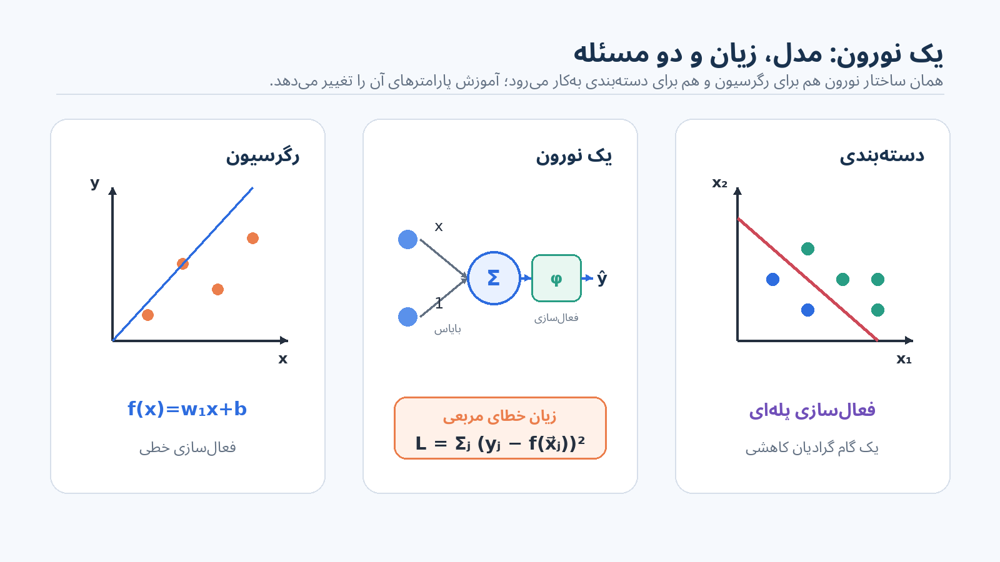

<em>تخته با محاسبه یک نورون، حالت‌های رگرسیون و دسته‌بندی، و زیان مربعی به‌عنوان تابعی از پارامترهای مدل شروع می‌شود.</em>

<h2 dir="rtl" align="right">یک مثال کوچک رگرسیون</h2>

با یک مجموعه‌داده رگرسیون چهارنقطه‌ای و یک‌بعدی شروع می‌کنیم. نورون فعلی وزن w1=2 و بایاس b=−2 دارد، پس خروجی آن خط مستقیم زیر است:

f(x) = 2x − 2.

در چهار ورودی x=1,2,3,4، مدل به‌ترتیب 0، 2، 4 و 6 را پیش‌بینی می‌کند. خروجی‌های درست 1، 3، 2 و 4 هستند. بنابراین خطاهای نقطه‌ای y−f(x) برابرند با 1، 1، −2 و −2.

| x | target y | prediction f(x) | error y−f(x) |
| --- | --- | --- | --- |
| 1 | 1 | 0 | 1 |
| 2 | 3 | 2 | 1 |
| 3 | 2 | 4 | −2 |
| 4 | 4 | 6 | −2 |

L(2,−2) = (1−0)² + (3−2)² + (2−4)² + (4−6)² = 10.

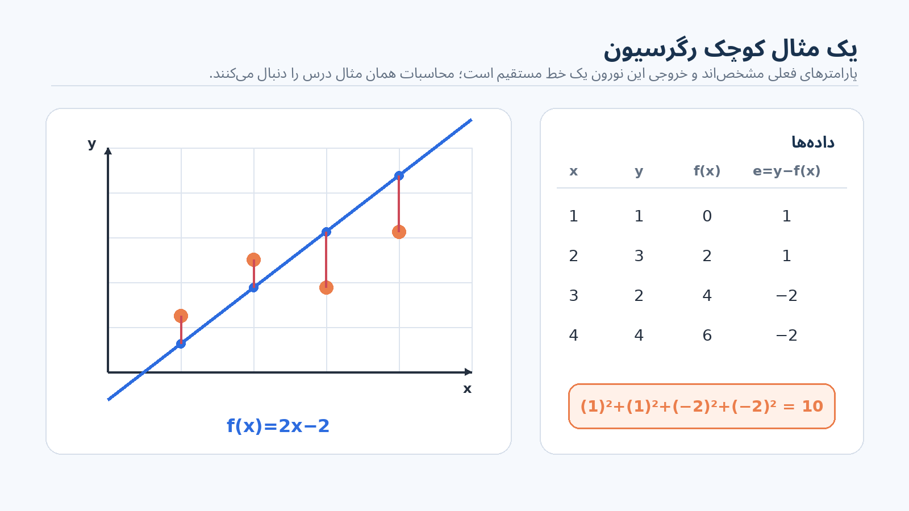

<em>چهار باقیمانده مستقیماً در مجموع خطاهای مربعی قرار می‌گیرند و مجموع مربع آن‌ها 10 می‌شود.</em>

هدف کمینه‌کردن زیان است. از حساب دیفرانسیل می‌دانیم که گرادیان جهت تندترین افزایش را نشان می‌دهد؛ بنابراین جهت کاهش زیان، منفیِ گرادیان است. چون این نورون دو پارامتر دارد، گرادیان دو مؤلفه دارد: یک مشتق جزئی نسبت به w1 و یک مشتق جزئی نسبت به b.

<h2 dir="rtl" align="right">مشتق‌گیری گرادیان در حالت کلی</h2>

به‌جای مشتق‌گیری فقط برای همین مثال، زیان یک نورون دلخواه روی یک مجموعه‌داده دلخواه را در نظر می‌گیریم. برای هر پارامتر مدل یک مشتق جزئی داریم. برای یک وزن دلخواه wi، مشتق از داخل جمع عبور می‌کند و سپس برای هر جمله مربعی از قاعده زنجیره‌ای استفاده می‌شود.

∂L/∂wi = −2 Σj=1N ( yj − f(x⃗j) ) · ∂f(x⃗j)/∂wi.

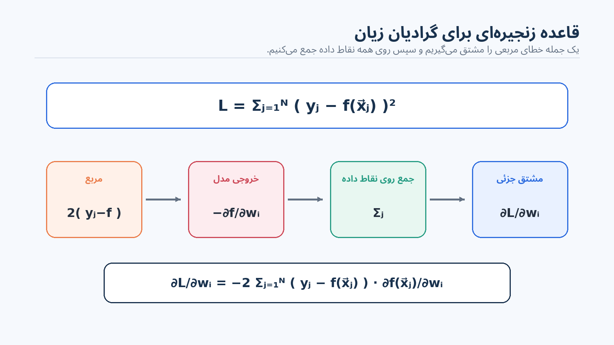

<em>مربع عامل 2 را ایجاد می‌کند؛ مشتق داخل پرانتز نیز علامت منفی می‌دهد، چون yj ثابت است و خروجی مدل از آن کم شده است.</em>

هنوز نمی‌توان مشتق تابع فعال‌سازی را به‌صورت یک فرمول همگانی نوشت، چون نورون‌ها می‌توانند فعال‌سازی‌های متفاوتی داشته باشند. اما هر نورون از همان جمع وزن‌دار شروع می‌کند. برای نقطه داده j، جمع وزن‌دار پیش از فعال‌سازی را با xj، بدون علامت بردار، می‌نویسیم:

xj = b + Σk=1n wkxj,k.

فقط یک جمله از این جمع شامل wi است. پس:

∂xj/∂wi = xj,i, and ∂xj/∂b = 1.

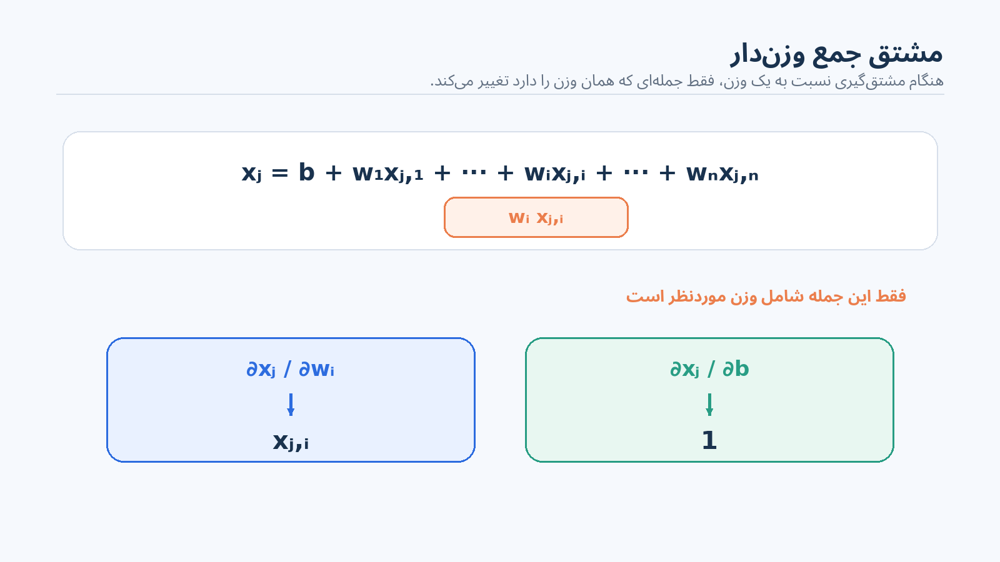

<em>مشتق جمع وزن‌دار نسبت به وزن wi فقط مؤلفه ورودی متناظر xj,i را باقی می‌گذارد؛ مشتق نسبت به بایاس برابر 1 است.</em>

کمیت تکرارشونده yj−f(x⃗j) همان اختلافِ پیش از مربع‌کردن است که در محاسبه زیان داشتیم. آن را خطای نقطه j می‌نامیم: ej.

ej = yj − f(x⃗j), so ∂L/∂wi = −2 Σ ej · ∂f(x⃗j)/∂wi.

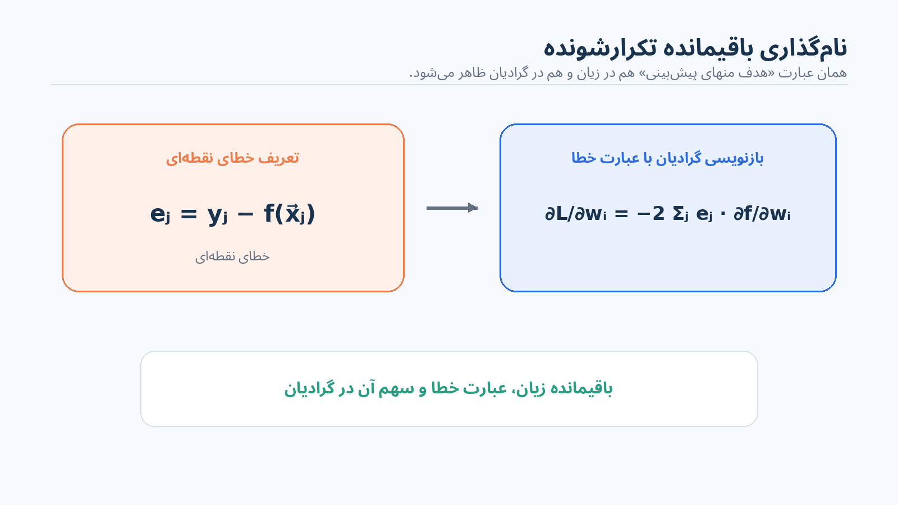

<em>روی تخته اختلاف «هدف منهای پیش‌بینی» با ej نام‌گذاری می‌شود تا محاسبه گرادیان مستقیماً به همان باقیمانده‌های محاسبه زیان وصل شود.</em>

<h2 dir="rtl" align="right">اعمال گرادیان به رگرسور خطی</h2>

برای فعال‌سازی خطی، مشتق تابع فعال‌سازی برابر 1 است. بنابراین پس از عبور قاعده زنجیره‌ای، هنگام مشتق نسبت به یک وزن فقط همان مؤلفه ورودی متناظر باقی می‌ماند. برای w1:

∂L/∂w1 = −2 Σ ejxj,1 = −2[1·1 + 1·2 − 2·3 − 2·4] = 22.

برای بایاس، مشتق جمع وزن‌دار برابر 1 است:

∂L/∂b = −2 Σ ej = −2[1 + 1 − 2 − 2] = 4.

پس گرادیان در نقطه w1=2, b=−2 برابر است با:

∇L = [22, 4]T.

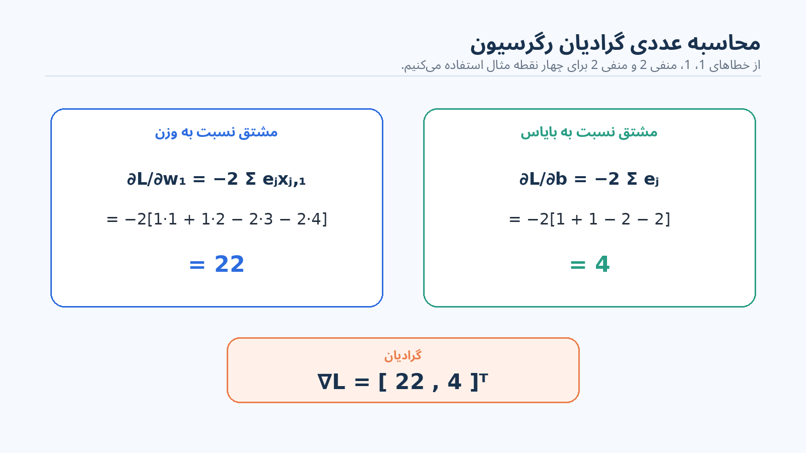

<em>هر دو مشتق جزئی به‌صورت عددی محاسبه و سپس در بردار گرادیان [22,4] کنار هم قرار می‌گیرند.</em>

<h2 dir="rtl" align="right">معنای هندسی گرادیان</h2>

زیان تابعی از پارامترهای مدل است. در اینجا دو ورودی آن w1 و b هستند. هر نقطه در صفحه (w1,b) یک خط متفاوت را مشخص می‌کند که نورون می‌تواند محاسبه کند. مثلاً w1=−3 و b=2 یک پارامترگذاری متفاوت از نورون خطی خواهد بود. نقطه فعلی ما (2,−2) است که زیان آن 10 بود.

حالا تصور کنید مقدار زیان از این صفحه پارامترها به‌صورت یک سطح بیرون آمده باشد. گرادیان در هر نقطه جهت تندترین افزایش آن سطح را نشان می‌دهد. برای کم‌کردن زیان باید در جهت عکس حرکت کنیم.

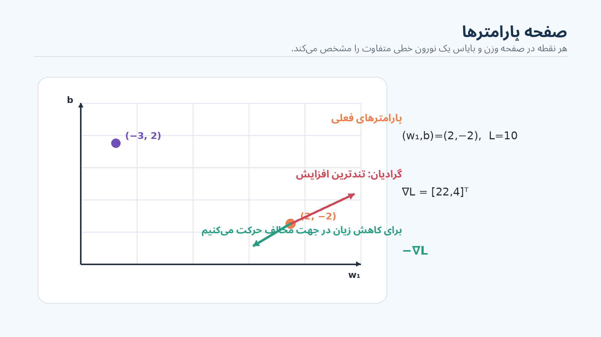

<em>صفحه پارامترها با w1 در جهت افقی و b در جهت عمودی رسم می‌شود؛ هر نقطه یک پارامترگذاری ممکن برای نورون است.</em>

یک گام کوچک با کم‌کردن ضریبی از گرادیان بردارید:

[w1, b]T ← [w1, b]T − η∇L.

ضریب η اندازه گام است. اگر η=0.01 باشد، 0.22 را از وزن و 0.04 را از بایاس کم می‌کنیم:

w1: 2 → 1.78, b: −2 → −2.04.

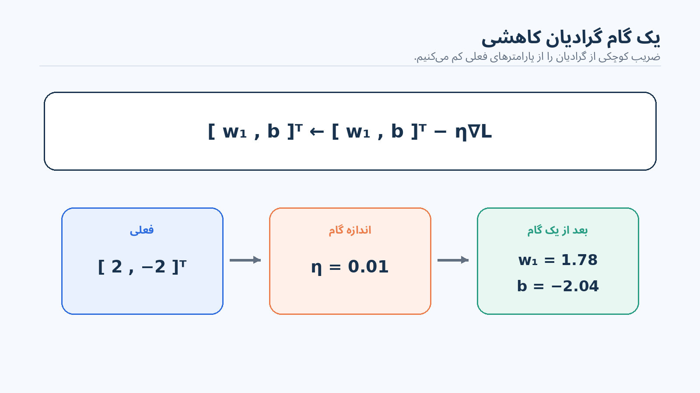

<em>جهت به‌روزرسانی روی صفحه پارامترها نشان داده می‌شود و η=0.01 زیر گرادیان عددی نوشته شده است.</em>

با پارامترهای جدید، زیان را دوباره ارزیابی می‌کنیم، گرادیان تازه را حساب می‌کنیم و یک گام دیگر برمی‌داریم. تکرار این فرایند مدل را بهتر می‌کند.

سطح زیان در این مثال در جهت وزن بسیار تندتر از جهت بایاس است. این با رفتار مدل هم سازگار است: تغییر وزن شیب خط را عوض می‌کند و می‌تواند خطاهای نقاط مختلف x را سریع‌تر تغییر دهد؛ در حالی که تغییر بایاس فقط کل خط را کمی بالا یا پایین می‌برد.

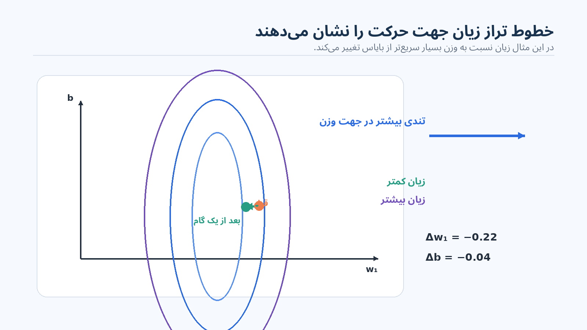

<em>خطوط تراز بیضوی پیرامون ناحیه زیان کم رسم می‌شوند؛ کشیدگی آن‌ها تفاوت زیاد شیب سطح در دو جهت پارامتر را نشان می‌دهد.</em>

بعد از اولین گام، بایاس کمی کوچک‌تر شده، پس محل برخورد خط با محور اندکی پایین می‌آید. وزن بسیار بیشتر کاهش یافته، پس شیب خط کمتر می‌شود. در نتیجه خط کمی پایین می‌رود و به سمت راست می‌چرخد؛ و این با چهار نقطه داده بهتر جور است.

<h2 dir="rtl" align="right">چرا دسته‌بند پله‌ای را نمی‌توان به همین روش آموزش داد</h2>

اگر همین محاسبه گرادیان را برای تابع فعال‌سازی پله‌ای به کار ببریم، فوراً به مشکل می‌خوریم: مشتق تابع پله‌ای تقریباً همه‌جا صفر است. بنابراین گرادیان تقریباً هیچ اطلاعات مفیدی درباره جهت تغییر پارامترها به ما نمی‌دهد.

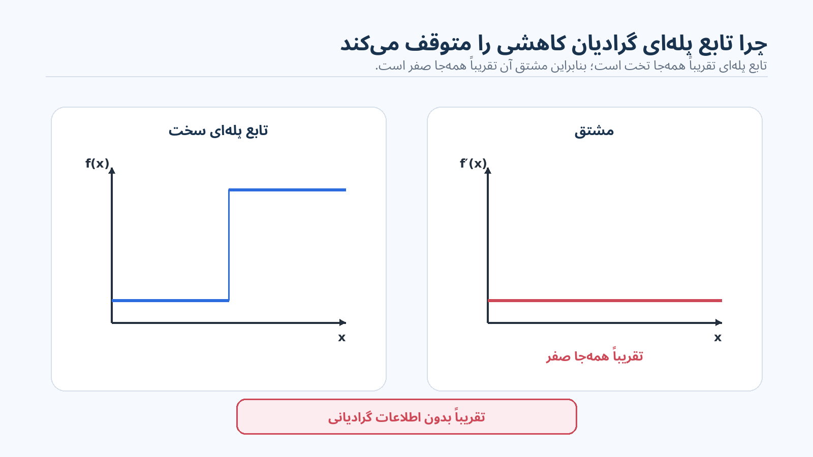

<em>پس از تکمیل تصویر گرادیان کاهشی برای رگرسیون، درس به نیمه دسته‌بندی تخته برمی‌گردد.</em>

راه‌حل این است که تابع پله‌ای سخت را با یک تقریب نرم، یعنی تابع سیگموید، جایگزین کنیم.

σ(x) = 1 / (1 + e−x).

وقتی x بزرگ و مثبت است، e−x بسیار کوچک می‌شود و σ(x) به 1 نزدیک می‌شود. وقتی x بسیار منفی است، e−x بسیار بزرگ می‌شود، مخرج به سمت بی‌نهایت می‌رود و σ(x) به 0 نزدیک می‌شود. میان این دو حالت، یک گذار نرم داریم.

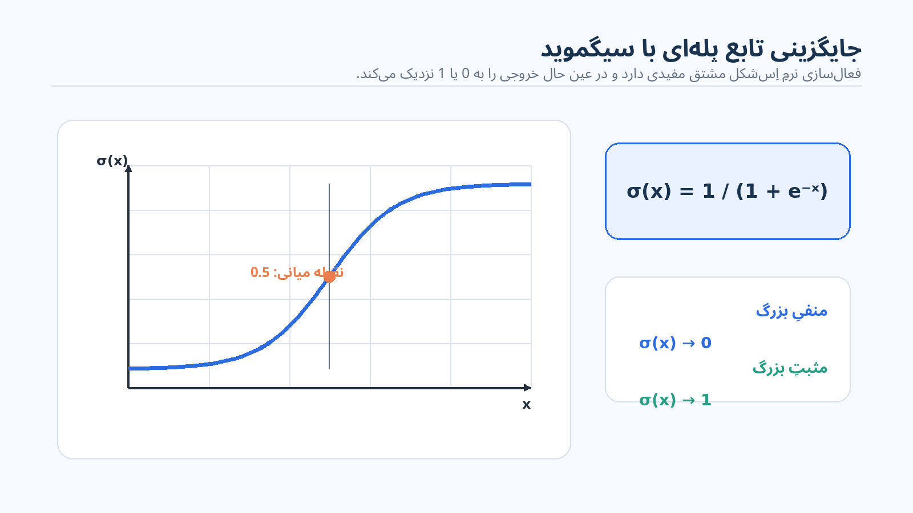

<em>تابع پله‌ای روی تخته با منحنی S شکل نرم جایگزین می‌شود و فرمول σ(x)=1/(1+e−x) بالای آن نوشته می‌شود.</em>

<h2 dir="rtl" align="right">دسته‌بندی با سیگموید</h2>

مرز دسته‌بندی هنوز همان جایی است که جمع وزن‌دار از منفی به مثبت تغییر می‌کند. اما نزدیک این مرز، خروجی سیگموید حدود 0.5 است؛ فقط وقتی از مرز دور می‌شویم خروجی به 0 یا 1 نزدیک می‌شود. این منطقی است، چون برای نقطه‌ای که درست روی مرز قرار دارد نباید به‌اندازه نقطه‌ای دور از مرز اعتماد داشته باشیم.

نورونی را در نظر بگیرید که w1=1، w2=1 و b=−4 دارد. شش نقطه داده روی تخته چنین‌اند:

| x1 | x2 | target y | weighted sum x1+x2−4 | σ(weighted sum) |
| --- | --- | --- | --- | --- |
| 1 | 2 | 0 | −1 | 0.27 |
| 2 | 1 | 0 | −1 | 0.27 |
| 2 | 3 | 1 | 1 | 0.73 |
| 3 | 2 | 1 | 1 | 0.73 |
| 4 | 1 | 1 | 1 | 0.73 |
| 4 | 2 | 1 | 2 | 0.88 |

با تابع پله‌ای، این جمع‌های وزن‌دار پیش‌بینی‌های 0،0،1،1،1،1 را می‌دهند. با سیگموید، همان مقادیر به خروجی‌های درجه‌بندی‌شده تبدیل می‌شوند. برای −1:

σ(−1)=1/(1+e)≈0.27;

برای +1:

σ(1)=1/(1+e−1)≈0.73;

و برای +2:

σ(2)≈0.88.

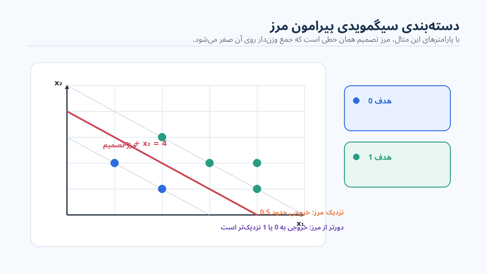

<em>مرز خطی همان است، اما فعال‌سازی نرم شدت امتیاز نقاط نزدیک و دور از مرز را تغییر می‌دهد.</em>

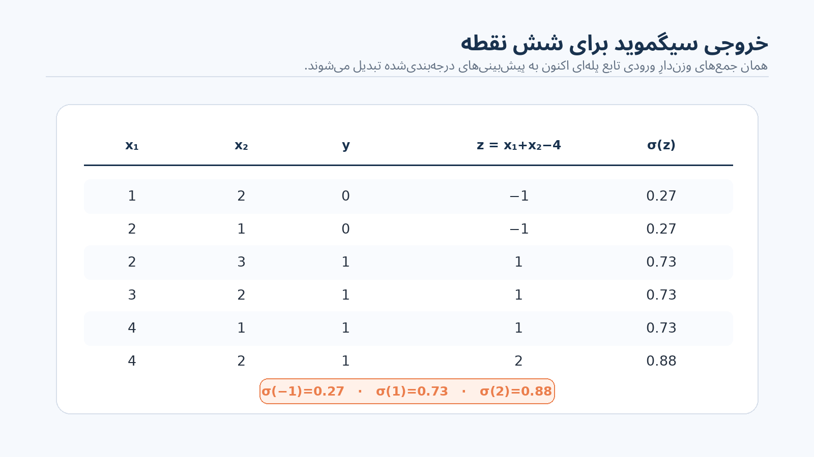

<em>در جدول سمت راست، خروجی‌های سیگموید مانند 0.27، 0.73 و 0.88 برای شش نقطه نوشته می‌شوند.</em>

می‌توان زیان را همچنان با مجموع مربع اختلاف میان پاسخ درست و پیش‌بینی‌ها ساخت. اما هدف اصلی اینجا پیدا کردن گرادیان است؛ پس باید خود تابع سیگموید را مشتق بگیریم.

<h2 dir="rtl" align="right">مشتق سیگموید</h2>

از σ(x)=1/(1+e−x) شروع می‌کنیم. با استفاده از قاعده خارج‌قسمت:

dσ/dx = e−x / (1+e−x)².

این عبارت را می‌توان به شکل بسیار مفید زیر بازنویسی کرد:

σ′(x) = σ(x)(1−σ(x)).

برابری این دو عبارت برای بررسی به خودمان واگذار می‌شود؛ جبر آن دشوار نیست. همین هویت است که فرمول گرادیان بعدی را فشرده می‌کند.

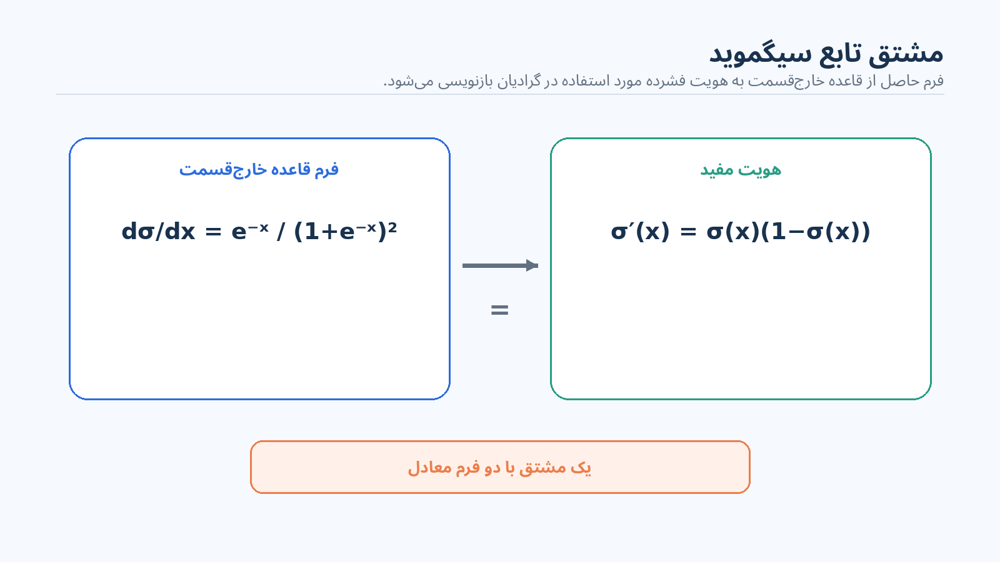

<em>مشتق حاصل از قاعده خارج‌قسمت نوشته و با σ(x)(1−σ(x)) برابر دانسته می‌شود.</em>

<h2 dir="rtl" align="right">گرادیان برای دسته‌بند سیگمویدی</h2>

همان مشتق کلیِ زیان مربعی را به کار می‌بریم. ابتدا یک وزن را در نظر می‌گیریم؛ وزن دیگر و بایاس دقیقاً الگوی مشابهی دارند:

∂L/∂wi = −2 Σj=1N ej · ∂f(x⃗j)/∂wi.

اکنون f همان سیگمویدِ اعمال‌شده به جمع وزن‌دار است. قاعده زنجیره‌ای، مشتق سیگموید را در مقدار جمع وزن‌دار در مشتق خودِ جمع وزن‌دار ضرب می‌کند. و مثل قبل، مشتق جمع وزن‌دار نسبت به یک وزن فقط همان مؤلفه ورودی متناظر xj,i است.

∂L/∂wi = −2 Σj=1N ej σ(xj)(1−σ(xj)) xj,i.

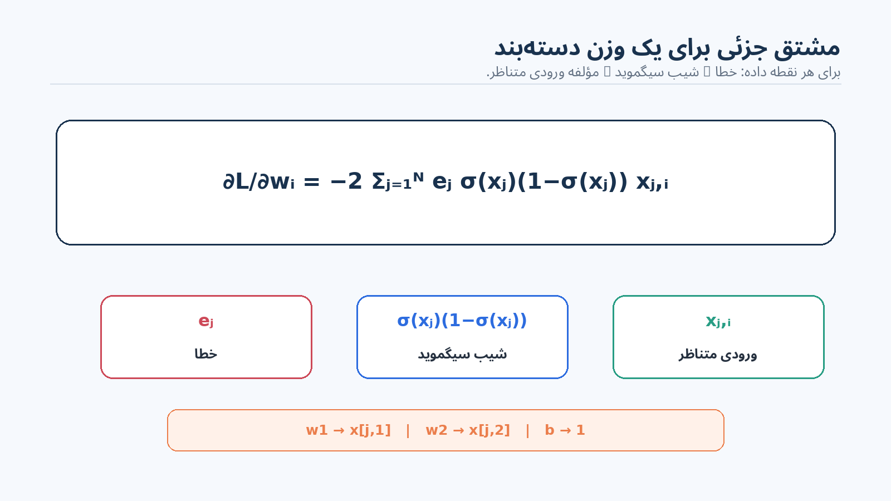

<em>عبارت نهایی هر خطا را در σ(xj)(1−σ(xj)) و در مؤلفه ورودیِ متناظر با وزن موردنظر ضرب می‌کند.</em>

برای w1 از مؤلفه اول هر نقطه داده و برای w2 از مؤلفه دوم استفاده می‌کنیم. برای بایاس، مشتق جمع وزن‌دار برابر 1 است، پس عامل xj,i حذف می‌شود. کنار هم گذاشتن این سه مشتق جزئی، بردار گرادیان برای (w1,w2,b) را می‌سازد.

باز هم گرادیان جهت افزایش زیان را نشان می‌دهد. ضریب کوچکی از آن را از پارامترهای فعلی کم می‌کنیم، با وزن‌ها و بایاس تازه گرادیان را دوباره حساب می‌کنیم، یک گام دیگر برمی‌داریم و این روند را ادامه می‌دهیم.

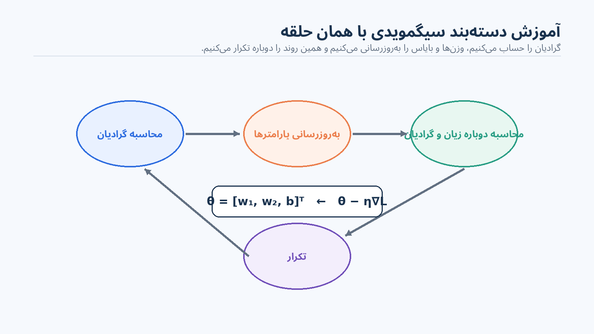

<em>فرمول کامل مشتق دسته‌بندی روی تخته باقی می‌ماند و فرایند به‌روزرسانی دوباره به همان حلقه گرادیان کاهشیِ بخش رگرسیون متصل می‌شود.</em>

<h2 dir="rtl" align="right">همان ایده در ابعاد بالاتر</h2>

هیچ بخش اساسیِ این مشتق‌گیری به یک ورودی برای رگرسیون یا دو ورودی برای دسته‌بندی وابسته نیست. اگر ورودی مختصات بیشتری داشته باشد، نورون فقط وزن‌های بیشتری خواهد داشت. فرمول هر مشتق جزئی همان می‌ماند و فقط برای هر وزن یک بار دیگر اجرا می‌شود تا بردار کامل گرادیان ساخته شود.

در رگرسیون، نتیجه همان رگرسیون خطی با یک نورون و آموزش گرادیان کاهشی است. در دسته‌بندی، جایگزین‌کردن تابع پله‌ای با سیگموید، رگرسیون لجستیک را می‌سازد؛ باز هم فقط با یک نورون و گرادیان کاهشی.

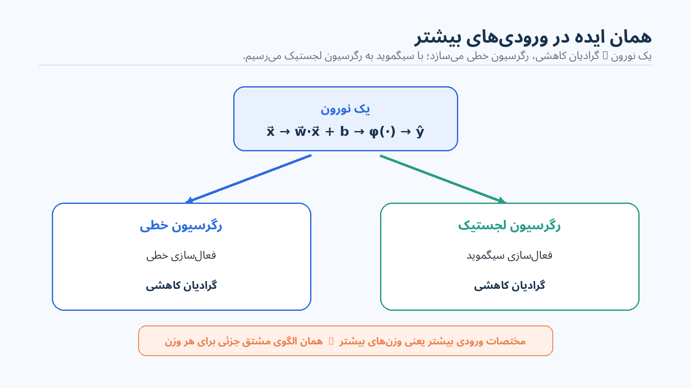

<em>در پایان، به‌روزرسانی رگرسیون، طرح سطح زیان، فعال‌سازی سیگموید، مشتق آن و فرمول گرادیان دسته‌بند هم‌زمان روی تخته دیده می‌شوند.</em>

---

[Source: https://www.youtube.com/watch?v=HU91yMSTU0Y](https://www.youtube.com/watch?v=HU91yMSTU0Y)
