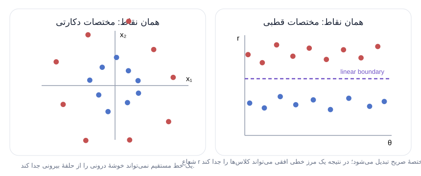

<p dir="rtl" align="right"><strong>یادگیری عمیق • DL 05</strong></p>

<h1 dir="rtl" align="right">خط لولهٔ تحلیل داده</h1>

<p dir="rtl" align="right">شبکهٔ عصبی هیچ‌وقت تمام سامانهٔ یادگیری ماشین نیست. داده باید جمع‌آوری و پاک‌سازی شود، به شکل عددی مناسبی درآید، از مدل عبور کند و سپس خروجی آن به پیش‌بینی قابل استفاده تبدیل شود. این درس کل این مسیر را دنبال می‌کند: از مشاهده‌های جهان تا پیش‌بینی دربارهٔ جهان.</p>

<p dir="rtl" align="right"><strong>نمای کلی</strong></p>

<h2 dir="rtl" align="right">مدل فقط یکی از مرحله‌های یک سامانهٔ بزرگ‌تر است</h2>

<p dir="rtl" align="right">در درس یادگیری عمیق طبیعی است که بیشتر توجه ما روی شبکه‌های عصبی باشد. اما یک شبکهٔ عصبی — یا هر مدل یادگیری ماشین — همیشه فقط بخشی از یک سامانهٔ بزرگ‌تر است. پیش از آن‌که داده وارد مدل شود، باید جمع‌آوری و به شکلی پردازش شود که مدل بتواند با آن کار کند. بعد از تولید خروجی نیز معمولاً هنوز رمزگشایی، ارائه، اعتبارسنجی یا تحلیل دیگری لازم است.</p>

<p dir="rtl" align="right">استعارهٔ مفید این درس <strong>خط لولهٔ تحلیل داده</strong> است: دنباله‌ای از مرحله‌ها که اطلاعات از آن‌ها عبور می‌کند. هدف کلی این است که <strong>مشاهده‌های جهان</strong> را به <strong>پیش‌بینی دربارهٔ جهان</strong> تبدیل کنیم. نگاه خط لوله‌ای کمک می‌کند فقط خود مدل را نبینیم؛ بلکه ورودی آن، خروجی آن و فرض‌هایی را که در هر انتقال به داده اضافه می‌کنیم هم جدی بگیریم.</p>

<p dir="rtl" align="right">1. مشاهده‌ها</p>

<p dir="rtl" align="right">2. <strong>جمع‌آوری و پاک‌سازی</strong> — حجم • پوشش • سوگیری • مقادیر گمشده • برچسب‌ها</p>

<p dir="rtl" align="right">3. <strong>پیش‌پردازش</strong> — رمزگذاری عددی • بازنمایی • نرمال‌سازی • تقسیم آموزش/آزمون</p>

<p dir="rtl" align="right">4. <strong>شبکهٔ عصبی</strong> — یا یک مدل دیگر یادگیری ماشین</p>

<p dir="rtl" align="right">5. <strong>پس‌پردازش و تحلیل</strong> — رمزگشایی • بازگردانی مقیاس • ارائه • اعتبارسنجی • تنظیم</p>

<p dir="rtl" align="right">6. پیش‌بینی‌ها</p>

<p dir="rtl" align="right">چه داده‌ای داریم؟ / مدل دقیقاً چه اعدادی می‌گیرد؟ / یادگیری نگاشت / تبدیل خروجی خام به نتیجهٔ قابل استفاده / استفاده از نتیجه</p>

<p dir="rtl" align="right"><em>شبکه عمداً فقط یکی از چند جعبهٔ این شکل است: کیفیت پیش‌بینی به همهٔ مرحله‌ها و انتقال درست داده بین آن‌ها بستگی دارد، نه فقط به خود مدل.</em></p>

<p dir="rtl" align="right">برای مسئله‌های مختلف، شکل خط لوله هم فرق می‌کند. در یک مجموعه‌دادهٔ استاندارد یا شبیه‌سازی‌شده شاید بعضی مراحل جمع‌آوری یا پاک‌سازی تقریباً از قبل انجام شده باشند. در یک کاربرد واقعی معمولاً نمی‌توان چنین فرضی کرد. ادامهٔ درس مهم‌ترین مرحله‌های رایج را به ترتیب بررسی می‌کند.</p>

<p dir="rtl" align="right"><strong>مرحلهٔ ۱</strong></p>

<h2 dir="rtl" align="right">جمع‌آوری داده: مشاهده‌های درست را به دست آورید</h2>

<p dir="rtl" align="right">یادگیری ماشین به داده‌ای نیاز دارد که مدل روی آن آموزش ببیند. پس نخستین پرسش عملی این است: <em>چه مشاهده‌هایی می‌توانیم جمع کنیم که واقعاً مسئله‌ای را توصیف کنند که قرار است مدل حل کند؟</em> گاهی مجموعه‌داده از قبل وجود دارد؛ اما برای یک کاربرد تازه، خودِ جمع‌آوری بخشی از مسئلهٔ مدل‌سازی است.</p>

<h3 dir="rtl" align="right">چه مقدار داده؟</h3>

<p dir="rtl" align="right">موفقیت‌های یادگیری عمیق تا حد زیادی از امکان آموزش روی مجموعه‌داده‌های بسیار بزرگ آمده است؛ بنابراین داشتن <strong>دادهٔ کافی</strong> مهم است. با این حال ممکن است نسبت به توان محاسباتی موجود، <strong>دادهٔ بیش از حد</strong> هم داشته باشیم. به‌خصوص وقتی هنوز در مرحلهٔ اکتشاف هستیم و می‌خواهیم بفهمیم چه چیزی اصلاً ممکن است، کار با یک زیرمجموعهٔ کوچک‌تر و قابل مدیریت می‌تواند بسیار مفیدتر از پردازش فوری همهٔ داده باشد.</p>

<h3 dir="rtl" align="right">نماینده‌بودن داده: پوشش، موارد نادر و سوگیری</h3>

<p dir="rtl" align="right">مجموعه‌داده زمانی <strong>نماینده</strong> است که نوع مثال‌ها و شرایطی را بازتاب دهد که مدل در مسئلهٔ واقعی با آن‌ها روبه‌رو خواهد شد. در طبقه‌بندی، <strong>کلاس (class)</strong> یکی از دسته‌هایی است که مدل باید از بقیه تشخیص دهد؛ پس هر کلاس موردنیاز باید در داده پوشش کافی داشته باشد.</p>

<p dir="rtl" align="right">پوشش به‌تنهایی کافی نیست. <strong>دادهٔ پرت یا مورد غیرمعمول (outlier)</strong> نمونه‌ای است که با بیشتر داده‌ها فرق دارد؛ بعضی از این نمونه‌های نادر دقیقاً همان موقعیت‌هایی هستند که سامانهٔ واقعی باید درست مدیریت کند. مثال درس، بینایی کامپیوتری برای خودروی خودران است: سامانه باید یک <strong>درشکهٔ آمیش</strong> را تشخیص دهد و بداند رفتار حرکتی آن با ترافیک معمول خودروها یکسان نیست. ممکن است مجموعه‌داده بسیار بزرگ باشد و بااین‌حال چنین نمونهٔ مهمی را اصلاً نداشته باشد.</p>

<p dir="rtl" align="right"><strong>سوگیری نظام‌مند</strong> یعنی یک عدم‌تعادل یا ناسازگاری تکرارشونده میان دادهٔ جمع‌آوری‌شده و جهان گسترده‌تر. اگر تقریباً همهٔ تصاویر آموزشی در روز آفتابی گرفته شده باشند، طبقه‌بند تصویر ممکن است در هوای ابری مشکل پیدا کند. در سلامت یا آموزش نیز ممکن است الگویی در داده ظاهراً به یک فرد نسبت داده شود، درحالی‌که منشأ آن ساختارهای اجتماعی گسترده‌تر است. بنابراین شناسایی و اصلاح سوگیری یک مسئلهٔ دشوار و فعال پژوهشی است، نه کاری که با یک بررسی ساده برای همیشه تمام شود.</p>

<h4 dir="rtl" align="right">پوشش</h4>

<p dir="rtl" align="right">همهٔ کلاس‌هایی که طبقه‌بند باید تشخیص دهد باید در داده نمایندگی شوند.</p>

<h4 dir="rtl" align="right">نمونه‌های نادر اما مهم</h4>

<p dir="rtl" align="right">ترافیک معمولی + یک درشکهٔ آمیش</p>

<p dir="rtl" align="right">یک نمونهٔ کم‌تکرار ممکن است با وجود نادر بودن، از نظر کاربردی بسیار مهم باشد.</p>

<h4 dir="rtl" align="right">سوگیری نظام‌مند</h4>

<p dir="rtl" align="right">تصاویر بسیار زیادِ آفتابی ← عملکرد ضعیف‌تر در هوای ابری</p>

<p dir="rtl" align="right">عدم‌تعادل تکرارشونده در شرایط جمع‌آوری می‌تواند وارد رفتار مدل شود.</p>

<p dir="rtl" align="right"><em>«نماینده بودن» فقط به معنای بزرگ بودن مجموعه‌داده نیست؛ داده باید موقعیت‌هایی را پوشش دهد که مدل در کاربرد واقعی با آن‌ها روبه‌رو می‌شود.</em></p>

<blockquote dir="rtl"><p dir="rtl" align="right"><strong>چرا مرحلهٔ بعد پاک‌سازی است؟</strong> حتی یک مجموعه‌دادهٔ خوب ممکن است اندازه‌گیری گمشده، فیلد بی‌ربط، شکل ورودی ناسازگار یا برچسب ناهماهنگ داشته باشد. پیش از آن‌که از شبکهٔ عصبی بخواهیم چیزی یاد بگیرد، باید روشن کنیم یک نمونهٔ آموزشی معتبر دقیقاً چه شکلی دارد.</p></blockquote>

<p dir="rtl" align="right"><strong>مرحلهٔ ۲</strong></p>

<h2 dir="rtl" align="right">پاک‌سازی داده: نمونه‌ها را سازگار و معنادار کنید</h2>

<p dir="rtl" align="right"><strong>ویژگی (feature)</strong> یکی از جنبه‌های اندازه‌گیری‌شده یا بازنمایی‌شدهٔ یک نمونه است؛ مثلاً فشار خون در پروندهٔ سلامت یا مقدار یک پیکسل در تصویر. پاک‌سازی بررسی می‌کند که ویژگی‌ها و برچسب‌های دادهٔ جمع‌آوری‌شده تا چه اندازه برای یادگیری قابل استفاده‌اند.</p>

<h3 dir="rtl" align="right">ویژگی‌های گمشده</h3>

<p dir="rtl" align="right">ممکن است یک ویژگی برای بعضی نمونه‌ها وجود داشته باشد و برای بعضی دیگر نه. اگر بیشتر پرونده‌های سلامت فشار خون داشته باشند اما چند پرونده فاقد آن باشند، دو تصمیم جداگانه داریم: آیا فشار خون اصلاً باید جزو ورودی مدل باشد؟ و اگر هست، نبودن این مقدار در برخی نمونه‌ها چگونه نمایش داده شود؟</p>

<h3 dir="rtl" align="right">ویژگی‌های زائد</h3>

<p dir="rtl" align="right">بعضی فیلدهای ذخیره‌شده شاید هیچ ارتباط معناداری با هدف مسئله نداشته باشند. شمارهٔ شناسهٔ بیمار برای کار اداری لازم است، اما لزوماً ویژگی‌ای از فرد نیست که بخواهیم مدل بر اساس آن یاد بگیرد. وارد کردن چنین فیلدی می‌تواند نویز اضافه کند یا مدل را به سمت همبستگی‌های کاذب ببرد، به‌جای آن‌که رابطه‌های واقعی را یاد بگیرد.</p>

<h3 dir="rtl" align="right">ناهمخوانی ابعاد</h3>

<p dir="rtl" align="right">مدل به ساختار ورودی سازگار نیاز دارد. تصاویر یک مجموعه‌داده ممکن است وضوح یا نسبت ابعاد متفاوت داشته باشند. این به معنی غیرقابل‌استفاده بودن آن‌ها نیست؛ یعنی خط لوله باید روشی روشن برای تبدیل این نمونه‌های متفاوت به ورودی‌هایی داشته باشد که یک مدل واحد بتواند بپذیرد.</p>

<h3 dir="rtl" align="right">برچسب مناسب برای یادگیری نظارت‌شده</h3>

<p dir="rtl" align="right">در <strong>یادگیری نظارت‌شده (supervised learning)</strong>، مدل از مثال‌هایی آموزش می‌بیند که هر کدام یک هدف یا <strong>برچسب (label)</strong> دارند. بنابراین برچسب باید دقیقاً همان چیزی را نمایندگی کند که می‌خواهیم مدل یاد بگیرد. مثال درس، زبان اشارهٔ آمریکایی (ASL) است. اگر فقط ویدئوی زبان اشاره را داشته باشیم، ساختن برچسب دقیق برای تمام بخش‌های ویدئو می‌تواند کار انسانی بسیار زیادی بخواهد. اگر ویدئو مربوط به مترجم زبان اشاره باشد و متن گفتار انگلیسی را هم داشته باشیم، باز هم ممکن است میان متن گفتاری و چیزی که در زبان اشاره بیان شده تناظر یک‌به‌یک وجود نداشته باشد. برچسبِ در دسترس الزاماً برچسبِ درست نیست.</p>

<h4 dir="rtl" align="right">ویژگی گمشده</h4>

`patient_042: blood_pressure = —`

<p dir="rtl" align="right">→ تصمیم بگیرید ویژگی باقی بماند یا نه و اگر ماند، نبودن مقدار چگونه نمایش داده شود.</p>

<h4 dir="rtl" align="right">ویژگی زائد</h4>

`patient_ID = 817392`

<p dir="rtl" align="right">→ بپرسید آیا این عدد دربارهٔ مسئلهٔ واقعی اطلاعاتی دارد یا فقط نویز و حواس‌پرتی برای مدل ایجاد می‌کند.</p>

<h4 dir="rtl" align="right">ناهمخوانی ابعاد</h4>

`image A: 640×480 / image B: 1024×1024`

<p dir="rtl" align="right">→ یک مدل واحد به ساختار ورودی سازگار نیاز دارد؛ پس تفاوت اندازه و نسبت ابعاد باید آگاهانه مدیریت شود.</p>

<h4 dir="rtl" align="right">برچسب مناسب</h4>

`ASL video ⇄ English transcript?`

<p dir="rtl" align="right">→ در یادگیری نظارت‌شده، هدف باید واقعاً با چیزی متناظر باشد که قرار است مدل از ورودی یاد بگیرد.</p>

<p dir="rtl" align="right"><em>پاک‌سازی فقط «مرتب کردن داده» نیست؛ مجموعه‌ای از تصمیم‌های مدل‌سازی است. هر ناسازگاری می‌تواند تعیین کند مدل چه چیزی را می‌تواند با اطمینان از داده بیاموزد.</em></p>

<blockquote dir="rtl"><p dir="rtl" align="right"><strong>پل به پیش‌پردازش:</strong> حالا فرض می‌کنیم داده را آن‌قدر جمع‌آوری و پاک‌سازی کرده‌ایم که مسئله را خوب نمایندگی می‌کند. پرسش بعدی دیگر «آیا نمونه معتبر است؟» نیست؛ پرسش این است که این نمونه را چگونه عددی کنیم تا شبکهٔ عصبی بتواند از آن مؤثر یاد بگیرد.</p></blockquote>

<p dir="rtl" align="right"><strong>مرحلهٔ ۳</strong></p>

<h2 dir="rtl" align="right">پیش‌پردازش: دادهٔ قابل استفاده را به ورودی مؤثر مدل تبدیل کنید</h2>

<p dir="rtl" align="right">شبکهٔ عصبی با عدد کار می‌کند. دقیق‌تر بگوییم، ورودی آن ساختارهایی مانند <strong>بردار (vector)</strong> — فهرستی مرتب از اعداد — یا <strong>ماتریس (matrix)</strong> — شبکه‌ای مستطیلی از اعداد — است. پیش‌پردازش نمونه‌های پاک‌شده را به این قالب عددی می‌برد و در صورت نیاز بازنمایی یا مقیاس آن‌ها را نیز تغییر می‌دهد.</p>

<h3 dir="rtl" align="right">رمزگذاری عددی فقط «یک عدد دادن» نیست</h3>

<p dir="rtl" align="right">سختی این کار به نوع داده وابسته است. تصویر نسبتاً ساده است چون رایانه از قبل آن را به‌صورت آرایه‌ای از مقدارهای پیکسلی ذخیره می‌کند. متن متفاوت است. کدگذاری نویسه‌ای مانند ASCII حروف را به عدد تبدیل می‌کند، اما این اعداد برای ذخیره‌سازی طراحی شده‌اند؛ نه برای نشان دادن معنای زبان به شبکهٔ عصبی.</p>

<h4 dir="rtl" align="right">تصویر از ابتدا تقریباً عددی است</h4>

```
20 55 90 130
45 85 140 190
70 120 175 225
110 155 205 250
```

<p dir="rtl" align="right">رایانه تصویر را از قبل با مقدارهای پیکسلی ذخیره می‌کند؛ بنابراین بازنمایی طبیعی تصویر به چیزی که شبکهٔ عصبی نیاز دارد نزدیک است.</p>

<h4 dir="rtl" align="right">کد نویسه عدد است، اما فضای معنایی مناسبی نیست</h4>

```
"cat" → [99, 97, 116]
"dog" → [100, 111, 103]
```

<p dir="rtl" align="right">ASCII برای ذخیره‌کردن نویسه‌ها به آن‌ها عدد می‌دهد. خودِ این اعداد رابطه‌های معنایی زبان را که مدل باید یاد بگیرد نشان نمی‌دهند. پس همان متن به یک بازنمایی عددی مناسب‌تر نیاز دارد.</p>

<p dir="rtl" align="right"><em>پرسش فقط این نیست که «آیا داده را می‌توان عددی نوشت؟»؛ پرسش مهم‌تر این است که «آیا این اعداد ساختار مفید مسئله را برای یادگیری آشکار می‌کنند؟»</em></p>

<p dir="rtl" align="right">از همین‌جا به ایدهٔ بعدی می‌رسیم: گاهی همان مشاهده، بدون آن‌که محتوایش عوض شود، با یک بازنمایی عددی دیگر برای یک مدل ساده بسیار آسان‌تر قابل یادگیری می‌شود.</p>

<p dir="rtl" align="right"><strong>پیش‌پردازش • بازنمایی</strong></p>

<h2 dir="rtl" align="right">بازنمایی جایگزین می‌تواند یک مرز دشوار را ساده کند</h2>

<p dir="rtl" align="right">از یک طبقه‌بند خطی شروع کنیم. در فضای دوبعدی، <strong>مرز تصمیم خطی</strong> یک خط مستقیم است که قرار است یک کلاس را از کلاس دیگر جدا کند. اگر یک کلاس در مرکز باشد و کلاس دیگر حلقه‌ای دور آن تشکیل دهد، در مختصات اولیهٔ (x₁, x₂) هیچ خط مستقیمی نمی‌تواند جداسازی تمیزی ایجاد کند.</p>

<p dir="rtl" align="right">اما همان نقطه را می‌توان با دستگاه مختصات دیگری توصیف کرد. در <strong>مختصات قطبی</strong>، هر نقطه با فاصله‌اش از مبدأ یعنی r و زاویه‌اش یعنی θ مشخص می‌شود. تبدیل به‌صورت زیر است:</p>

<p align="center" dir="ltr"><font size="5">r = √(x₁² + x₂²) و θ = atan2(x₂, x₁)</font></p>

<p dir="rtl" align="right">وقتی r به یک مختصهٔ صریح تبدیل شود، «داخلی» و «بیرونی» را می‌توان با یک آستانهٔ ساده روی شعاع جدا کرد. در نمودار (r, θ) این آستانه یک خط افقی است؛ یعنی دقیقاً نوع مرزی که یک مدل خطی می‌تواند نمایش دهد.</p>



<p dir="rtl" align="right"><strong>توصیف اولیه</strong> — (x₁, x₂) — دو مختصه برای هر نقطه</p>

<p dir="rtl" align="right"><strong>توصیف گسترش‌یافته</strong> — (x₁, x₂, r, θ) — چهار ویژگی برای توصیف همان نقطه</p>

<p dir="rtl" align="right"><em>خود مشاهده‌ها تغییر نکرده‌اند؛ فقط بازنمایی آن‌ها عوض شده است. همین تغییر می‌تواند جداسازی با یک مدل خطی ساده را ممکن کند.</em></p>

<p dir="rtl" align="right">برای یک مجموعه‌دادهٔ دیگر ممکن است هیچ‌کدام از این دو دستگاه به‌تنهایی کافی نباشد. در آن صورت می‌توانیم <strong>بازنمایی را گسترش دهیم</strong>: به‌جای حذف (x₁, x₂)، آن دو ویژگی را نگه داریم و r و θ را هم اضافه کنیم. مشاهده عوض نشده است؛ فقط به‌جای دو عدد، با چهار ویژگی عددی توصیف می‌شود. هرچه مسئله پیچیده‌تر شود، انتخاب یا ساختن بازنمایی مناسب اهمیت بیشتری پیدا می‌کند.</p>

<p dir="rtl" align="right"><strong>پیش‌پردازش • مقیاس</strong></p>

<h2 dir="rtl" align="right">نرمال‌سازی: اعداد را به مقیاسی مناسب ببرید</h2>

<p dir="rtl" align="right">بازنمایی عددی مسئلهٔ دیگری هم ایجاد می‌کند: <strong>مقیاس</strong>. یک مجموعه‌داده ممکن است مقدار پیکسل از ۰ تا ۲۵۵، تعداد افراد یا مبلغ‌های بسیار بزرگ داشته باشد. تأکید این درس این است که محاسبات شبکهٔ عصبی اغلب وقتی ورودی‌ها در دامنه‌ای فشرده‌تر باشند راحت‌تر مدیریت می‌شوند.</p>

<p dir="rtl" align="right"><strong>نرمال‌سازی (normalization)</strong> یعنی تبدیل مقدارهای اصلی به مقیاسی مناسب‌تر. در مثال سادهٔ پیکسل ۸ بیتی، تقسیم بر ۲۵۵ بازهٔ ۰ تا ۲۵۵ را تقریباً به ۰ تا ۱ می‌برد:</p>

<p align="center" dir="ltr"><font size="5">x′ = x / 255 →</font></p>

<p dir="rtl" align="right">0 → 0 / 128 → 0.502 / 255 → 1</p>

<p dir="rtl" align="right"><em>یک نمونهٔ مشخص از «فشرده‌کردن» دامنه برای پیکسل‌ها. داده‌های دیگر ممکن است روش نرمال‌سازی دیگری داشته باشند؛ نکتهٔ اصلی درس این است که مقادیر را به مقیاسی مناسب برای شبکه ببریم و هرجا دوباره واحد واقعی لازم است، تبدیل را برگردانیم.</em></p>

<p dir="rtl" align="right">این تبدیل بخشی از خط لوله است. اگر مدل کمیتی نرمال‌شده را پیش‌بینی کند اما کاربر نهایی مقدار را در واحد واقعی بخواهد، در پس‌پردازش باید <strong>نرمال‌سازی را برگردانیم</strong> و تبدیل معکوس را اعمال کنیم.</p>

<p dir="rtl" align="right"><strong>پیش‌پردازش • آماده‌سازی ارزیابی</strong></p>

<h2 dir="rtl" align="right">مجموعهٔ آموزش و آزمون: دادهٔ ندیده را حفظ کنید</h2>

<p dir="rtl" align="right">ممکن است مدل مثال‌هایی را که قبلاً دیده بسیار خوب برازش کند اما روی دادهٔ تازه شکست بخورد. برای اینکه بفهمیم الگوی آموخته‌شده فراتر از نمونه‌های آموزشی هم کار می‌کند یا نه، باید بخشی از داده را از فرایند آموزش دور نگه داریم و بعداً برای ارزیابی استفاده کنیم.</p>

<p dir="rtl" align="right"><strong>مجموعهٔ آموزش</strong> بخشی است که برای برازش مدل استفاده می‌شود. در اصطلاح این درس، <strong>مجموعهٔ آزمون</strong> بخشی است که کنار گذاشته می‌شود تا مدل روی مثال‌هایی ارزیابی شود که هنگام آموزش ندیده است.</p>

<h4 dir="rtl" align="right">پیش از آموزش، بخشی از داده را کنار بگذارید</h4>

<p dir="rtl" align="right">بخش آموزش — مدل اجازه دارد از این داده یاد بگیرد / کنارگذاشته‌شده</p>

<p dir="rtl" align="right"><strong>آموزش مدل</strong> — پارامترها با دادهٔ آموزشی برازش می‌شوند</p>

<p dir="rtl" align="right"><strong>ارزیابی بعدی روی دادهٔ ندیده</strong> — بررسی می‌کنیم آیا رفتار آموخته‌شده فراتر از مثال‌های آموزشی هم کار می‌کند</p>

<p dir="rtl" align="right"><em>اصل مهم، جداسازی است: دادهٔ ارزیابی نباید همان مثال‌هایی باشد که مدل با آن‌ها برازش شده است. جزئیات تقسیم داده و تنظیم مدل به درس بعد واگذار می‌شود.</em></p>

<p dir="rtl" align="right">جزئیات تقسیم داده، اعتبارسنجی و تنظیم مدل موضوع درس بعدی است. در اینجا نکتهٔ اصلی این است که ارزیابی صادقانه به داده‌ای نیاز دارد که واقعاً در آموزش مدل استفاده نشده باشد.</p>

<p dir="rtl" align="right"><strong>مرحلهٔ ۴</strong></p>

<h2 dir="rtl" align="right">پس‌پردازش: خروجی خام مدل را به پیش‌بینی موردنیاز تبدیل کنید</h2>

<p dir="rtl" align="right">خروجی شبکه معمولاً عددی است، اما چیزی که واقعاً می‌خواهیم شاید یک رده، یک مقدار در واحد واقعی، یک مصورسازی برای انسان یا ورودی یک الگوریتم دیگر باشد. <strong>پس‌پردازش</strong> این فاصله را پر می‌کند.</p>

<h3 dir="rtl" align="right">رمزگشایی خروجی‌های رده‌ای</h3>

<p dir="rtl" align="right">فرض کنید پیش‌بینی موردنظر یکی از چند برچسب رده‌ای باشد. هنگام آموزش می‌توان هر برچسب را با <strong>رمزگذاری one-hot (وان‌هات)</strong> نمایش داد: برای هر کلاس ممکن یک مؤلفه داریم؛ مؤلفهٔ کلاس درست ۱ و بقیه ۰ هستند. خروجی واقعی شبکه می‌تواند به این هدف نزدیک باشد، نه اینکه دقیقاً فقط صفر و یک تولید کند؛ بنابراین در مرحلهٔ رمزگشایی از بردار خروجی، برچسب پیش‌بینی‌شده را به دست می‌آوریم.</p>

<p dir="rtl" align="right"><strong>برچسب رده‌ای</strong> — class C</p>

<p dir="rtl" align="right"><strong>هدف آموزشی</strong> — [0, 0, 1]</p>

<p dir="rtl" align="right"><strong>پیش‌بینی رمزگشایی‌شده</strong> — class C</p>

<p dir="rtl" align="right"><em>رمزگذاری one-hot به شبکه یک هدف عددی می‌دهد. در پس‌پردازش، بردار خروجی دوباره به برچسبی تبدیل می‌شود که انسان یا سامانهٔ بعدی واقعاً به آن نیاز دارد.</em></p>

<h3 dir="rtl" align="right">بازگرداندن مقیاس و انتقال اطلاعات اطمینان</h3>

<p dir="rtl" align="right">اگر هدف پیش از آموزش نرمال شده باشد، پیش‌بینی ممکن است نیاز به بازگردانی مقیاس داشته باشد. درس همچنین تأکید می‌کند که پس‌پردازش می‌تواند اطلاعاتی دربارهٔ میزان اطمینان سیستم به پیش‌بینی‌های مختلف منتقل کند. روی نقشهٔ این مرحله، <strong>فاصلهٔ اطمینان (confidence interval)</strong> یکی از شکل‌های ممکنِ بیان عدم‌قطعیت است: بازه‌ای که میزان عدم‌قطعیت یک برآورد را نشان می‌دهد. روش دقیق به نوع مسئله بستگی دارد؛ پرسش کلی این است که گیرنده برای استفادهٔ درست از پیش‌بینی به چه اطلاعاتی نیاز دارد.</p>

<h3 dir="rtl" align="right">خروجی را برای مقصد بعدی طراحی کنید</h3>

<p dir="rtl" align="right">پیش‌بینی‌ای که انسان می‌خواند نیاز متفاوتی از پیش‌بینی‌ای دارد که مستقیم وارد یک محاسبهٔ دیگر می‌شود. سامانهٔ کمک‌تشخیص پزشکی ممکن است به نمودار یا مصورسازی‌ای نیاز داشته باشد که نتیجه را برای پزشک قابل‌فهم کند. در خودروی خودران، تشخیص یک وسیلهٔ نقلیه باید در قالبی باشد که مؤلفهٔ تصمیم‌گیری بعدی بتواند مصرف کند.</p>

<p dir="rtl" align="right"><strong>پیش‌بینی مدل</strong></p>

<p dir="rtl" align="right"><strong>برای انسان</strong> — مثال درس: کمک به پزشکی که می‌خواهد تشخیص بگذارد. <strong>اولویت پس‌پردازش:</strong> قابل‌فهم کردن نتیجه با نمودار، خلاصهٔ بصری و اطلاعات مفید دربارهٔ میزان اطمینان.</p>

<p dir="rtl" align="right"><strong>برای محاسبهٔ بعدی</strong> — مثال درس: تشخیص یک خودرو که وارد فرایند تصمیم‌گیری خودروی خودران می‌شود. <strong>اولویت پس‌پردازش:</strong> خروجی را در قالب و ساختاری بدهید که گام الگوریتمی بعدی نیاز دارد.</p>

<p dir="rtl" align="right"><em>«خروجی مفید» به این بستگی دارد که در مرحلهٔ بعد چه کسی یا چه سامانه‌ای قرار است پیش‌بینی را مصرف کند.</em></p>

<p dir="rtl" align="right"><strong>مرحلهٔ ۵</strong></p>

<h2 dir="rtl" align="right">تحلیل: بررسی کنید سامانه کار می‌کند و چگونه بهتر می‌شود</h2>

<p dir="rtl" align="right">بعد از آموزش، کار تمام نشده است. باید بپرسیم آیا مدل واقعاً درست کار می‌کند و چه تغییرهایی می‌توانند آن را بهتر کنند. روی تختهٔ درس، <strong>اعتبارسنجی</strong>، <strong>تنظیم فراپارامتر / انتخاب مدل</strong>، <strong>خلاصه‌سازی آماری</strong> و <strong>مدل‌سازی ریاضی</strong> به‌عنوان نمونه‌هایی از تحلیل آمده‌اند.</p>

<p dir="rtl" align="right">داده‌ای که در مرحلهٔ پیش‌پردازش کنار گذاشتیم اینجا اهمیت پیدا می‌کند: از آن برای سنجش رفتار مدل آموزش‌دیده روی مثال‌هایی استفاده می‌کنیم که مدل با آن‌ها برازش نشده است. این یکی از اتصال‌های مهم خط لوله است؛ تصمیمی که در ابتدای مسیر گرفته شده تعیین می‌کند در انتهای مسیر چه نوع تحلیل معناداری ممکن باشد.</p>

<blockquote dir="rtl"><p dir="rtl" align="right"><strong>خط لوله مجموعه‌ای از جعبه‌های مستقل نیست؛ مرحله‌ها به هم وابسته‌اند.</strong> جمع‌آوری تعیین می‌کند مدل اصلاً چه چیزی می‌تواند یاد بگیرد. پاک‌سازی مشخص می‌کند کدام سیگنال‌ها قابل اعتمادند. بازنمایی می‌تواند یک مدل ساده را ممکن یا ناممکن کند. تقسیم داده تعیین می‌کند ارزیابی بعدی چقدر معتبر است. پس‌پردازش تعیین می‌کند خروجی واقعاً قابل استفاده هست یا نه.</p></blockquote>

<h3 dir="rtl" align="right">یک بار دیگر خط لوله را از ابتدا بخوانیم</h3>

<p dir="rtl" align="right">- <strong>۱. چه چیزی را مشاهده کرده‌ایم؟</strong> داده‌ای انتخاب کنید که مسئلهٔ واقعی، موارد نادر مهم و منابع احتمالی سوگیری را پوشش دهد.</p>

<p dir="rtl" align="right">- <strong>۲. یک نمونهٔ معتبر چیست؟</strong> مقادیر گمشده، ویژگی‌های بی‌ربط، شکل‌های ناسازگار و برچسب‌های نامناسب را حل‌وفصل کنید.</p>

<p dir="rtl" align="right">- <strong>۳. مدل چه اعدادی خواهد دید؟</strong> رمزگذاری، بازنمایی، مقیاس و تقسیم آموزش/آزمون را تعیین کنید.</p>

<p dir="rtl" align="right">- <strong>۴. خروجی مدل چه معنایی دارد؟</strong> آن را رمزگشایی یا از حالت نرمال خارج کنید و به شکلی بدهید که انسان یا محاسبهٔ بعدی بتواند استفاده کند.</p>

<p dir="rtl" align="right">پیام مرکزی درس همین است: یادگیری عمیق فقط دربارهٔ شبکهٔ عصبی نیست. شبکه در میان زنجیره‌ای از تصمیم‌های عملی قرار دارد که با مشاهده شروع می‌شود و به پیش‌بینی‌ای می‌رسد که باید بتوان آن را ارزیابی و استفاده کرد.</p>

---

[Source: https://www.youtube.com/watch?v=Usl7m15bsT0](https://www.youtube.com/watch?v=Usl7m15bsT0)
