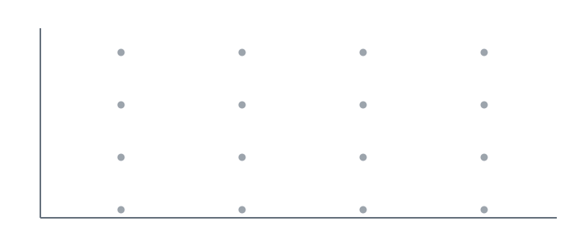

<strong>یادگیری عمیق · درس ۰۶</strong>

<h1 dir="rtl" align="right">انتخاب مدل و اعتبارسنجی خارج از نمونه</h1>

در یادگیری ماشین، همانند علم، یک مدل را با انجام پیش‌بینی‌های تازه و آزمودن آن‌ها روی داده‌های تازه ارزیابی می‌کنیم. این درس منطق عملیِ استفاده از داده را مرحله‌به‌مرحله می‌سازد تا بتوانیم مدل‌ها را مقایسه کنیم، ابرپارامترها را تنظیم کنیم، بیش‌برازش را تشخیص دهیم، و اندازه بگیریم که آیا مدلِ آموزش‌دیده به مثال‌هایی فراتر از دادهٔ آموزش تعمیم می‌دهد یا نه.

<h2 dir="rtl" align="right">انتخاب مدل با این سؤال شروع می‌شود: مدل اصولاً چه چیزهایی را می‌تواند نمایش دهد؟</h2>

تمام بحث این درس زیر عنوان <strong>انتخاب مدل</strong> قرار می‌گیرد: از میان رویکردهای مختلف یادگیری ماشین، کدام‌یک برای مسئلهٔ خاص ما مناسب‌تر است؟ اما قبل از مقایسهٔ تجربیِ مدل‌ها باید بدانیم اصلاً چه گزینه‌هایی ممکن‌اند. این ما را به مفهوم <strong>فضای فرضیه (Hypothesis Space)</strong> می‌رساند.

برای یک مدل مشخص، فضای فرضیه مجموعه—یا نوع—تابع‌هایی است که مدل می‌تواند نمایش دهد. آموزش قرار نیست از هیچ، یک تابع کاملاً دلخواه بسازد. آموزش میان تابع‌هایی که مدل توانایی بیان آن‌ها را دارد جست‌وجو می‌کند و مدل را طوری تنظیم می‌کند که یکی از آن تابع‌ها داده را خوب نمایش دهد.

<h4 dir="rtl" align="right">چه چیزهایی «فضای فرضیه» مدل را می‌سازند؟</h4>

<strong>نمایش ورودی</strong> — این‌که مثال‌ها چگونه کد می‌شوند؛ این انتخاب می‌تواند تعداد بُعدهای ورودی را تعیین کند.

<strong>خروجیِ موردنیاز</strong> — طبقه‌بندی خروجیِ شبیه برچسب می‌خواهد؛ رگرسیون مقدار پیوسته تولید می‌کند.

<strong>مدل / الگوریتم</strong> — کلاس مدل تعیین می‌کند چه نوع نگاشت‌هایی از ورودی به خروجی قابل نمایش‌اند.

<blockquote dir="rtl">
<strong>نتیجه:</strong> مدل فقط می‌تواند میان تابع‌هایی جست‌وجو کند که همهٔ این محدودیت‌ها را برآورده می‌کنند.
</blockquote>

<em>فضای فرضیه «همهٔ تابع‌های ممکن» نیست؛ مجموعه‌ای از تابع‌هاست که بعد از محدودیت‌های نمایش مسئله و مدل انتخاب‌شده هنوز ممکن باقی می‌مانند.</em>

خودِ مسئله از قبل گزینه‌ها را محدود می‌کند. نحوهٔ نمایش ورودی می‌تواند مشخص کند مدل چند بُعد ورودی داشته باشد. نوع خروجی هم مهم است: در <strong>طبقه‌بندی (Classification)</strong> خروجی یک کلاس یا دسته را نشان می‌دهد، در حالی‌که در <strong>رگرسیون (Regression)</strong> خروجی یک مقدار عددیِ پیوسته است. بعد از این محدودیت‌های مسئله، الگوریتم یادگیریِ انتخاب‌شده محدودیت‌های بیشتری روی نوع نگاشتِ قابل یادگیری از ورودی به خروجی ایجاد می‌کند.

<h4 dir="rtl" align="right">ورودی و خروجی یکسان، انعطاف نمایشی متفاوت</h4>

<strong>یک نورون سیگمویدی</strong> — با سه ورودی، مرز تصمیم هنوز خطی است؛ در فضای ورودی سه‌بعدی این مرز یک صفحه است.

<strong>شبکهٔ عصبی بزرگ‌تر</strong> — می‌تواند همان ورودی‌ها و همان خروجی را حفظ کند، اما فضای ورودی را به شکل‌های پیچیده‌تری جدا کند.

<em>تعداد ورودی و خروجی به‌تنهایی فضای فرضیه را تعیین نمی‌کند؛ ساختار داخلی مدل نیز مهم است.</em>

طبقه‌بند تک‌نورونیِ سیگمویدی نمونهٔ خوبی از یک فضای فرضیهٔ محدود است. اگر سه متغیر ورودی داشته باشیم، این مدل فقط می‌تواند یک <strong>مرز تصمیم خطی</strong> بسازد—در فضای ورودی سه‌بعدی، این مرز یک صفحه است. شبکهٔ عصبی بزرگ‌تر می‌تواند همان سه ورودی و همان خروجیِ طبقه‌بندی را حفظ کند، ولی مرزهای بسیار پیچیده‌تری را نمایش دهد. بنابراین فکر کردن به فضای فرضیه اولین بررسی مهم برای این است که بفهمیم یک مدل اصلاً انعطاف کافی برای مسئلهٔ ما دارد یا نه.

<h2 dir="rtl" align="right">بعد از انتخاب خانوادهٔ مدل، «پارامتر» را از «ابرپارامتر» جدا کنید</h2>

<blockquote dir="rtl">
<strong>حرکت بعدی درس:</strong> انتخاب خانوادهٔ مدل مسئلهٔ انتخاب را تمام نمی‌کند. حتی در یک خانوادهٔ ثابت، بعضی کمیت‌ها از داده یاد گرفته می‌شوند و بعضی انتخاب‌ها باید بیرون از فرایند آموزش تعیین شوند. این دو نوع انتخاب نقش یکسانی ندارند.
</blockquote>

<strong>پارامترهای مدل</strong> کمیت‌هایی هستند که آموزش با استفاده از داده آن‌ها را تغییر می‌دهد. اصلِ یادگیری ماشین همین است: تابع دقیق مطلوب را از قبل نمی‌دانیم، پس اجازه می‌دهیم داده مقدار پارامترها را تعیین کند. در مدل‌های تک‌نورونیِ قبلی، پارامترها همان وزن‌ها و بایاس بودند. در یک شبکهٔ عصبی بزرگ‌تر ایده عوض نمی‌شود؛ فقط وزن‌ها و بایاس‌های بسیار بیشتری در نورون‌های مختلف داریم.

<strong>ابرپارامترها (Hyperparameters)</strong> انتخاب‌های قابل تنظیمی هستند که خودِ گرادیان‌کاهشی آن‌ها را به‌روزرسانی نمی‌کند. اندازهٔ گام، که همان <strong>نرخ یادگیری (Learning Rate)</strong> است، یک نمونه است؛ این مقدار تعیین می‌کند در هر به‌روزرسانی چه‌قدر در جهت منفی گرادیان حرکت کنیم. تعداد تکرارهای آموزش هم نمونهٔ دیگری است: ممکن است به به‌روزرسانی‌های زیادی برای همگرایی نیاز داشته باشیم، اما تعداد تکرارهای برنامه‌ریزی‌شده انتخابی است که بیرون از آموزش انجام می‌دهیم.

<h4 dir="rtl" align="right">دو سطح انتخاب: پارامترها داخل آموزش، ابرپارامترها بیرون از آموزش</h4>

حلقهٔ داخلی — یادگیری از داده — <strong>پارامترهای مدل</strong> — از مقدارهایی برای وزن‌ها و بایاس شروع می‌کنیم → گرادیان‌کاهشی از دادهٔ آموزش استفاده می‌کند → وزن‌ها و بایاس‌ها به‌روزرسانی می‌شوند

حلقهٔ بیرونی — انتخاب یا تنظیم — <strong>ابرپارامترها</strong> — نرخ یادگیری، تعداد تکرار، معماری، تابع فعال‌سازی و… را انتخاب می‌کنیم → با این انتخاب‌ها یک مدل را آموزش می‌دهیم → نتیجه را ارزیابی می‌کنیم و تنظیم دیگری را امتحان می‌کنیم

<em>آموزش، پارامترها را تغییر می‌دهد. تنظیم ابرپارامترها شرایطی را عوض می‌کند که آموزش در آن انجام می‌شود.</em>

هرچه مدل پیچیده‌تر شود، فهرست ابرپارامترها هم بزرگ‌تر می‌شود. در یک شبکهٔ عصبی، تعداد گره‌ها، نحوهٔ اتصال گره‌ها، و تابع فعال‌سازیِ گره‌های پنهان می‌توانند جزو این انتخاب‌ها باشند. بعضی ابرپارامترها اثر بسیار بزرگی دارند و بعضی دیگر فقط در مسئله‌های خاص مهم می‌شوند. در هر حالت، گزینه‌های بیشتری ایجاد می‌شود که باید با هم مقایسه شوند.

<h2 dir="rtl" align="right">انتخاب مدل و تنظیم ابرپارامتر، در اصل یک مسئلهٔ تجربی‌اند</h2>

فرض کنید چند کلاس مدل معقول داریم یا چند مقدار ابرپارامتر ممکن است مناسب باشند. به یک روش منظم نیاز داریم تا آن‌ها را امتحان کنیم و بفهمیم کدام مؤثرتر است. <strong>انتخاب مدل</strong> می‌پرسد کدام کلاس مدل داده را بهتر نمایش می‌دهد. <strong>تنظیم ابرپارامتر</strong> می‌پرسد کدام تنظیم‌ها نتیجهٔ بهتری می‌دهند.

مرز بین این دو عنوان همیشه دقیق نیست. ممکن است یک معماری متفاوت شبکهٔ عصبی را «کلاس مدل متفاوت» بنامیم. در موقعیتی دیگر، تغییر تعداد و اتصال گره‌ها را صرفاً تغییر ابرپارامترهای یک خانوادهٔ مدل بدانیم. نام‌گذاری از آزمایشی که باید انجام دهیم کم‌اهمیت‌تر است.

<h4 dir="rtl" align="right">انتخاب مدل به یک آزمایش تبدیل می‌شود</h4>

<strong>یک گزینه را انتخاب کنید</strong> — یک کلاس مدل یا مجموعه‌ای از مقدارهای ابرپارامتر

<strong>روی مجموعهٔ آموزش، آموزش دهید</strong> — فقط پارامترهای مدل با این مثال‌ها برازش می‌شوند

<strong>روی دادهٔ ندیده ارزیابی کنید</strong> — اندازه بگیرید مدل آموزش‌دیده چقدر خوب تعمیم می‌دهد

<blockquote dir="rtl">
<strong>بعد گزینه‌ها را با هم مقایسه کنید.</strong> فرقی ندارد «گزینه» را یک مدل متفاوت بنامیم یا یک تنظیم متفاوت ابرپارامتر؛ منطق آزمایش یکی است.
</blockquote>

<em>به همین دلیل در این درس انتخاب مدل و تنظیم ابرپارامتر در اصل یک نوع مسئله‌اند: هر دو به مقایسهٔ تجربیِ گزینه‌های معقول نیاز دارند.</em>

<h2 dir="rtl" align="right">ایدهٔ کلیدی: بخشی از داده را از آموزش بیرون نگه دارید تا تعمیم را واقعاً آزمایش کنید</h2>

<blockquote dir="rtl">
<strong>چه مسئله‌ای هنوز حل نشده است؟</strong> اگر همان داده‌ای را که برای آموزش استفاده کرده‌ایم معیار قضاوت قرار دهیم، نمی‌توانیم مطمئن شویم مدل روی مثال‌های تازه هم خوب عمل می‌کند. هدف واقعی، پیش‌بینی روی دادهٔ جدید است؛ پس باید آزمایشی بسازیم که این وضعیت را شبیه‌سازی کند.
</blockquote>

کل مجموعه‌داده—هم ورودی‌ها و هم خروجی‌های هدف—را به یک <strong>مجموعهٔ آموزش</strong> و یک بخش جدا تقسیم کنید که مدل روی آن آموزش نمی‌بیند. هر مدل نامزد را فقط روی بخش آموزش برازش دهید و بخش کنارگذاشته‌شده را برای <strong>اعتبارسنجی خارج از نمونه (Out-of-Sample Validation)</strong> نگه دارید. «خارج از نمونه» در اینجا یعنی این مثال‌ها در برازش پارامترهای مدل دخالت نداشته‌اند.

<h4 dir="rtl" align="right">یک آزمایش ساده با دادهٔ کنارگذاشته‌شده</h4>

آموزش ≈ ۸۰٪ / کنارگذاشته‌شده ≈ ۲۰٪

<strong>بخش آموزش</strong> — برای برازش وزن‌ها، بایاس‌ها و دیگر پارامترهای یادگرفتنی استفاده می‌شود.

<strong>بخش کنارگذاشته‌شده</strong> — برای برازش پارامترها استفاده نمی‌شود؛ پیش‌بینی را روی مثال‌هایی می‌سنجد که مدل در آموزش ندیده است.

<em>تقسیم ۸۰/۲۰ یک قاعدهٔ سرانگشتی است، نه قانون ثابت. هدفش این است که دادهٔ ندیدهٔ کافی برای آزمون معنادارِ تعمیم باقی بماند.</em>

مثلاً فرض کنید بین دو نرخ یادگیری مردد هستیم. یک مدل را با نرخ اول و مدل دوم را با نرخ دیگر، هر دو روی همان مجموعهٔ آموزش، آموزش می‌دهیم. سپس هر دو مدلِ آموزش‌دیده را روی مثال‌های کنارگذاشته‌شده ارزیابی می‌کنیم. حالا مقایسه دقیقاً همان سؤال مهم را می‌پرسد: <em>کدام انتخاب روی داده‌ای که هنگام آموزش ندیده است پیش‌بینی بهتری انجام می‌دهد؟</em>

اهمیت تعمیم دقیقاً از همین‌جا می‌آید. اگر قرار نبود هرگز دادهٔ جدیدی ببینیم، انگیزهٔ چندانی برای یادگیری یک مدل پیش‌بینی‌گر وجود نداشت. هدف مدلِ یادگرفته‌شده این است که روی موارد تازه خوب پیش‌بینی کند. کنار گذاشتن بخشی از داده اجازه می‌دهد این هدف را مستقیماً آزمایش کنیم، نه این‌که فقط فرض کنیم خطای کم روی آموزش حتماً روی دادهٔ تازه هم تکرار می‌شود.

<h2 dir="rtl" align="right">بیش‌برازش نشان می‌دهد چرا آزمایش روی دادهٔ کنارگذاشته‌شده ضروری است</h2>

<strong>بیش‌برازش (Overfitting)</strong> یعنی مدل بیش از حد به همان مجموعهٔ آموزشِ خاص وابسته شده باشد. داده‌ای با ورودی یک‌بعدی و خروجی یک‌بعدی را در نظر بگیرید. دو مدل نامزد روی همان مشاهدات آموزش برازش شده‌اند.

<h4 dir="rtl" align="right">چرا خطای آموزش به‌تنهایی می‌تواند گمراه‌کننده باشد</h4>

<strong>اگر فقط مجموعهٔ آموزش را ببینیم</strong> — منحنی آبی می‌تواند ایده‌آل به نظر برسد، چون از همهٔ نقاط آموزش عبور می‌کند.

<strong>اگر نقاط کنارگذاشته‌شده را ببینیم</strong> — نقاط کنارگذاشته‌شده نشان می‌دهند کدام منحنی واقعاً مثال‌های ندیده را دقیق‌تر پیش‌بینی می‌کند.

نقاط آموزش · نقاط کنارگذاشته‌شده · مدل قرمزِ ساده‌تر · مدل آبی که همهٔ نقاط آموزش را برازش می‌کند

<em>شکل دقیق منحنی‌ها صرفاً برای نمایش ایده است؛ منطق درس تجربی است: بخشی از داده را کنار بگذارید، بدون آن آموزش دهید، و با همان نقاطِ کنارگذاشته‌شده تعمیم مدل‌های نامزد را بسنجید.</em>

اگر تنها هدف بازتولید مجموعهٔ آموزش باشد، مدل آبیِ پرپیچ‌وخم می‌تواند بی‌نقص به نظر برسد چون از همهٔ نقاط آموزش عبور می‌کند. مدل قرمزِ ساده‌تر روی همان نقاط خطای قابل مشاهده دارد. اما برای یک ورودی جدید که در آموزش حضور نداشته است، ممکن است مدل قرمز پیش‌بینی بهتری بدهد؛ منحنی آبی برای تطبیق دقیق با جزئیات نمونهٔ دیده‌شده بیش از حد خم شده است.

این شهود مفید است، اما نکتهٔ قوی‌تر درس این است که نباید فقط دربارهٔ «معقول‌تر به نظر رسیدن» دو منحنی بحث کنیم. چند نقطه را به‌صورت تصادفی کنار بگذارید، هر دو مدل را روی بقیه آموزش دهید، و بعد اندازه بگیرید کدام مدل نقاط کنارگذاشته‌شده را دقیق‌تر پیش‌بینی می‌کند. به این ترتیب سؤالِ تعمیم به یک آزمایش تبدیل می‌شود.

<blockquote dir="rtl">
<strong>قاعدهٔ سرانگشتی درس:</strong> تقسیم ۸۰/۲۰—تقریباً ۸۰٪ برای آموزش و ۲۰٪ کنارگذاشته‌شده—نقطهٔ شروع معقولی است. این نسبت قانون ثابت نیست و بعضی مجموعه‌داده‌ها یا مدل‌ها به تقسیم دیگری نیاز دارند.
</blockquote>

<h2 dir="rtl" align="right">برای تنظیم ابرپارامترها، اول بازهٔ مفید را پیدا کنید و بعد ریز شوید</h2>

مقایسه لازم نیست فقط بین دو گزینه باشد. می‌توان مقدارهای زیادی از یک ابرپارامتر را ارزیابی کرد. گاهی امتحان‌کردن همهٔ مقدارهای یک مجموعهٔ کوچک و گسسته عملی است؛ اما با چند ابرپارامتر، تعداد همهٔ ترکیب‌ها خیلی سریع بزرگ و پرهزینه می‌شود.

پس حرکت پیشنهادی این است که ابتدا برای هر ابرپارامتر مهم یک <strong>بازهٔ معقول</strong> پیدا کنید. فرض کنید نرخ یادگیری فعلی 0.01 است. قبل از آزمایش تغییرهای بسیار کوچک، آن را با ضریب ده عوض کنید؛ مثلاً 0.001، 0.01 و 0.1 را امتحان کنید. تغییر با ضریب ده را تغییرِ یک <strong>مرتبهٔ بزرگی (Order of Magnitude)</strong> می‌گوییم. اگر حتی این تغییرهای بزرگ نتیجه را خیلی عوض نکنند، احتمالاً هنوز لازم نیست برای تفاوت‌های بسیار ریز در همان بازه وقت زیادی صرف کنید.

حتی می‌تواند مفید باشد پارامتر را آن‌قدر جلو ببرید که رفتار آموزش به‌وضوح متفاوت شود یا عملاً «خراب شود». این کار کمک می‌کند مرزهای ناحیه‌ای را پیدا کنید که اصلاً ارزش جست‌وجو دارد.

<h4 dir="rtl" align="right">پیش از تنظیم ریز، جست‌وجو را وسیع انجام دهید</h4>

0.0001 / 0.001 / 0.01 / 0.1 / 1

<strong>شبکهٔ منظم</strong> — شبکهٔ منظم ممکن است آزمایش‌های زیادی را صرف تغییر همهٔ مختصات با یک الگوی ازپیش‌تعیین‌شده کند.

<strong>ترکیب‌های تصادفی</strong> — وقتی چند ابرپارامتر با هم تعامل دارند، نمونه‌گیری تصادفی سریع‌تر ترکیب‌های متنوعی را پوشش می‌دهد و می‌تواند ناحیهٔ امیدوارکننده‌ای را برای جست‌وجوی ریزتر آشکار کند.

<em>پیشنهاد درس این است که ابتدا هر ابرپارامتر مهم را در بازه‌ای وسیع هل بدهید—حتی تا جایی که رفتار آموزش به‌وضوح عوض شود—و بعد جست‌وجو را روی ناحیه‌های مهم متمرکز کنید.</em>

اگر چند ابرپارامتر با هم تعامل داشته باشند، تغییر دادن یکی‌یکی آن‌ها ممکن است ترکیب‌های خوب را از دست بدهد. اول برای هر پارامتر بازه‌ای معقول پیدا کنید و بعد از داخل این بازه‌ها ترکیب‌ها را نمونه‌گیری کنید. تصادفی‌سازی کمک می‌کند سریع‌تر مجموعهٔ متنوع‌تری از ترکیب‌ها را ببینید و ناحیه‌هایی را پیدا کنید که ارزش جست‌وجوی ریزتر دارند.

<h2 dir="rtl" align="right">اگر تنظیم را زیاد ادامه دهید، حتی به دادهٔ کنارگذاشته‌شده هم می‌توانید بیش‌برازش کنید</h2>

<blockquote dir="rtl">
<strong>چرا تقسیم دوگانه در نهایت کافی نیست؟</strong> هر بار که تنظیم‌ها را با همان دادهٔ کنارگذاشته‌شده مقایسه می‌کنیم و برنده را انتخاب می‌کنیم، اطلاعات آن مجموعه روی انتخاب بعدی اثر می‌گذارد. با آزمایش‌های زیاد، خودِ فرایند انتخاب می‌تواند به همان مجموعه سازگار شود.
</blockquote>

این شکل ظریف‌تری از بیش‌برازش است. پارامترهای داخلی مدل هرگز روی مثال‌های کنارگذاشته‌شده آموزش ندیده‌اند؛ اما <em>تصمیم‌های انتخاب مدل</em>—کدام معماری، کدام نرخ یادگیری، کدام ترکیب ابرپارامتر—بر اساس عملکرد روی آن مثال‌ها بهینه می‌شوند. بنابراین مجموعهٔ کنارگذاشته‌شده دیگر کاملاً مستقل از تصمیم‌هایی نیست که مدل نهایی را ساخته‌اند.

<h4 dir="rtl" align="right">وقتی تنظیم گسترده می‌شود، سه نقش جدا لازم داریم</h4>

آموزش / اعتبارسنجی / آزمون

<strong>مجموعهٔ آموزش</strong> — پارامترهای مدل را برازش می‌کند.

<strong>مجموعهٔ اعتبارسنجی</strong> — برای انتخاب کلاس مدل و ابرپارامترها استفاده می‌شود و ممکن است در طول تنظیم بارها به آن مراجعه کنیم.

<strong>مجموعهٔ آزمون</strong> — <strong>تا پایان دست‌نخورده</strong> مدل نهایی را روی داده‌ای می‌سنجد که هیچ نقشی در آموزش یا انتخاب نداشته است.

<em>اگر بارها تنظیمی را فقط به‌دلیل امتیاز خوب روی یک مجموعهٔ کنارگذاشته‌شده انتخاب کنیم، انتخاب‌های ما به همان مجموعه سازگار می‌شوند. مجموعهٔ اعتبارسنجی این فشار انتخاب را جذب می‌کند و مجموعهٔ آزمون برای بررسی نهایی تازه می‌ماند.</em>

اینجاست که تقسیم سه‌تایی معنا پیدا می‌کند. <strong>مجموعهٔ آموزش</strong> پارامترهای مدل را برازش می‌کند. <strong>مجموعهٔ اعتبارسنجی</strong> در طول انتخاب برای مقایسهٔ کلاس مدل و ابرپارامترها استفاده می‌شود. <strong>مجموعهٔ آزمون</strong> تا بعد از نهایی‌شدن همهٔ انتخاب‌ها دست‌نخورده می‌ماند تا بررسی کند مدل نهایی هنوز روی داده‌ای واقعاً مستقل تعمیم می‌دهد یا نه.

<blockquote dir="rtl">
<strong>پل اصطلاحی مهم:</strong> در حالت ساده که فقط یک بخش کنارگذاشته‌شده داریم، می‌توان آن را مجموعهٔ آزمون نامید. اما وقتی برای تنظیم بارها به همان بخش مراجعه می‌کنیم، نقش آن عملاً «اعتبارسنجی» است و باید یک مجموعهٔ آزمون تازه و دست‌نخورده برای ارزیابی نهایی کنار بگذاریم.
</blockquote>

<h2 dir="rtl" align="right">اعتبارسنجی متقاطع، وابستگی نتیجه به یک تقسیم تصادفی خاص را کمتر می‌کند</h2>

گاهی نمی‌خواهیم نتیجه بیش از حد به یک تقسیم تصادفی خاص از داده وابسته باشد. در <strong>اعتبارسنجی متقاطع (Cross-Validation)</strong> آزمایشِ آموزش/دادهٔ کنارگذاشته‌شده را با زیرمجموعه‌های متفاوت تکرار می‌کنیم و عملکرد را میانگین می‌گیریم. به این ترتیب، بخش‌های مختلف مجموعه‌داده به نوبت نقش دادهٔ ندیده را بازی می‌کنند.

در درس، <strong>اعتبارسنجی متقاطع چهار-بخشی (4-Fold Cross-Validation)</strong> نشان داده می‌شود. داده را به چهار زیرمجموعهٔ هم‌اندازه تقسیم کنید. در اجرای اول روی سه‌چهارم آموزش دهید و یک‌چهارم باقی‌مانده را کنار بگذارید. فرایند را چهار بار تکرار کنید تا هر یک‌چهارم دقیقاً یک بار بخشِ کنارگذاشته‌شده باشد.

<h4 dir="rtl" align="right">اعتبارسنجی متقاطع چهار-بخشی: هر یک‌چهارم یک بار کنار گذاشته می‌شود</h4>

|   | بخش 1 | بخش 2 | بخش 3 | بخش 4 |
| --- | --- | --- | --- | --- |
| اجرا 1 | کنارگذاشته | آموزش | آموزش | آموزش |
| اجرا 2 | آموزش | کنارگذاشته | آموزش | آموزش |
| اجرا 3 | آموزش | آموزش | کنارگذاشته | آموزش |
| اجرا 4 | آموزش | آموزش | آموزش | کنارگذاشته |

average score = (s₁ + s₂ + s₃ + s₄) / 4

هر s امتیاز خارج از نمونه در یک اجراست. میانگین‌گیری وابستگی نتیجه به یک تقسیم تصادفیِ خوش‌شانس یا بدشانس را کمتر می‌کند.

<em>اعتبارسنجی متقاطع از داده به‌طور کارآمد استفاده می‌کند، اما محاسبات بیشتری می‌خواهد چون مدل باید برای هر بخش دوباره آموزش داده شود.</em>

چهار امتیازِ خارج از نمونه را میانگین بگیرید. در نتیجه احتمال این‌که یک عملکرد بسیار خوب یا بد فقط به‌خاطر یک زیرمجموعهٔ خاص و تصادفی دیده شده باشد کمتر می‌شود. هزینهٔ این کار محاسباتی است: در اعتبارسنجی متقاطع چهار-بخشی باید همان مدل نامزد را چهار بار روی چهار مجموعهٔ آموزشیِ کمی متفاوت دوباره آموزش دهید.

به همین دلیل، اعتبارسنجی متقاطع همیشه بهترین انتخاب برای هر پروژه نیست. در بسیاری از موارد یک تقسیم سادهٔ آموزش/آزمون، یا زمانی که تنظیم گسترده داریم تقسیم آموزش/اعتبارسنجی/آزمون، کافی است. اصل مهمی که همهٔ این روش‌ها بهبود می‌دهند یکی است: <strong>تمام دادهٔ موجود را برای آموزش مصرف نکنید و خودتان را بدون راهی مستقل برای آزمودن تعمیم مدل باقی نگذارید.</strong>

<strong>برازش</strong> — با دادهٔ آموزش، پارامترهای مدل را یاد بگیرید.

<strong>انتخاب</strong> — با دادهٔ کنارگذاشته‌شده/اعتبارسنجی، مدل و ابرپارامترها را مقایسه کنید.

<strong>بررسی نهایی</strong> — اگر انتخاب گسترده است، مجموعهٔ آزمون را تا پایان دست‌نخورده نگه دارید.

---

[Source: https://www.youtube.com/watch?v=fBP0-OhOPz0](https://www.youtube.com/watch?v=fBP0-OhOPz0)
