
<strong>شبکه‌های عصبی پیش‌خور · DL 07</strong>

<h1 dir="rtl" align="right">محاسبه با شبکه‌های عصبی</h1>

از نورون‌های منفرد به شبکه‌های عصبی چندلایه می‌رویم. دو سؤال اصلی این درس این است: <strong>شبکه چگونه یک پیش‌بینی را محاسبه می‌کند؟</strong> و <strong>اصلاً چرا لایه‌های پنهان مفیدند؟</strong> برای پاسخ، یک شبکهٔ پیش‌خور ۴–۳–۳–۲ را از محاسبهٔ محلی هر نورون تا تابع زیان و گرادیانی که برای آموزش لازم داریم دنبال می‌کنیم.

<strong>محاسبه</strong> — فعال‌سازی‌ها را از ورودی تا خروجی دنبال می‌کنیم.

<strong>قدرت نمایش</strong> — می‌بینیم چرا نورون‌های غیرخطی قدرت بیشتری به شبکه می‌دهند.

<strong>آموزش</strong> — همهٔ وزن‌ها و بایاس‌ها را در یک بردار پارامتر جمع می‌کنیم و زیان آن را تعریف می‌کنیم.

<h2 dir="rtl" align="right">از یک نورون به یک شبکه</h2>

شبکهٔ چندلایه داخل هر گره محاسبهٔ تازه‌ای اختراع نمی‌کند. هر <strong>نورونِ غیرورودی</strong> همان دو کار نورون منفرد را انجام می‌دهد: ابتدا یک مجموع وزن‌دار می‌سازد و سپس آن عدد را از تابع فعال‌سازی عبور می‌دهد. تفاوت در منبع ورودی‌هاست. ورودی یک نورون می‌تواند فعال‌سازی‌هایی باشد که نورون‌های لایهٔ قبل ساخته‌اند.

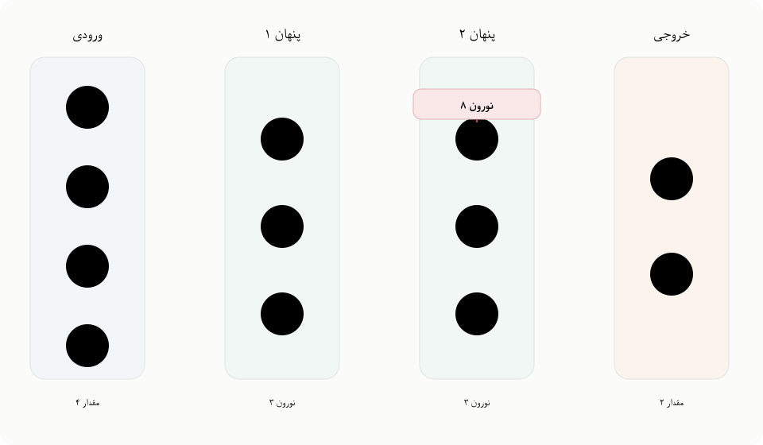

<em>یک شبکهٔ ۴–۳–۳–۲. گره‌های ورودی ۱ تا ۴ چهار مؤلفهٔ نقطهٔ داده را نگه می‌دارند؛ نورون‌های پنهان ۵ تا ۱۰ آن‌ها را تبدیل می‌کنند؛ و نورون‌های ۱۱ و ۱۲ دو مؤلفهٔ پیش‌بینی را می‌سازند. نورون ۸ و اتصال‌های ورودی و خروجی آن برجسته شده‌اند.</em>

<strong>وزن و بایاس</strong> — وزن، فعال‌سازیِ ورودی را مقیاس می‌کند. بایاس یک مقدارِ ثابتِ قابل‌آموزش است که پس از جمعِ ورودی‌های وزن‌دار اضافه می‌شود.

روی نورون ۸ تمرکز کنید. سه ورودی آن فعال‌سازی‌های a5, a6, a7 هستند. هر فعال‌سازی در وزن یال مربوط به خودش ضرب می‌شود و نورون ۸ یک بایاس مخصوص خودش هم دارد.

x8 = b8 + ∑i=57 aiwi→8

<em>در اینجا <strong>x8</strong> مجموع وزن‌دارِ پیش از تابع فعال‌سازی است؛ منظور یکی از ویژگی‌های خامِ ورودی نیست.</em>

تابع فعال‌سازی نورون ۸ سپس این مقدار را به فعال‌سازی آن نورون تبدیل می‌کند:

a8 = f8(x8)

اکنون a8 فقط «پاسخ یک نورون» نیست؛ خودش دادهٔ ورودی برای لایهٔ بعد می‌شود. در این شبکه، این مقدار به نورون‌های خروجی ۱۱ و ۱۲ فرستاده می‌شود.

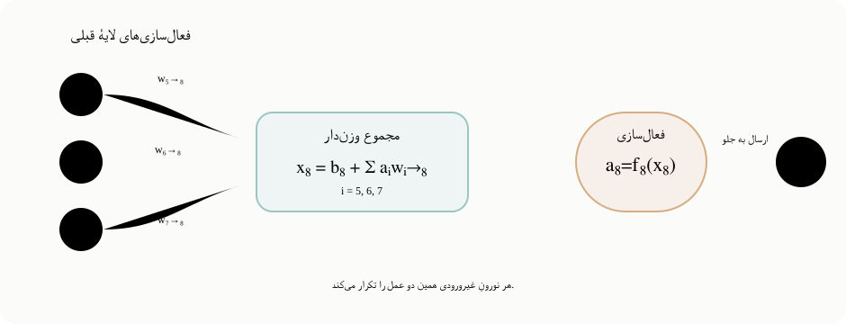

<em>محاسبهٔ محلی در نورون ۸: فعال‌سازی‌های قبلی وارد مجموع وزن‌دار می‌شوند، تابع فعال‌سازی آن مجموع را تبدیل می‌کند و نتیجه به جلو فرستاده می‌شود. هر نورونِ غیرورودی همین الگو را تکرار می‌کند.</em>

<strong>فعال‌سازی</strong> — عددی که نورون پس از اعمال تابع فعال‌سازی خروجی می‌دهد. این عدد می‌تواند به‌عنوان ورودی نورون‌های لایهٔ بعد استفاده شود.

<h2 dir="rtl" align="right">توابع فعال‌سازی داخل شبکه</h2>

در مدل تک‌نورونی، خروجی خطی برای رگرسیون و خروجی سیگموید برای طبقه‌بندی به کار می‌رفت. در شبکهٔ چندلایه بسیاری از نورون‌ها <em>داخلی</em> هستند و خروجی‌شان فقط یک مقدار میانی است، نه پیش‌بینی نهایی؛ بنابراین توابع فعال‌سازی دیگری هم مفید می‌شوند.

در این درس چهار انتخاب رایج مقایسه می‌شوند. مشتق هر تابع هم مهم است، چون گرادیان نزولی بعداً باید شیب تابع فعال‌سازی را بداند تا محاسبه کند تغییر پارامترها چه اثری بر زیان می‌گذارد.

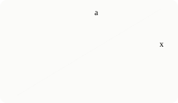

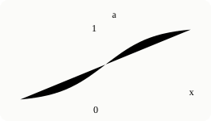

<h4 dir="rtl" align="right">خطی</h4>

a = x d a / d x = 1

مجموع وزن‌دار را بدون تغییر عبور می‌دهد.

<h4 dir="rtl" align="right">سیگموید</h4>

a = 1/(1+e−x) d a / d x = a(1−a)

مقادیر را به‌صورت نرم در بازهٔ ۰ تا ۱ فشرده می‌کند.

<h4 dir="rtl" align="right">تانژانت هیپربولیک</h4>

a = tanh(x) d a / d x = 1−a2

تابعی Sشکل است که خروجی‌اش از −۱ تا ۱ تغییر می‌کند.

<h4 dir="rtl" align="right">ReLU</h4>

a = max(0,x) d a / d x = 0 if a=0; 1 if a>0

برای ورودی منفی صفر می‌دهد و برای ورودی مثبت مانند تابع خطی است.

تا جای ممکن مشتق‌ها برحسب خودِ فعال‌سازی a نوشته شده‌اند. این نکته از نظر محاسباتی مفید است: عبور پیش‌خور این فعال‌سازی‌ها را از قبل می‌سازد و ذخیره می‌کند، و محاسبهٔ گرادیان می‌تواند دوباره از همان مقادیر استفاده کند.

<blockquote dir="rtl">
<strong>ReLU دقیقاً در صفر.</strong> از نظر ریاضی مشتق در x=0 یکتا نیست. این درس از قرارداد محاسباتی رایجِ مشتق صفر در این نقطه استفاده می‌کند.
</blockquote>

<h2 dir="rtl" align="right">یک پیش‌بینی پیش‌خور چگونه محاسبه می‌شود؟</h2>

واژهٔ <strong>پیش‌خور (feed-forward)</strong> جهت محاسبه را توصیف می‌کند: اطلاعات از لایهٔ ورودی، از میان لایه‌های پنهان، به لایهٔ خروجی حرکت می‌کند. هنگام خودِ پیش‌بینی حلقه‌ای نداریم که فعال‌سازی یک لایهٔ بعدی را به لایه‌ای قبلی برگرداند.

از یک نقطهٔ داده شروع می‌کنیم. اگر مشاهده چهار مؤلفه داشته باشد، این چهار عدد در گره‌های ۱ تا ۴ قرار می‌گیرند. بهتر است گره‌های ورودی را محل نگهداری داده بدانیم: آن‌ها مجموع وزن‌دار یا تابع فعال‌سازی محاسبه نمی‌کنند.

<em>پیش‌بینی لایه‌به‌لایه انجام می‌شود. هر لایه فقط زمانی محاسبه می‌شود که لایهٔ قبلی همهٔ فعال‌سازی‌های مورد نیاز را ساخته باشد.</em>

<strong>۱. قرار دادن نقطه</strong> a₁,…,a₄ را برابر چهار مقدار ورودی بگذارید.

<strong>۲. لایهٔ پنهان اول</strong> نورون‌های ۵، ۶ و ۷ را از چهار ورودی محاسبه کنید.

<strong>۳. لایهٔ پنهان دوم</strong> از فعال‌سازی‌های ذخیره‌شدهٔ ۵ تا ۷ برای محاسبهٔ ۸، ۹ و ۱۰ استفاده کنید.

<strong>۴. لایهٔ خروجی</strong> با فعال‌سازی‌های ۸ تا ۱۰، دو خروجی نهایی ۱۱ و ۱۲ را بسازید.

اندازهٔ مرزهای شبکه را خودِ مسئله تعیین می‌کند: این شبکه مشاهده‌ای چهاربعدی می‌گیرد و خروجی دوبعدی می‌دهد. این انتخاب‌ها بخشی از تعیین <strong>فضای فرضیه (hypothesis space)</strong> هستند؛ یعنی مجموعهٔ توابعی که معماری اجازه دارد نمایش دهد. دو لایهٔ میانی هرکدام سه نورون دارند، پس اندازهٔ لایه‌های پنهان [3,3] است؛ تعداد و نحوهٔ اتصال همین واحدهای میانی تعیین می‌کند شبکه تا چه حد بتواند تابع پیچیده‌تری بسازد.

<strong>لایهٔ پنهان</strong> — لایه‌ای میان ورودی و خروجی. فعال‌سازی‌های آن نمایش‌های داخلی هستند: در ساخت پیش‌بینی کمک می‌کنند اما خودشان خروجی نهایی مدل نیستند.

چرا هر فعال‌سازی را ذخیره می‌کنیم؟ دو دلیل دارد. لایهٔ بعد به آن به‌عنوان ورودی نیاز دارد و هنگام آموزش، محاسبهٔ گرادیان نیز دوباره به بسیاری از همین مقادیر احتیاج خواهد داشت.

<h2 dir="rtl" align="right">چرا اصلاً لایهٔ پنهان؟</h2>

تا اینجا شبکه می‌تواند چهار عدد را به دو عدد نگاشت کند، اما این هنوز نشان نمی‌دهد لایه‌های پنهان چه مزیتی دارند. چرا دو مدل تک‌نورونی مستقل برای دو خروجی کافی نباشد؟

پاسخ به تابع فعال‌سازی بستگی دارد. اگر همهٔ نورون‌های پنهان خطی باشند، روی‌هم‌گذاشتن لایه‌ها تابعی از نوع بنیادیِ جدید نمی‌سازد.

If f and g are linear, then f(g(x)) is also linear.

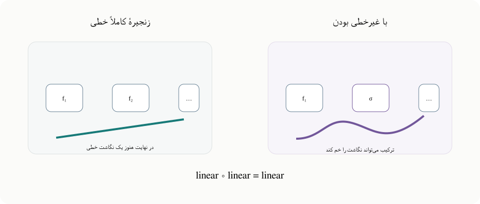

<em>ترکیب چند تبدیل خطی در نهایت فقط یک تبدیل خطی دیگر است. یک تابع فعال‌سازی غیرخطی این فروپاشی را می‌شکند و به ترکیب لایه‌ها اجازه می‌دهد نگاشت‌هایی بسازد که یک تبدیل خطی تنها نمی‌تواند.</em>

یک مثال یک‌بعدی، بدون ورود به اثبات رسمی، ایده را روشن می‌کند. اگر g(x)=dx+e و f(u)=cu+q باشند، آن‌گاه:

f(g(x)) = c(dx+e)+q = (cd)x + (ce+q)

نتیجه هنوز فقط یک خط با شیب و عرض از مبدأ جدید است. لایه‌های خطی بیشتر می‌توانند ضرایب را تغییر دهند، اما نوع تابع را عوض نمی‌کنند. پس پیام اصلی این است که <strong>لایه‌های پنهان زمانی از نظر قدرت نمایش مهم می‌شوند که میان مجموع‌های وزن‌دار، فعال‌سازی‌های غیرخطی قرار بگیرند.</strong>

<blockquote dir="rtl">
<strong>سؤال بعدی چیست؟</strong> غیرخطی بودن اجازه نمی‌دهد همهٔ لایه‌ها به یک نگاشت خطی فروبریزند. حالا باید ببینیم این قدرت تا کجا می‌تواند پیش برود. درس برای پاسخ از مثال آشنای منطق بولی استفاده می‌کند.
</blockquote>

<h2 dir="rtl" align="right">با غیرخطی بودن چقدر می‌توان نمایش داد؟</h2>

نورون سیگموید شبیه نسخهٔ نرمِ یک تابع پله‌ای است: برای ورودی‌های خیلی منفی خروجی‌اش نزدیک ۰ و برای ورودی‌های خیلی مثبت نزدیک ۱ می‌شود. برای اینکه استدلال دربارهٔ منطق بولی ساده باشد، موقتاً سیگموید را با یک تابع پله‌ایِ دقیق جایگزین می‌کنیم.

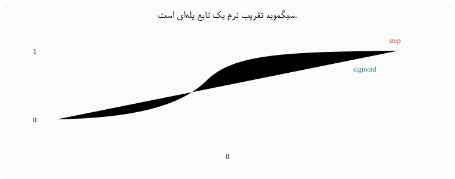

<em>سیگموید تقریب نرمِ یک پلهٔ صفر/یک است. به همین دلیل ابتدا با یک نورون پله‌ای ایدهٔ عملگرهای بولی را دقیق بررسی می‌کنیم و بعد به سیگموید به‌عنوان تقریب مشتق‌پذیر آن برمی‌گردیم.</em>

در مثال‌های بولی، نورون ابتدا مقدار زیر را محاسبه می‌کند:

s = w₁x₁ + w₂x₂ + b

و فعال‌سازی ایده‌آل، وقتی s>0 باشد خروجی ۱ و در غیر این صورت خروجی ۰ می‌دهد. مجموعهٔ نقاطی که در آن s=0 است <strong>مرز تصمیم</strong> نام دارد؛ نقاطِ دو سوی این خط خروجی متفاوت می‌گیرند.

قضیهٔ دومِ استفاده‌شده در درس می‌گوید <strong>AND و OR و NOT برای ساخت منطق بولی کافی‌اند.</strong> اگر بتوانیم این عملگرها را با نورون بسازیم، با ترکیب آن‌ها می‌توانیم هر تابع بولیِ متناهی را نمایش دهیم.

<h3 dir="rtl" align="right">AND</h3>

در AND(x₁,x₂) فقط ورودی (1,1) باید خروجی ۱ بدهد. اگر w₁=w₂=1 و b=-1.5 باشند، s=x₁+x₂-1.5 می‌شود. این مجموع فقط زمانی مثبت است که هر دو ورودی دودویی ۱ باشند.

<h3 dir="rtl" align="right">OR</h3>

در OR(x₁,x₂) همهٔ نقاط دودویی به‌جز (0,0) باید خروجی ۱ بدهند. دو وزن را ۱ نگه می‌داریم و با بایاس -0.5 مرز را جابه‌جا می‌کنیم؛ اکنون s=x₁+x₂-0.5 است.

<h3 dir="rtl" align="right">NOT</h3>

NOT فقط یک ورودی دارد. می‌خواهیم ورودی ۰ خروجی ۱ و ورودی ۱ خروجی ۰ بدهد؛ پس با افزایش x₁ باید جهت خروجی برعکس شود. با همان قراردادِ آستانهٔ صفرِ بالا، w₁=-1 و b=+0.5 داریم: s=-x₁+0.5 در ورودی ۰ مثبت و در ورودی ۱ منفی است.

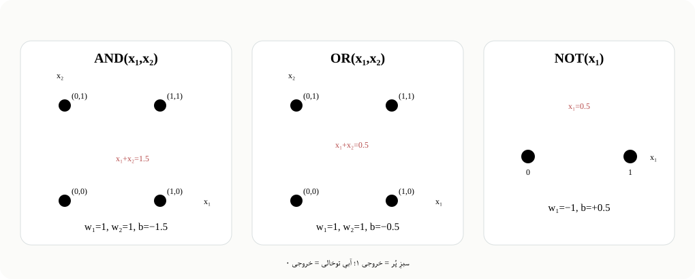

<em>AND و OR در صفحهٔ دودویی x₁–x₂ با یک خط جداشدنی هستند. NOT یک مسئلهٔ آستانه‌ایِ یک‌بعدی است. خط قرمز دقیقاً جایی است که مجموع وزن‌دار صفر می‌شود.</em>

| عملگر | مجموع وزن‌دار | اثر مرز |
| --- | --- | --- |
| فقط (۱،۱) |
| همه به‌جز (۰،۰) |
| ۰ ← ۱ و ۱ ← ۰ |

با تابع پله‌ای دقیق، این گیت‌ها دقیق‌اند. سیگموید پیوسته و نرم است، بنابراین نورون‌های سیگمویدی همین رفتارِ گیت‌مانند را <em>تقریب</em> می‌زنند. اگر وزن‌ها و بایاس یک گیت را همگی در یک ضریب مثبتِ بزرگ ضرب کنیم، مرز تصمیم جابه‌جا نمی‌شود اما گذار سیگموید در اطراف مرز تندتر و خروجی‌ها به صفر و یک نزدیک‌تر می‌شوند.

<h2 dir="rtl" align="right">از مدار بولی تا شبکه‌ای که واقعاً آموزش می‌دهیم</h2>

استدلال بولی دربارهٔ <strong>امکانِ نمایش</strong> است: نورون‌های غیرخطی می‌توانند در ترکیب با هم محاسبات پیچیده بسازند. اما این به آن معنا نیست که در عمل معمولاً شبکه را با تخصیص دستی یک نورون به AND، نورون بعد به OR و غیره طراحی می‌کنیم.

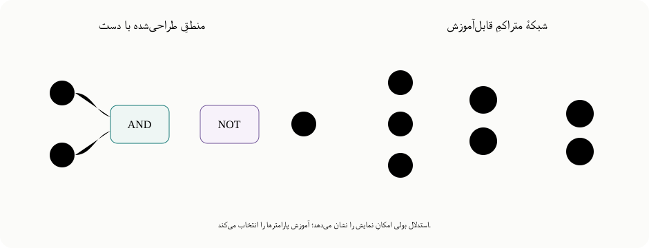

<em>تصویر مدار منطقی نشان می‌دهد ترکیب عملگرهای ساده می‌تواند قدرت زیادی داشته باشد. اما در معماری مورد نظرِ آموزش، لایه‌های متراکم را نگه می‌داریم و اجازه می‌دهیم گرادیان نزولی وزن‌ها و بایاس‌ها را از روی داده انتخاب کند.</em>

هدف این است که یک معماری انتخاب کنیم و بعد آن را <strong>آموزش</strong> دهیم: پارامترهایش را طوری تنظیم کنیم که پیش‌بینی‌ها با داده هماهنگ شوند. معماری چند لایه که هر لایه به‌طور متراکم به لایهٔ بعد وصل است برای این کار بسیار مناسب است.

<h2 dir="rtl" align="right">پارامترهای کل شبکه چیستند؟</h2>

در یک نورون، پارامترهای قابل تنظیم وزن‌های ورودی و بایاس‌اند. در کل شبکه، مجموعهٔ پارامترها فقط شامل <strong>تمام وزن‌های همهٔ یال‌ها به‌علاوهٔ تمام بایاس‌های نورون‌های غیرورودی</strong> است.

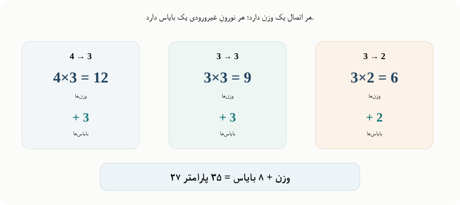

<em>شمارش پارامترهای شبکهٔ ۴–۳–۳–۲ به تفکیک لایه‌ها: ۲۷ وزنِ اتصال و ۸ بایاسِ نورون، یعنی در مجموع ۳۵ پارامتر قابل تنظیم.</em>

<strong>12 + 9 + 6 = 27</strong> وزن

<strong>3 + 3 + 2 = 8</strong> بایاس

<strong>27 + 8 = 35</strong> پارامتر

این مقادیر را در یک بردار بلند به نام θ می‌گذاریم. ترتیب دقیق عناصر فقط یک انتخاب برای سامان‌دهی است؛ نکتهٔ اصلی این است که هر وزن و هر بایاسِ قابل تنظیم دقیقاً یک بار در این بردار حضور داشته باشد.

θ = [w1→5, w1→6, …, w10→12, b5, …, b12]T   ∈ ℝ35

پس برای آموزش باید برای هرکدام از این ۳۵ عدد بدانیم در چه جهتی تغییرش دهیم. این جهت از گرادیانِ یک تابع زیان به دست می‌آید.

<h2 dir="rtl" align="right">تابع زیان با چند خروجی</h2>

<strong>زیان (loss)</strong> عددی است که فاصلهٔ پیش‌بینی مدل تا هدف را اندازه می‌گیرد. در مدل تک‌خروجی یک فعال‌سازی را با یک <strong>هدف (target)</strong>، یعنی خروجیِ مطلوبی که دادهٔ آموزشی در اختیارمان می‌گذارد، مقایسه می‌کردیم. اکنون دو نورون خروجی داریم، پس خطای هر دو بُعد خروجی باید در زیان سهم داشته باشد.

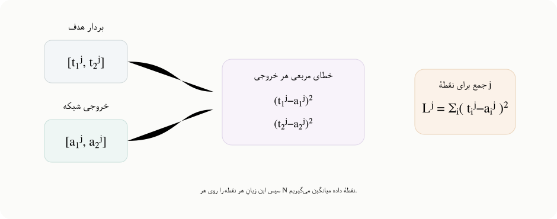

<em>برای یک نقطهٔ دادهٔ j، هر فعال‌سازی خروجی را با هدف متناظر مقایسه می‌کنیم، اختلاف‌ها را مربع می‌کنیم و روی ابعاد خروجی جمع می‌زنیم. سپس زیان‌های نقاط مختلف را روی کل مجموعه‌داده میانگین می‌گیریم.</em>

برای نقطهٔ دادهٔ j، خطای مربعی با جمع روی همهٔ نورون‌های خروجی تعمیم داده می‌شود:

Lj(θ, dataj) = ∑i ∈ outputs (tij − aij)2

<em>زیرنویس i مشخص می‌کند کدام نورون خروجی و بالانویس j مشخص می‌کند کدام نقطهٔ داده مورد نظر است.</em>

سپس روی هر N نقطهٔ داده میانگین می‌گیریم:

L(θ, dataset) = (1/N) ∑j=1N Lj(θ, dataj)

<blockquote dir="rtl">
<strong>یک بررسی کوچکِ دوخروجی.</strong> اگر هدف [1,0] و خروجی شبکه [0.8,0.3] باشد، زیان همان نقطه (1−0.8)² + (0−0.3)² = 0.13 می‌شود. یعنی هر دو بُعد خروجی در یک عددِ زیان سهم دارند.
</blockquote>

<h2 dir="rtl" align="right">گرادیان نزولی روی هر ۳۵ پارامتر</h2>

<strong>گرادیان</strong> برداری از مشتق‌های جزئیِ زیانِ کل مجموعه‌داده است؛ برای هر مؤلفهٔ θ یک مشتق داریم. چون θ ۳۵ مؤلفه دارد، گرادیان هم ۳۵ مؤلفه دارد.

∇L = [∂L/∂w1→5, ∂L/∂w1→6, …, ∂L/∂b11, ∂L/∂b12]T

گرادیان جهت افزایش زیان را نشان می‌دهد. گرادیان نزولی یک گام کوچک در جهت مخالف آن برمی‌دارد. اگر اندازهٔ گام یا نرخ یادگیری η باشد:

θ ← θ − η∇L(θ)

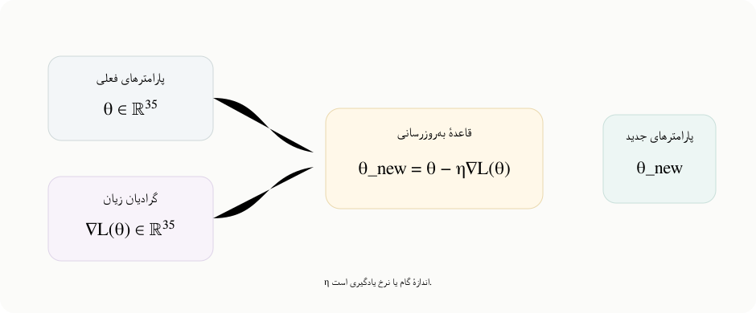

<em>بردار پارامترها و بردار گرادیان هر دو ۳۵ مؤلفه دارند. گرادیان نزولی همهٔ وزن‌ها و بایاس‌ها را کمی در خلاف جهت گرادیان زیان جابه‌جا می‌کند.</em>

با تکرار این روند، وزن‌ها و بایاس‌ها طوری تغییر می‌کنند که زیان شبکه بتواند کاهش پیدا کند. سؤال محاسباتیِ باقی‌مانده این است: <em>چطور این ۳۵ مشتق جزئی را در یک شبکهٔ چندلایه به‌صورت کارآمد به دست بیاوریم؟</em>

<blockquote dir="rtl">
<strong>این دقیقاً نقطهٔ ورود به پس‌انتشار (backpropagation) است.</strong> عبور پیش‌خور فعال‌سازی‌ها را ذخیره می‌کند. پس‌انتشار از همین مقادیر استفاده می‌کند تا اطلاعات مشتق را به‌طور کارآمد از شبکه به عقب منتقل کند و گرادیانی را بسازد که برای گام بعدی گرادیان نزولی لازم است.
</blockquote>

---

[Source: https://www.youtube.com/watch?v=AsyPA69QBks](https://www.youtube.com/watch?v=AsyPA69QBks)
